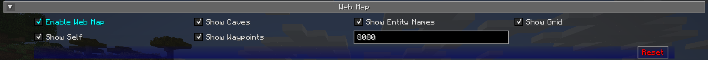
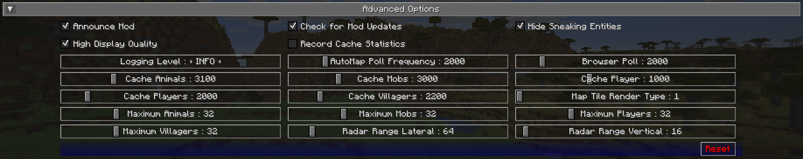

## **Settings**

JourneyMap provides more than a few configuration options, allowing you to customize the behaviour and appearance of many different aspects of the mod. All of these settings are made available through the settings manager.

{: .center}

To get to the settings manager, open the full-screen map and click the settings button at the bottom, or press the ++o++ key. Each entry in the list represents a specific category of settings - click on it to expand and see the settings within.

!!! note "Note"

    Each category has a Reset button. Please note that pressing this button will reset the settings in that category to the default settings bundled with JourneyMap, instead of simply discarding your changes.

Some of these categories have quite a few settings. Feel free to skip to a specific category by clicking on the links on the right side.

## **Grid Settings**

Both minimap presets and the full-screen map may have a configurable grid overlay. You can customize this overlay by clicking on the Edit Grid… button below the settings in each respective category.

You can also reach this from the full-screen map by holding the ++shift++ key and clicking on the grid button at the top.

{: .center}

The grid outlines individual chunks on the map. Grid styles that include region lines will draw an extra grid with differently-coloured lines to outline world regions on the map.

- Select a colour for the grid lines by clicking on the colour wheel.
- Select the map type (day, night or caves) to edit on the left side.
- Click the **Reset** button to reset the current map type to the default grid settings.
- Click the **Cancel** button to discard your changes and close the grid editor.
- Click the **Save** button to save your changes and close the grid editor.

| Setting | Options | Description |
| ----------- | ------------------------------------ | ------------------------------------ |
| Style | **Squares**, SquaresWithRegion, GridRegion, Dots, Checkers | Change the type of grid overlaid on the map |
| Opacity | Percentage: (default: **50**) | How opaque the grid should be drawn |

## **Minimap Settings**

JourneyMap allows you to have two minimap presets. Each preset represents a separate set of settings - essentially allowing you to have two distinct minimaps available to switch between.

!!! note "Note"

    The settings for each minimap are identical, so we’ll only cover a single preset below.

To switch between minimap presets, press the switch minimap preset key (the # key by default).

{: .center}

## **Toggles**

By default, all of the following toggle settings are enabled.

| Toggle | Description |
| ----------- | ------------------------------------ |
| Enable Minimap | Enable or disable this minimap preset |
| Show Animals | Show or hide animals |
| Show Caves | Toggle automatically switching to cave mode |
| Show Compass | Toggle showing compass points around the edge of the minimap |
| Show Day/Night | Toggle automatically switching between day and night mode |
| Show Entity Names | Show or hide entity names |
| Show Grid | Show or hide the grid overlay |
| Show Mob Headings | Toggle showing which way mobs are facing |
| Show Mobs | Show or hide mobs |
| Show Pets | Show or hide pets |
| Show Player Headings | Toggle showing which way other players are facing |
| Show Players | Show or hide other players |
| Show Reticle | Show or hide midpoint lines pointing to the center of the minimap |
| Show Self | Show or hide your own location and heading |
| Show Villagers | Show or hide villagers |
| Show Waypoint Labels | Show or hide the names of waypoints |
| Show Waypoints | Show or hide all waypoints |
| Verbose Location | Toggle between a long or short form of your current coordinates |

## **Info Slots**

Info slots are text areas above and below the minimap that show extra contextual information. There are four of them, numbered from top to bottom.

{: .center}

All info slots can be set to one of the following:

- **Blank**: Nothing, hide this info slot
- **Biome**: The biome you're currently in
- **Dimension**: The dimension you're currently in
- **FPS**: The game's FPS counter
- **Game Time**: The current ingame time, as represented by Minecraft's daylight cycle
- **Game Time Real**: The current ingame time, shifted to match a real clock
- **Light Level**: The light level of the block you're standing in
- **Location**: Your current coordinates
- **Region**: Your current region coordinates
- **System Time**: The current real time, according to your computer

## **Other Settings**

The default option for each setting below is marked with **bold** text.

<table>
<colgroup>
<col style="width: 28%" />
<col style="width: 28%" />
<col style="width: 86%" />
</colgroup>
<thead>
<tr class="header">
<th>Setting</th>
<th>Options</th>
<th>Description</th>
</tr>
</thead>
<tbody>
<tr class="odd">
<td>Location</td>
<td><ul>
<li><strong>x, z, y (v)</strong></li>
<li>x, y (v), z</li>
<li>x, z, y</li>
<li>x, y, z</li>
<li>x, z</li>
</ul></td>
<td>The format of your coordinates, as shown in an info slot</td>
</tr>
<tr class="even">
<td>Map Heading</td>
<td><ul>
<li><strong>North</strong></li>
<li>Old North</li>
<li>My Heading</li>
</ul></td>
<td>Which direction the top of the map should face - Note: only circle
maps support the "My Heading" setting</td>
</tr>
<tr class="odd">
<td>Mob Display</td>
<td><ul>
<li><strong>Small Dots</strong></li>
<li>Large Dots</li>
<li>Small Icons</li>
<li>Large Icons</li>
</ul></td>
<td>How mobs should be displayed on the minimap</td>
</tr>
<tr class="even">
<td>Player Display</td>
<td><ul>
<li><strong>Small Dots</strong></li>
<li>Large Dots</li>
<li>Small Icons</li>
<li>Large Icons</li>
</ul></td>
<td>How other players should be displayed on the minimap</td>
</tr>
<tr class="odd">
<td>Position</td>
<td><ul>
<li><strong>Top Right</strong></li>
<li>Bottom Right</li>
<li>Bottom Left</li>
<li>Top Left</li>
<li>Top Center</li>
<li>Center</li>
</ul></td>
<td>The location of the minimap on your screen</td>
</tr>
<tr class="even">
<td>Real Game Time Format</td>
<td><ul>
<li><strong>HH:mm:ss</strong></li>
<li>H:mm:ss</li>
<li>HH:mm</li>
<li>H:mm</li>
<li>hh:mm:ss a</li>
<li>h:mm:ss a</li>
<li>hh:mm:ss</li>
<li>h:mm:ss</li>
<li>h:mm a</li>
<li>h:mm a</li>
<li>hh:mm</li>
<li>h:mm</li>
</ul></td>
<td>
The text format of the real game time, as shown in an info
slot

<ul>
<li><strong>H</strong>: Hours (24-hour, without leading 0)</li>
<li><strong>HH</strong>: Hours (24-hour, with leading 0)</li>
<li><strong>h</strong>: Hours (12-hour, without leading 0)</li>
<li><strong>hh</strong>: Hours (12-hour, with leading 0)</li>
<li><strong>mm</strong>: Minutes</li>
<li><strong>ss</strong>: Seconds</li>
<li><strong>a</strong>: Time of day (AM/PM)</li>
</ul></td>
</tr>
<tr class="odd">
<td>Reticle Heading</td>
<td><ul>
<li><strong>Compass</strong></li>
<li>My Heading</li>
</ul></td>
<td>Change the orientation of the reticle</td>
</tr>
<tr class="even">
<td>Shape</td>
<td><ul>
<li><strong>Circle</strong></li>
<li>Square</li>
<li>Rectangle</li>
</ul></td>
<td>Change the shape of the minimap</td>
</tr>
<tr class="even">
<td>Compass Font Scale</td>
<td>Range: <strong>1</strong> - 4</td>
<td>How large the compass text should be relative to the GUI scale
setting</td>
</tr>
<tr class="odd">
<td>Font Scale</td>
<td>Range: <strong>1</strong> - 4</td>
<td>How large the info slot text should be relative to the GUI scale
setting</td>
</tr>
<tr class="even">
<td>Frame Opacity</td>
<td>Percentage, default: <strong>100%</strong></td>
<td>How opaque the frame around the outside of the minimap should
be</td>
</tr>
<tr class="odd">
<td>Map Opacity</td>
<td>Percentage, default: <strong>100%</strong></td>
<td>How opaque the map view itself should be</td>
</tr>
<tr class="even">
<td>Size</td>
<td>Percentage, default: <strong>30%</strong></td>
<td>How large the minimap should be, as a percentage of the window
size</td>
</tr>
</tbody>
</table>

## **Full-Screen Map Settings**

The full-screen map provides a large, scrollable view of your entire map. Just like the minimap presets, it can be customized to a great deal.

To switch open the full-screen map, press the full-screen map key (the ++j++ key by default).

{: .center}

!!! note "Note"

    A handful of the following options are also available as buttons on the full-screen map view itself. For more information on this, please see the [full-screen map page](full-screen-map.md).

## **Toggles**

By default, all of the following toggle settings are enabled.

<table>
  <colgroup>
    <col style="width: 42%" />
    <col style="width: 100%" />
  </colgroup>
  <thead>
    <tr class="header">
      <th>Toggle</th>
      <th>Description</th>
    </tr>
  </thead>
  <tbody>
    <tr class="odd">
      <td>Enable Minimap</td>
      <td>Enable or disable this minimap preset</td>
    </tr>
    <tr class="even">
      <td>Show Animals</td>
      <td>Show or hide animals</td>
    </tr>
    <tr class="odd">
      <td>Show Caves</td>
      <td>Toggle automatically switching to cave mode</td>
    </tr>
    <tr class="even">
      <td>Show Compass</td>
      <td>Toggle showing compass points around the edge of the minimap</td>
    </tr>
    <tr class="odd">
      <td>Show Day/Night</td>
      <td>Toggle automatically switching between day and night mode</td>
    </tr>
    <tr class="even">
      <td>Show Entity Names</td>
      <td>Show or hide entity names</td>
    </tr>
    <tr class="odd">
      <td>Show Grid</td>
      <td>Show or hide the grid overlay</td>
    </tr>
    <tr class="even">
      <td>Show Mob Headings</td>
      <td>Toggle showing which way mobs are facing</td>
    </tr>
    <tr class="odd">
      <td>Show Mobs</td>
      <td>Show or hide mobs</td>
    </tr>
    <tr class="even">
      <td>Show Pets</td>
      <td>Show or hide pets</td>
    </tr>
    <tr class="odd">
      <td>Show Player Headings</td>
      <td>Toggle showing which way other players are facing</td>
    </tr>
    <tr class="even">
      <td>Show Players</td>
      <td>Show or hide other players</td>
    </tr>
    <tr class="odd">
      <td>Show Reticle</td>
      <td>Show or hide midpoint lines pointing to the center of the minimap</td>
    </tr>
    <tr class="even">
      <td>Show Self</td>
      <td>Show or hide your own location and heading</td>
    </tr>
    <tr class="odd">
      <td>Show Villagers</td>
      <td>Show or hide villagers</td>
    </tr>
    <tr class="even">
      <td>Show Waypoint Labels</td>
      <td>Show or hide the names of waypoints</td>
    </tr>
    <tr class="odd">
      <td>Show Waypoints</td>
      <td>Show or hide all waypoints</td>
    </tr>
    <tr class="even">
      <td>Verbose Location</td>
      <td>Toggle between a long or short form of your current coordinates</td>
    </tr>
  </tbody>
</table>

## **Other Settings**

The default option for each setting below is marked with **bold text.**

<table>
  <colgroup>
    <col style="width: 28%" />
    <col style="width: 28%" />
    <col style="width: 86%" />
  </colgroup>
  <thead>
    <tr class="header">
      <th>Setting</th>
      <th>Options</th>
      <th>Description</th>
    </tr>
  </thead>
  <tbody>
    <tr class="odd">
      <td>Location</td>
      <td>
        <ul>
          <li><strong>x, z, y (v)</strong></li>
          <li>x, y (v), z</li>
          <li>x, z, y</li>
          <li>x, y, z</li>
          <li>x, z</li>
        </ul>
      </td>
      <td>The format of your coordinates, as shown on the map</td>
    </tr>
    <tr class="even">
      <td>Mob Display</td>
      <td>
        <ul>
          <li><strong>Small Dots</strong></li>
          <li>Large Dots</li>
          <li>Small Icons</li>
          <li>Large Icons</li>
        </ul>
      </td>
      <td>How mobs should be displayed on the map</td>
    </tr>
    <tr class="odd">
      <td>Player Display</td>
      <td>
        <ul>
          <li><strong>Small Dots</strong></li>
          <li>Large Dots</li>
          <li>Small Icons</li>
          <li>Large Icons</li>
        </ul>
      </td>
      <td>How other players should be displayed on the map</td>
    </tr>
    <tr class="even">
      <td>UI Theme</td>
      <td>
        <ul>
          <li><strong>OceanMonument</strong></li>
          <li>Purist</li>
          <li>Stronghold</li>
          <li>DesertTemple</li>
          <li>EndCity</li>
          <li>ForestMansion</li>
          <li>NetherFortress</li>
        </ul>
      </td>
      <td>Change the theme of the buttons around the fullscreen map - <strong>Note</strong>: If you have extra themes installed, there will be more to toggle through than shown here</td>
    </tr>
    <tr class="odd">
      <td>Font Scale</td>
      <td>Range: <strong>1</strong> - 4</td>
      <td>How large the text should be relative to the GUI scale setting</td>
    </tr>
  </tbody>
</table>

## **Webmap Settings**

The webmap is an entirely different way to view your map - in a web browser instead of from directly within Minecraft. This allows you to have a map view visible on another screen, or even another device!

{: .center}

!!! info "Important"

    There are a lot of settings in this category that don’t do anything at the moment. Instead, the webmap is configured using its own interface - see the webmap page for more information on this.

    Because of this, only the settings that actually do anything are documented below.

## **Toggles**

By default, **none** of the following toggle settings are enabled. You will need to enable the webmap before you can use it.

| Toggle | Description |
| ----------- | ------------------------------------ |
| Enable Web Map | Whether the webmap should be enabled and accessible |

!!! note "Note"

    While there is an input to provide a port for the webmap to use, it is currently ignored. JourneyMap will attempt to use port 8080 by default - if that isn’t available, it’ll attempt to find a port that is.

    The correct port is always shown in chat when the webmap is enabled.

## **Waypoint Settings**

This category allows you to change some settings relating to how [waypoints](waypoints.md) behave and are displayed. Waypoints also have a number of individual settings - you can find out about those on [the waypoints page.](waypoints.md)

{: .center}

## **Toggles**

The **bold** toggle settings below are enabled by default.

| Toggle | Description |
| ----------- | ------------------------------------ |
| **Enable Waypoint Manager** | Enable the waypoint manager - you can disable this if you use another  mod to manage waypoints |
| Auto Remove Death Waypoints | Whether death waypoints should be removed when you approach them |
| **Create Deathpoints** | Whether death waypoints should be created when you die |
| **Display Death Waypoint Label  on map overlay** | Whether to show the name for death waypoints on your minimap and  full-screen map |

## **Other Settings**

The default option for each setting below is marked with **bold text.**

<table>
  <colgroup>
    <col style="width: 36%" />
    <col style="width: 36%" />
    <col style="width: 72%" />
  </colgroup>
  <thead>
    <tr class="header">
      <th>Setting</th>
      <th>Options</th>
      <th>Description</th>
    </tr>
  </thead>
  <tbody>
    <tr class="odd">
      <td>Custom Waypoint Teleport Command</td>
      <td>Text input: <strong>/tp {name} {x} {y} {z}</strong></td>
      <td>
        
The teleport command that should be used when you teleport to a
        waypoint, using the following placeholders:

        <ul>
          <li><strong>{name}</strong>: Your player name</li>
          <li><strong>{dim}</strong>: The target dimension</li>
          <li><strong>{x}</strong>: The waypoint's X coordinate</li>
          <li><strong>{y}</strong>: The waypoint's Y coordinate</li>
          <li><strong>{z}</strong>: The waypoint's Z coordinate</li>
        </ul>
        
This setting is ignored in single player or if JourneyMap is
        installed on a server; teleportation happens without a command in that
        case.

      </td>
    </tr>
    <tr class="even">
      <td>Death Date Format</td>
      <td>
        <ul>
          <li><strong>MM-dd-yyyy</strong></li>
          <li>MM-dd-yy</li>
          <li>dd-MM-yyyy</li>
          <li>dd-MM-yy</li>
          <li>yyyy-MM-dd</li>
          <li>yy-MM-dd</li>
        </ul>
      </td>
      <td>
        
The text format of the date of death, as shown in the death
        waypoint label

        <ul>
          <li><strong>dd</strong>: Day</li>
          <li><strong>MM</strong>: Month</li>
          <li><strong>yy</strong>: Year (2 digits)</li>
          <li><strong>yyyy</strong>: Year (4 digits)</li>
        </ul>
      </td>
    </tr>
    <tr class="odd">
      <td>Death Time Format</td>
      <td>
        <ul>
          <li><strong>HH:mm:ss</strong></li>
          <li>H:mm:ss</li>
          <li>HH:mm</li>
          <li>H:mm</li>
          <li>hh:mm:ss a</li>
          <li>h:mm:ss a</li>
          <li>hh:mm:ss</li>
          <li>h:mm:ss</li>
          <li>h:mm a</li>
          <li>h:mm a</li>
          <li>hh:mm</li>
          <li>h:mm</li>
        </ul>
      </td>
      <td>
        
The text format of the time of death, as shown in the death
        waypoint label

        <ul>
          <li><strong>H</strong>: Hours (24-hour, without leading 0)</li>
          <li><strong>HH</strong>: Hours (24-hour, with leading 0)</li>
          <li><strong>h</strong>: Hours (12-hour, without leading 0
        <tr>
        </tr>
        <tr class="even">
            <td>Auto Remove Death Waypoint Distance</td>
            <td>Range: <strong>2</strong> - 64 (in blocks)</td>
            <td>How close you need to be to a death waypoint for it to be deleted automatically, if <strong>Auto Remove Death Waypoints</strong> is enabled</td>
        </tr>
        <tr class="odd">
            <td>Maximum Distance</td>
            <td>Range: <strong>0</strong> -10,000 (in blocks)</td>
            <td>How far away you need to be from a waypoint for it to be displayed, including in the world, on the minimap and the full-screen map</td>
        </tr>
    </tbody>
</table>

<table>
  <colgroup>
    <col style="width: 36%" />
    <col style="width: 36%" />
    <col style="width: 72%" />
  </colgroup>
  <thead>
    <tr class="header">
      <th>Setting</th>
      <th>Options</th>
      <th>Description</th>
    </tr>
  </thead>
  <tbody>
    <tr class="odd">
      <td style="vertical-align: middle;">Custom Waypoint Teleport Command</td>
      <td style="vertical-align: middle;">Text input: <strong>/tp {name} {x} {y} {z}</strong></td>
      <td>
        
The teleport command that should be used when you teleport to a
        waypoint, using the following placeholders:

        <ul>
          <li><strong>{name}</strong>: Your player name</li>
          <li><strong>{dim}</strong>: The target dimension</li>
          <li><strong>{x}</strong>: The waypoint's X coordinate</li>
          <li><strong>{y}</strong>: The waypoint's Y coordinate</li>
          <li><strong>{z}</strong>: The waypoint's Z coordinate</li>
        </ul>
        
This setting is ignored in single player or if JourneyMap is
        installed on a server; teleportation happens without a command in that
        case.

      </td>
    </tr>
    <tr class="even">
      <td style="vertical-align: middle;">Death Date Format</td>
      <td style="vertical-align: middle;">
        <ul>
          <li><strong>MM-dd-yyyy</strong></li>
          <li>MM-dd-yy</li>
          <li>dd-MM-yyyy</li>
          <li>dd-MM-yy</li>
          <li>yyyy-MM-dd</li>
          <li>yy-MM-dd</li>
        </ul>
      </td>
      <td>
        
The text format of the date of death, as shown in the death
        waypoint label

        <ul>
          <li><strong>dd</strong>: Day</li>
          <li><strong>MM</strong>: Month</li>
          <li><strong>yy</strong>: Year (2 digits)</li>
          <li><strong>yyyy</strong>: Year (4 digits)</li>
        </ul>
      </td>
    </tr>
    <tr class="odd">
      <td style="vertical-align: middle;">Death Time Format</td>
      <td style="vertical-align: middle;">
        <ul>
          <li><strong>HH:mm:ss</strong></li>
          <li>H:mm:ss</li>
          <li>HH:mm</li>
          <li>H:mm</li>
          <li>hh:mm:ss a</li>
          <li>h:mm:ss a</li>
          <li>hh:mm:ss</li>
          <li>h:mm:ss</li>
          <li>h:mm a</li>
          <li>h:mm a</li>
          <li>hh:mm</li>
          <li>h:mm</li>
        </ul>
      </td>
      <td>
        
The text format of the time of death, as shown in the death
        waypoint label

      <tr class="even">
        <td style="vertical-align: middle;">Auto Remove Death Waypoint Distance</td>
        <td style="vertical-align: middle;">Range: <strong>2</strong> - 64 (in blocks)</td>
        <td style="vertical-align: middle;">How close you need to be to a death waypoint for it to be deleted automatically, if <strong>Auto Remove Death Waypoints</strong> is enabled</td>
      </tr>
      <tr class="odd">
        <td style="vertical-align: middle;">Maximum Distance</td>
        <td style="vertical-align: middle;">Range: <strong>0</strong> -10,000 (in blocks)</td>
        <td style="vertical-align: middle;">How far away you need to be from a waypoint for it to be displayed, including in the world, on the minimap and the full-screen map</td>
      </tr>
    </tbody>
</table>

## **Waypoint Beacon Settings**

By default, waypoints are displayed in the world using a beacon beam in the distance, which allows you to see where they are from anywhere in the world. By default, you can look towards the beam and see the waypoint’s icon and label as well. This behaviour can be customized below.

{: .center}

## **Toggles**

The **bold** toggle settings below are enabled by default.

| Toggle | Description |
| ----------- | ------------------------------------ |
| Always Map Caves | Whether to map caves below you when you’re on the surface |
| Always Map Surface | Whether to map the surface above you when you’re in caves |
| **Blend Foliage** | Whether to apply biome colours to foliage |
| Blend Grass | Whether to apply biome colours to grass |
| Blend Water | Whether to apply biome colours to water |
| **Ignore Glass Ceilings** | Whether to remain in surface mode when under a glass ceiling |
| **Map Topography** | Whether to generate a contour map that shows elevation |
| Show Bathymetry | Whether to show underwater terrain on the map |
| **Show Crops** | Whether to show crops on the map |
| Show Plant Shadows | Whether to plants and crops should cast shadows on the map |
| Show Plants | Whether to show plants on the map |
| **Show Surface Above Caves** | Whether to show a dimmed view of the surface when in cave mode |
| **Use Antialiasing** | Whether to use anti-aliasing to improve the shading effect used to show elevation |
| **Use Cave Lighting** | Whether to show lights underground - disable for a fully bright map |
| **Use Transparency** | Whether transparent blocks should reveal what’s below them on the map |

## **Other Settings**

The default option for each setting below is marked with **bold text.**

<table>
  <colgroup>
    <col style="width: 36%" />
    <col style="width: 36%" />
    <col style="width: 72%" />
  </colgroup>
  <thead>
    <tr class="header">
      <th style="vertical-align: middle;">Setting</th>
      <th style="vertical-align: middle;">Options</th>
      <th>Description</th>
    </tr>
  </thead>
  <tbody>
    <tr class="odd">
      <td style="vertical-align: middle;">Reveal Shape</td>
      <td>
        <ul>
          <li><strong>Circle</strong></li>
          <li>Square</li>
        </ul>
      </td>
      <td>Whether to reveal chunks in a circle or square - circle reveals show
        fewer chunks at once, and so perform better</td>
    </tr>
    <tr class="even">
      <td style="vertical-align: middle;">Render Delay</td>
      <td style="vertical-align: middle;">Range: 0 - 10 (in seconds, default: <strong>2</strong>)</td>
      <td>How often JourneyMap should try to render the chunks around you -
        Higher values can result in better performance, but may result in chunks
        being missed when travelling at high speed</td>
    </tr>
    <tr class="odd">
      <td style="vertical-align: middle;">Cave Max Distance</td>
      <td style="vertical-align: middle;">Range: 1 - 32 (in chunks, default: <strong>3</strong>)</td>
      <td>The maximum distance within which to attempt to render the map while
        in a cave - if you set this higher than your render distance, then this
        will use that instead</td>
    </tr>
    <tr class="even">
      <td style="vertical-align: middle;">Surface Max Distance</td>
      <td style="vertical-align: middle;">Range: 1 - 32 (in chunks, default: <strong>7</strong>)</td>
      <td>The maximum distance within which to attempt to render the map while
        above ground -if you set this higher than your render distance, then
        this will use that instead</td>
    </tr>
  </tbody>
</table>

## **Advanced Settings**

This section contains advanced settings for power users and those that may wish to tweak some of JourneyMap’s internals.

!!! warning "Warning"

    The settings in this section cam have extreme effects on the performance of your client. We don’t recommend touching these settings unless you have a good understanding of what you’re doing, or you’re directed to do so by a member of the JourneyMap support staff.

    If tweaking these settings crashes your client or causes your computer to lag horribly, don’t say we didn’t warn you.

{: .center}

## **Toggles**

The **bold** toggle settings below are enabled by default.

| Toggle | Description |
| ----------- | ------------------------------------ |
| **Announce Mod** | Whether to announce in chat when JourneyMap is ready to use |
| **Check for Mod Updates** | Whether JourneyMap should check for updates on Curse |
| **Hide Sneaking Entities** | Whether sneaking/crouching creatures should be hidden |
| **High Display Quality** | Uncheck to improve zoom performance and memory usage, but reduce  display quality and lower performance of minimap rotation when set to “My Heading” |
| Record Cache Statistics | This is intended for beta testers - enable to record statistics for each cache |

## **Other Settings**

The default option for each setting below is marked with **bold text.**

<table>
  <colgroup>
    <col style="width: 36%">
    <col style="width: 36%">
    <col style="width: 72%">
  </colgroup>
  <thead>
    <tr class="header">
      <th>Setting</th>
      <th>Options</th>
      <th>Description</th>
    </tr>
  </thead>
  <tbody>
    <tr class="odd">
      <td style="vertical-align: middle;">Logging Level</td>
      <td style="vertical-align: middle;">
        <ul>
          <li><strong>INFO</strong></li>
          <li>ALL</li>
          <li>DEBUG</li>
          <li>ERROR</li>
          <li>FATAL</li>
          <li>OFF</li>
          <li>TRACE</li>
          <li>WARN</li>
        </ul>
      </td>
      <td>Set how verbose JourneyMap's logs are, but note that some log levels can cause serious performance problems</td>
    </tr>
    <tr class="even">
      <td style="vertical-align: middle;">AutoMap Poll Frequency</td>
      <td style="vertical-align: middle;">Range: 500 - 10000 (in ms, default: <strong>2000</strong>)</td>
      <td>Delay between automap region tasks - lower values will make the map generate faster, but will cause significant performance drops while mapping</td>
    </tr>
    <tr class="odd">
      <td style="vertical-align: middle;">Browser Poll</td>
      <td style="vertical-align: middle;">Range: 1000 - 10000 (in ms, default: <strong>2000</strong>)</td>
      <td>This setting isn't currently implemented and may be removed in a later version of JourneyMap</td>
    </tr>
    <tr class="even">
      <td style="vertical-align: middle;">Cache Animals</td>
      <td style="vertical-align: middle;">Range: 1000 - 10000 (in ms, default: <strong>3100</strong>)</td>
      <td>How long radar data for animals is cached for - lower values will impact performance</td>
    </tr>
    <tr class="odd">
      <td style="vertical-align: middle;">Cache Mobs</td>
      <td style="vertical-align: middle;">Range: 1000 - 10000 (in ms, default: <strong>3000</strong>)</td>
      <td>How long radar data for mobs is cached for - lower values will impact performance</td>
    </tr>
    <tr class="even">
      <td style="vertical-align: middle;">Cache Player</td>
      <td style="vertical-align: middle;">Range: 500 - 2000 (in ms, default: <strong>1000</strong>)</td>
      <td>How long data for your character is cached for - lower values will impact performance</td>
    </tr>
    <tr class="odd">
      <td style="vertical-align: middle;">Cache Players</td>
      <td style="vertical-align: middle;">Range: 1000 - 10000 (in ms, default: <strong>2000</strong>)</td>
      <td>How long radar data for other players is cached for - lower values will impact performance</td>
    <tr class="odd">
      <td style="vertical-align: middle;">Map Tile Render Type</td>
      <td style="vertical-align: middle;">Range: <strong>1</strong> - 4</td>
      <td>
        

          Change rendering strategy for map tiles if they appear blurry on your video card:
        

        <ol type="1">
          <li>Linear &amp; mirrored</li>
          <li>Linear &amp; clamped</li>
          <li>Nearest &amp; mirrored</li>
          <li>Nearest &amp; clamped</li>
        </ol>
      </td>
    </tr>
    <tr class="even">
      <td style="vertical-align: middle;">Maximum Animals</td>
      <td style="vertical-align: middle;">Range: 1 - 128 (default: <strong>32</strong>)</td>
      <td>Maximum number of animals displayed on the radar</td>
    </tr>
    <tr class="odd">
      <td style="vertical-align: middle;">Maximum Mobs</td>
      <td style="vertical-align: middle;">Range: 1 - 128 (default: <strong>32</strong>)</td>
      <td>Maximum number of mobs displayed on the radar</td>
    </tr>
    <tr class="even">
      <td style="vertical-align: middle;">Maximum Players</td>
      <td style="vertical-align: middle;">Range: 1 - 128 (default: <strong>32</strong>)</td>
      <td>Maximum number of players displayed on the radar</td>
    </tr>
    <tr class="odd">
      <td style="vertical-align: middle;">Maximum Villagers</td>
      <td style="vertical-align: middle;">Range: 1 - 128 (default: <strong>32</strong>)</td>
      <td>Maximum number of villagers displayed on the radar</td>
    </tr>
    <tr class="even">
      <td style="vertical-align: middle;">Radar Range Lateral</td>
      <td style="vertical-align: middle;">Range: 16 - 512 (in blocks, default: <strong>64</strong>)</td>
      <td>
        Lateral distance to search for entities to display on the radar -
        high values will cause a significant performance hit
      </td>
    </tr>
    <tr class="odd">
      <td style="vertical-align: middle;">Radar Range Vertical</td>
      <td style="vertical-align: middle;">Range: 8 - 256 (in blocks, default: <strong>16</strong>)</td>
      <td>
        Vertical distance to search for entities to display on the radar -
        high values will cause a significant performance hit
      </td>
    </tr>
  </tbody>
</table>
