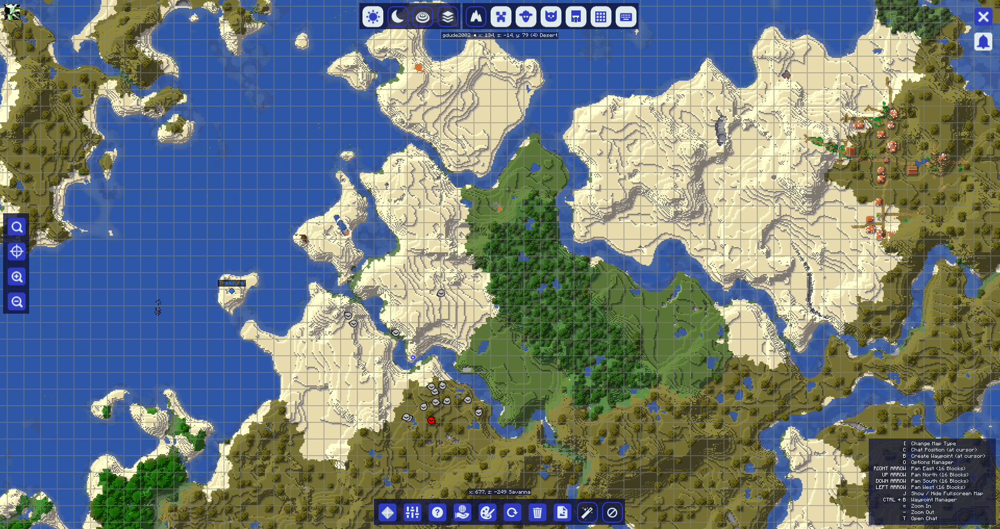

## **Basic Usage**

Once you have JourneyMap [installed](installing.md), all you need to do is join a server or load up a single-player world.

For the most part, JourneyMap works right out of the box. All you need to do to start mapping your world is to begin exploring it! The area around you will be mapped automatically as you travel, and will be visible in each of the three types of map that JourneyMap supports.

## **Key Mappings**

The following key mappings are available by default when you’re playing on a world or multiplayer server.

- ++j++ - Show/hide the full-screen map
- ++ctrl+j++ - Show/hide the minimap
- ++equal+minus++ - Zoom the minimap in and out respectively
- ++bracket-left++ - Cycle the map type shown in the minimap
- ++bar++ - Switch between minimap presets
- ++b++ - Create [a waypoint](waypoints.md) where you’re currently standing
- ++ctrl+b++ - Open the [waypoint manager](waypoints.md) (this conflicts with the narrator keybind, so you may want to change or disable that)
- ++z++ - Toggle the visibility of all waypoints

All keys specified in the documentation can be customized in Minecraft’s own settings. Just open the menu (by default, with the ++esc++ key), click on Options and then Controls, and you’ll see two new categories for all of JourneyMap’s keys.

## **Markers**

All map types contain markers. These markers denote various pieces of information - such as the position of an entity or [a waypoint](waypoints.md) on the map.

| Icon                                                          | Description                                                                    |
|---------------------------------------------------------------|--------------------------------------------------------------------------------|
| {: .center} | Your position on the map. *Note: This icon has a  white border ingame.*     |
| {: .center}           | [A waypoint](waypoints.md). The colour can be set in  the waypoint manager. |
| {: .center}     | [A death Waypoint](waypoints.md)                                               |

| Icon                                                                  | Description                                                                                      |
|-----------------------------------------------------------------------|--------------------------------------------------------------------------------------------------|
| {: .center}           | A marker denoting an entity on the map. The colour  of the marker denotes the type of entity. |
| {: .center} | An entity below you.                                                                             |
| {: .center}     | An entity above you.                                                                             |

| Icon                                                        | Description                       |
|-------------------------------------------------------------|-----------------------------------|
| {: .center}   | A neutral entity, like an animal. |
| {: .center} | A villager.                       |
| {: .center}   | Another player.                   |
| {: .center}     | A hostile entity, like a monster. |

Markers and their display can be customized in the [settings manager](settings/minimap.md).

## **The Minimap**

By default, the minimap will be displayed in the top-right corner of your screen.

{: .center}

This is your minimap. By default, it displays the area around your character, as well as some basic information and the positions of your character, other players, animals and monsters.

The minimap can be zoomed in and out at any time by pressing either of the zoom keys (by default, the ++equal++ and ++minus++ keys).

The four lines of text above and below the minimap are known as info slots. By default, they show (in order):

- The current time in real world
- The current time ingame
- The coordinate of your character
- The current biome your character is in

The minimap and its info slots may be customized in the [settings manager](settings/minimap.md).

## **The Full-Screen Map**

By pressing the full-screen map key (by default, the J key), you can open the full-screen map.

{: .center}

This map gives you a scrollable view of all the areas of the map you’ve explored so far, displayed as it was when you discovered them. It also provides access to JourneyMap’s Settings and a number of map display options.

For more information on the full-screen map, please see the [full-screen map page](settings/full-screen-map.md).

## **The Webmap**

Once enabled in the [settings manager](settings/webmap.md), the webmap allows you to view and explore your generated map in a web browser, including accessing it from another device (such as a phone or tablet). This will work as long as the game is running.

{: .center}

For more information on the webmap map, please see [the webmap page](settings/webmap.md).
