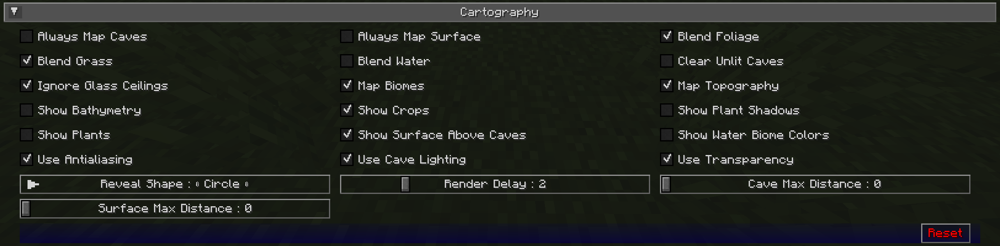

# **Cartography Settings**

The cartography settings allow you to customize how the map is rendered, and what is shown on it.

{: .center}

## **Toggles**

The **bold** toggle settings below are enabled by default.

| Toggle                       | Description                                                                                                     |
|------------------------------|-----------------------------------------------------------------------------------------------------------------|
| Always Map Caves             | Whether to map caves below you when you’re on the surface                                                       |
| Always Map Surface           | Whether to map the surface above you when you’re in caves                                                       |
| **Blend Foliage**            | Whether to apply biome colours to foliage                                                                       |
| **Blend Grass**              | Whether to apply biome colours to grass                                                                         |
| Blend Water                  | Whether to apply biome colours to water                                                                         |
| Clear Unlit Caves            | Unlit and inner slice blocks are rendered clear instead of black. This option only effects newly mapped blocks. |
| **Ignore Glass Ceilings**    | Whether to remain in surface mode when under a glass ceiling                                                    |
| **Map Biomes**               | Whether to show biome colours on the map                                                                        |
| **Map Topography**           | Whether to generate a contour map that shows elevation                                                          |
| Show Bathymetry              | Whether to show underwater terrain on the map                                                                   |
| **Show Crops**               | Whether to show crops on the map                                                                                |
| Show Plant Shadows           | Whether to plants and crops should cast shadows on the map                                                      |
| Show Plants                  | Whether to show plants on the map                                                                               |
| **Show Surface Above Caves** | Whether to show a dimmed view of the surface when in cave mode                                                  |
| Show Water Biome Colours     | Whether to show water colours based on biomes                                                                   |
| **Use Antialiasing**         | Whether to use anti-aliasing to improve the shading effect used to show elevation                               |
| **Use Cave Lighting**        | Whether to show lights underground - disable for a fully bright map                                             |
| **Use Transparency**         | Whether transparent blocks should reveal what’s below them on the map                                           |

## **Other Settings**

The default option for each setting below is marked with **bold text.**

| Setting              | Options                                     | Description                                                                                                                                                                           |
|----------------------|---------------------------------------------|---------------------------------------------------------------------------------------------------------------------------------------------------------------------------------------|
| Reveal Shape         | <ul><li>Square</li><li>**Circle**</li></ul> | Whether to reveal chunks in a circle or square - circle reveals show fewer chunks at once, and so perform better                                                                      |
| Render Delay         | Range: 0 - 10 (in seconds, Default: **2**)  | How often JourneyMap should try to render the chunks around you - Higher values can result in better performance, but may result in chunks being missed when traveling at high speed |
| Cave Max Distance    | Range: 0 - 32 (in chunks, Default: **0**)   | The maximum distance within which to attempt to render the map while in a cave - if you set this higher than your render distance, then this will use that instead                    |
| Surface Max Distance | Range: 0 - 32 (in chunks, default: **0**)   | The maximum distance within which to attempt to render the map while above ground -if you set this higher than your render distance, then this will use that instead                  |
