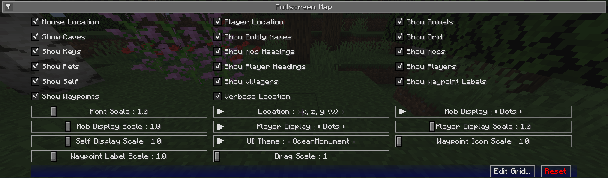

# **Full-Screen Map Settings**

The full-screen map provides a large, scrollable view of your entire map. Just like the minimap presets, it can be
customized to a great deal.

To switch open the full-screen map, press the full-screen map key (the ++j++ key by default).

{: .center}

!!! note "Note"

    A handful of the following options are also available as buttons on the full-screen map view itself. For more information on this, please see the [full-screen map page](../full-screen-map.md).

## **Toggles**

By default, all of the following toggle settings are enabled.

| Toggle               | Description                                                             |
|----------------------|-------------------------------------------------------------------------|
| Mouse Location       | Show mouse block location above buttons                                 |
| Player Location      | Show player location below top buttons                                  |
| Show Animals         | Show or hide animals on the map                                         |
| Show Caves           | Toggle automatically switching to cave mode when underground or indoors |
| Show Entity Names    | Show or hide entity names on the map                                    |
| Show Grid            | Show or hide the grid overlay on the map                                |
| Show Keys            | Show or hide the key bindings and descriptions on the map               |
| Show Mob Headings    | Toggle showing which way mobs are facing on the map                     |
| Show Mobs            | Show or hide mobs on the map                                            |
| Show Pets            | Show or hide pets on the map                                            |
| Show Player Headings | Toggle showing which way other players are facing on the map            |
| Show Players         | Show or hide other players on the map                                   |
| Show Self            | Show or hide your own location and heading on the map                   |
| Show Villagers       | Show or hide villagers on the map                                       |
| Show Waypoint Labels | Show or hide the names of waypoints on the map                          |
| Show Waypoints       | Show or hide all waypoints on the map                                   |
| Verbose Location     | Toggle between a long or short form of your current coordinates         |

## **Other Settings**

The default option for each setting below is marked with **bold** text.

| Setting              | Options                                                                                                                                                  | Description                                                                                                                                                    |
|----------------------|----------------------------------------------------------------------------------------------------------------------------------------------------------|----------------------------------------------------------------------------------------------------------------------------------------------------------------|
| Font Scale           | <ul><li>Range: 0.5 - 5 **Default is 1**</li></ul>                                                                                                        | The font scale for labels and text                                                                                                                             |
| Location             | <ul><li>**x, z, y (v)**</li><li>x, y, (v), z</li><li>x, z, y</li><li>x, y, z</li><li>x, z</li></ul>                                                      | The format of your coordinates, as shown on the map.                                                                                                           |
| Mob Display          | <ul><li>**Dots**</li><li>Icons</li></ul>                                                                                                                 | How mobs should be displayed on the map.                                                                                                                       |
| Mob Display Scale    | <ul><li>Range: 0.01 - 5  **Default is 1**</li></ul>                                                                                                   | The scale of Mob icons and dots on the map.                                                                                                                    |
| Player Display       | <ul><li>**Dots**</li><li>Icons</li></ul>                                                                                                                 | How other players should be displayed on the map.                                                                                                              |
| Player Display Scale | <ul><li>Range: 0.01 - 5  **Default is 1**</li></ul>                                                                                                   | The scale of Player icons and dots on the map.                                                                                                                 |
| Self Display Scale   | <ul><li>Range: 0.01 - 5  **Default is 1**</li></ul>                                                                                                   | The scale of your own icon on the map.                                                                                                                         |
| UI Theme             | <ul><li>**OceanMonument**</li><li>Desert Temple</li><li>EndCity</li><li>ForestMansion</li><li>NetherFortress</li><li>Purist</li><li>Stronghold</li></ul> | Change the theme of the buttons around the fullscreen map - **Note**: If you have extra themes installed, there will be more to toggle through than shown here |
| Waypoint Icon Scale  | <ul><li>Range: 1 - 5  **Default is 1**</li></ul>                                                                                                      | The scale of waypoint icons on the map.                                                                                                                        |
| Waypoint Label Scale | <ul><li>Range: 0.5 - 5  **Default is 1**</li></ul>                                                                                                    | The font scale for waypoint labels on the map.                                                                                                                 |
| Drag Scale           | <ul><li>Range: 1 - 5  **Default is 1**</li></ul>                                                                                                      | Custom drag scale, higher number slows it down. This is useful when your OS does display scaling, primarily OSX retina displays.                               |
