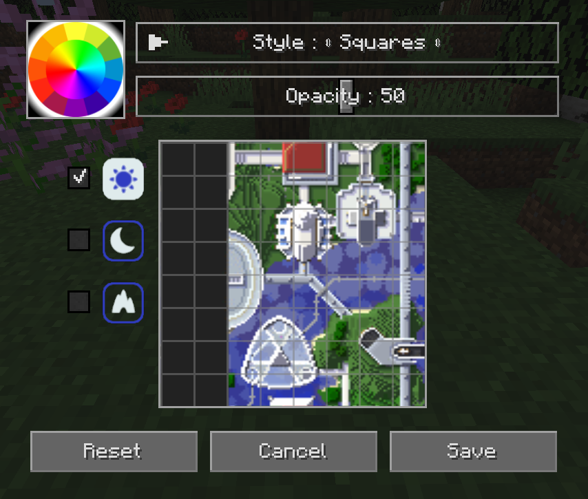

# **Grid Settings**

Both minimap presets and the full-screen map may have a configurable grid overlay. You can customize this overlay by clicking on the Edit Grid… button below the settings in each respective category.

You can also reach this from the full-screen map by holding the ++shift++ key and clicking on the grid button at the top.

{: .center}

The grid outlines individual chunks on the map. Grid styles that include region lines will draw an extra grid with differently-coloured lines to outline world regions on the map.

- Select a colour for the grid lines by clicking on the colour wheel.
- Select the map type (day, night or caves) to edit on the left side.
- Click the **Reset** button to reset the current map type to the default grid settings.
- Click the **Cancel** button to discard your changes and close the grid editor.
- Click the **Save** button to save your changes and close the grid editor.

| Setting | Options                                                    | Description                                 |
|---------|------------------------------------------------------------|---------------------------------------------|
| Style   | **Squares**, SquaresWithRegion, GridRegion, Dots, Checkers | Change the type of grid overlaid on the map |
| Opacity | Percentage: 0 - 100  **Default is 50**                  | How opaque the grid should be drawn         |
