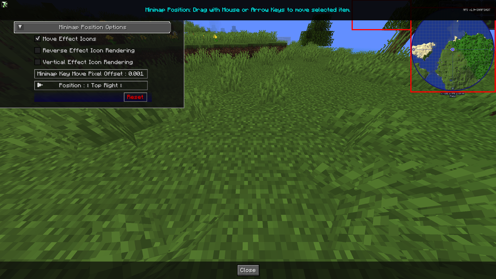

# **Minimap Position Settings**

JourneyMap allows you configure the placement for both the effect icons and the actual minimap. This allows you as a user to move the minimap and the effect icons wherever you want on the screen

{: .center}

## **Toggles**

The **bold** toggle settings below are enabled by default.

| Toggle                         | Description                                                                   |
|--------------------------------|-------------------------------------------------------------------------------|
| **Move Effect Icons**          | Enables moving the potion effects away from the minimap.                      |
| Reverse Effect Icon Rendering  | Reversed Rendering of Icons. Vertical bottom to top, Horizontal left to right |
| Vertical Effect Icon Rendering | Vertical Rendering of the icons first from top to bottom.                     |

## **Other Settings**

The default option for each setting below is marked with **bold** text.

| Setting                       | Options                                                                                                                                    | Description                                                                                                                |
|-------------------------------|--------------------------------------------------------------------------------------------------------------------------------------------|----------------------------------------------------------------------------------------------------------------------------|
| Minimap Key Move Pixel Offset | <ul><li>Range: 0.001 - 0.025  **Default is 0.001**</li></ul>                                                                            | When moving the minimap with arrow keys, this option controls how may pixels per key press to help fine tune the location. |
| Position                      | <ul><li>**Top Right**</li><li>Bottom Right</li><li>Bottom Left</li><li>Top Left</li><li>Top Center</li><li>Center</li><li>Custom</li></ul> | Set to **Custom** to drag the minimap to your desired location.                                                            |
