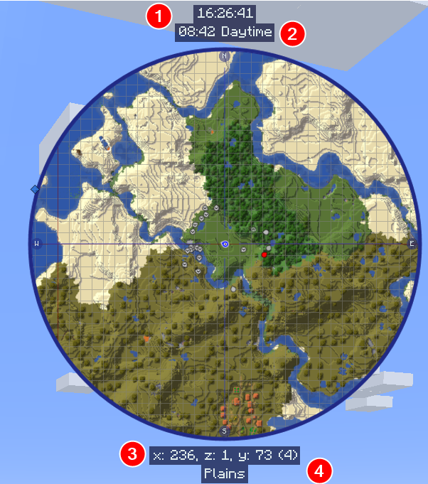

# **Minimap Settings**

JourneyMap allows you to have two minimap presets. Each preset represents a separate set of settings - essentially allowing you to have two distinct minimaps available to switch between.

!!! note "Note"

    The settings for each minimap are identical, so we’ll only cover a single preset below.

To switch between minimap presets, press the switch minimap preset key (the ++backslash++ key by default).

{: .center}

## **Toggles**

By default, all of the following toggle settings are enabled.

| Toggle               | Description                                                       |
|----------------------|-------------------------------------------------------------------|
| Enable Minimap       | Enable or disable this minimap preset                             |
| Show Animals         | Show or hide animals                                              |
| Show Caves           | Toggle automatically switching to cave mode                       |
| Show Compass         | Toggle showing compass points around the edge of the minimap      |
| Show Day/Night       | Toggle automatically switching between day and night mode         |
| Show Entity Names    | Show or hide entity names                                         |
| Show Grid            | Show or hide the grid overlay                                     |
| Show Mob Headings    | Toggle showing which way mobs are facing                          |
| Show Mobs            | Show or hide mobs                                                 |
| Show Pets            | Show or hide pets                                                 |
| Show Player Headings | Toggle showing which way other players are facing                 |
| Show Players         | Show or hide other players                                        |
| Show Reticle         | Show or hide midpoint lines pointing to the center of the minimap |
| Show Self            | Show or hide your own location and heading                        |
| Show Villagers       | Show or hide villagers                                            |
| Show Waypoint Labels | Show or hide the names of waypoints                               |
| Show Waypoints       | Show or hide all waypoints                                        |
| Verbose Location     | Toggle between a long or short form of your current coordinates   |

## **Info Slots**

Info slots are text areas above and below the minimap that show extra contextual information. There are four of them,
numbered from top to bottom.

{: .center}

All info slots can be set to one of the following:

- **Blank**: Nothing, hide this info slot
- **Biome**: The biome you're currently in
- **Dimension**: The dimension you're currently in
- **FPS**: The game's FPS counter
- **Game Time**: The current ingame time, as represented by Minecraft's daylight cycle
- **Game Time Real**: The current ingame time, shifted to match a real clock
- **Light Level**: The light level of the block you're standing in
- **Location**: Your current coordinates
- **Region**: Your current region coordinates
- **System Time**: The current real time, according to your computer

## **Other Settings**

The default option for each setting below is marked with **bold** text.

| Setting                      | Options                                                                                                                                                                                                  | Description                                                                                         |
|------------------------------|----------------------------------------------------------------------------------------------------------------------------------------------------------------------------------------------------------|-----------------------------------------------------------------------------------------------------|
| Compass Font Scale           | <ul><li>Range: 0.5 - 4 **Default is 1**</li></ul>                                                                                                                                                        | The font scale used for compass point labels                                                        |
| Font Scale                   | <ul><li>Range: 0.5 - 5 **Default is 1**</li></ul>                                                                                                                                                        | The font scale for labels and text                                                                  |
| Info Slot Background Opacity | <ul><li>Range: 0 - 1  **Default is 0.7**</li></ul>                                                                                                                                                    | Adjust the opacity of the Info Slot background.                                                     |
| Location                     | <ul><li>**x, z, y (v)**</li><li>x, y, (v), z</li><li>x, z, y</li><li>x, y, z</li><li>x, z</li></ul>                                                                                                      | The format of your coordinates, as shown on the map.                                                |
| Map Background Opacity       | <ul><li>Range: 0 - 1  **Default is 0.8**</li></ul>                                                                                                                                                    | Adjust how opaque the MiniMap frame is (as a percentage)                                            |
| Map Heading                  | <ul><li>**North**</li><li>Old North</li><li>My Heading</li></ul>                                                                                                                                         | The orientation (rotation) of the MiniMap. Note: Only Circle supports the "My Heading" Map Heading. |
| Mob Display                  | <ul><li>**Dots**</li><li>Icons</li></ul>                                                                                                                                                                 | How mobs should be displayed on the map.                                                            |
| Mob Display Scale            | <ul><li>Range: 0.01 - 5  **Default is 1**</li></ul>                                                                                                                                                   | The scale of Mob icons and dots on the map.                                                         |
| Player Display               | <ul><li>**Dots**</li><li>Icons</li></ul>                                                                                                                                                                 | How other players should be displayed on the map.                                                   |
| Player Display Scale         | <ul><li>Range: 0.01 - 5  **Default is 1**</li></ul>                                                                                                                                                   | The scale of Player icons and dots on the map.                                                      |
| Real Game Time Format        | <ul><li>**HH:mm:ss**</li><li>H:mm:ss</li><li>HH:mm</li><li>H:mm</li><li>hh:mm:ss a</li><li>h:mm:ss a</li><li>hh:mm:ss</li><li>h:mm:ss</li><li>h:mm a</li><li>h:mm a</li><li>hh:mm</li><li>h:mm</li></ul> | The text format of the real game time, as shown in an info slot.                                    |
| Reticle Heading              | <ul><li>**Compass**</li><li>My Heading</li></ul>                                                                                                                                                         | Change the orientation of the reticle.                                                              |
| Self Display Scale           | <ul><li>Range: 0.01 - 5  **Default is 1**</li></ul>                                                                                                                                                   | The scale of your own icon on the map.                                                              |
| Shape                        | <ul><li>**Circle**</li><li>Square</li><li>Rectangle</li></ul>                                                                                                                                            | Change the shape of the minimap.                                                                    |
| System Time Format           | <ul><li>**HH:mm:ss**</li><li>H:mm:ss</li><li>HH:mm</li><li>H:mm</li><li>hh:mm:ss a</li><li>h:mm:ss a</li><li>hh:mm:ss</li><li>h:mm:ss</li><li>h:mm a</li><li>h:mm a</li><li>hh:mm</li><li>h:mm</li></ul> | The text format of the system time, as shown in an info slot.                                       |
| Waypoint Icon Scale          | <ul><li>Range: 1 - 5  **Default is 1**</li></ul>                                                                                                                                                      | The scale of waypoint icons on the map.                                                             |
| Waypoint Label Scale         | <ul><li>Range: 0.5 - 5  **Default is 1**</li></ul>                                                                                                                                                    | The font scale for waypoint labels on the map.                                                      |
| Frame Opacity                | <ul><li>Range 0 - 100  **Default is 100**</li><ul>                                                                                                                                                    | How opaque the frame around the outside of the minimap should be                                    |
| Map Opacity                  | <ul><li>Range 0 - 100  **Default is 100**</li><ul>                                                                                                                                                    | How opaque the map view itself should be                                                            |
| Size                         | <ul><li>Range 0 - 100  **Default is 30**</li><ul>                                                                                                                                                     | How large the minimap should be, as a percentage of the window size                                 |
