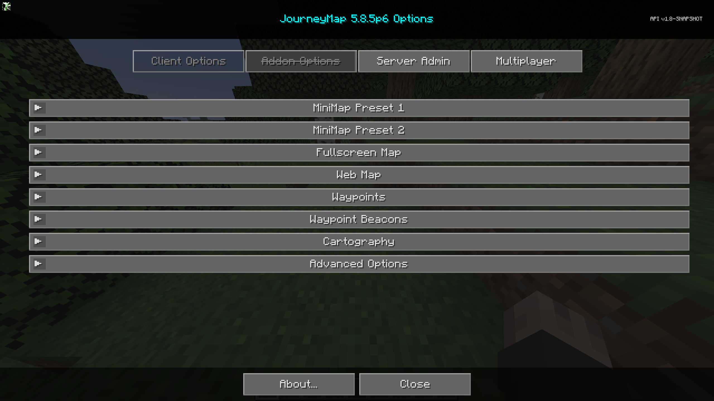

# **Settings**

JourneyMap provides more than a few configuration options, allowing you to customize the behaviour and appearance of many different aspects of the mod. All of these settings are made available through the settings manager.

{: .center}

To get to the settings manager, open the full-screen map and click the settings button at the bottom, or press the ++o++ key. Each entry in the list represents a specific category of settings - click on it to expand and see the settings within.

!!! note "Note"

    Each category has a Reset button. Please note that pressing this button will reset the settings in that category to the default settings bundled with JourneyMap, instead of simply discarding your changes.
