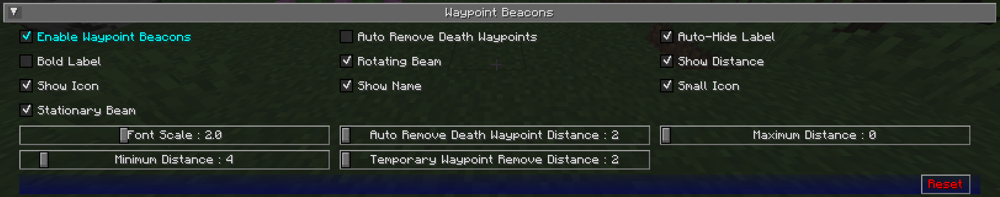

# **Waypoint Beacon Settings**

By default, waypoints are displayed in the world using a beacon beam in the distance, which allows you to see where they are from anywhere in the world. You can look towards the beam and see the waypoint’s icon and label as well. This behaviour can be customized below.

{: .center}

## **Toggles**

The **bold** toggle settings below are enabled by default.

| Toggle                      | Description                                                |
|-----------------------------|------------------------------------------------------------|
| **Enable Waypoint Beacons** | Show in-game beacons of your waypoints                     |
| Auto Remove Death Waypoints | Automatically remove death waypoints as you approach them  |
| **Auto-Hide Label**         | Hide Waypoint Labels when you are not looking towards them |
| Bold Label                  | Use bold waypoint labels on beacons                        |
| **Rotating Beam**           | Use a rotating outer beam for waypoint beacons             |
| **Show Distance**           | Show the distance to the waypoint on its label             |
| **Show Icon**               | Show the icon of a waypoint with its beacon                |
| **Show Name**               | Show the name of a waypoint in its beacon                  |
| **Small Icon**              | Use a small icon for waypoint beacons                      |
| **Stationary Beam**         | Use a stationary inner beam for waypoint beacons           |

## **Other Settings**

The default option for each setting below is marked with **bold text.**

| Setting                              | Options                                                  | Description                                                         |
|--------------------------------------|----------------------------------------------------------|---------------------------------------------------------------------|
| Font Scale                           | <ul><li>Range: 0.5 - 5  **Default is 1**</li></ul>    | The font scale for labels and text                                  |
| Auto Remove Death Waypoints Distance | <ul><li>Range: 2 - 64  **Default is 2**</li></ul>     | The distance to death waypoints to automatically remove them        |
| Maximum Distance                     | <ul><li>Range: 0 - 100000  **Default is 0**</li></ul> | The maximum distance to show waypoints at                           |
| Minimum Distance                     | <ul><li>Range: 0 - 64  **Default is 4**</li></ul>     | The minimum distance to show waypoints at                           |
| Temporary Waypoint Remove Distance   | <ul><li>Range: 0 - 64  **Default is 0**</li></ul>     | The distance from player when temporary waypoints are auto removed. |
