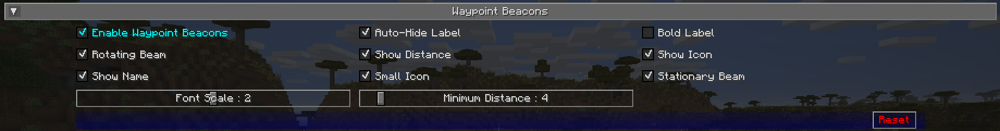

## **Waypoint Beacon Settings**

By default, waypoints are displayed in the world using a beacon beam in the distance, which allows you to see where they
are from anywhere in the world. By default, you can look towards the beam and see the waypoint’s icon and label as well.
This behaviour can be customized below.

{: .center}

## **Toggles**

The **bold** toggle settings below are enabled by default.

| Toggle                       | Description                                                                       |
|------------------------------|-----------------------------------------------------------------------------------|
| Always Map Caves             | Whether to map caves below you when you’re on the surface                         |
| Always Map Surface           | Whether to map the surface above you when you’re in caves                         |
| **Blend Foliage**            | Whether to apply biome colours to foliage                                         |
| Blend Grass                  | Whether to apply biome colours to grass                                           |
| Blend Water                  | Whether to apply biome colours to water                                           |
| **Ignore Glass Ceilings**    | Whether to remain in surface mode when under a glass ceiling                      |
| **Map Topography**           | Whether to generate a contour map that shows elevation                            |
| Show Bathymetry              | Whether to show underwater terrain on the map                                     |
| **Show Crops**               | Whether to show crops on the map                                                  |
| Show Plant Shadows           | Whether to plants and crops should cast shadows on the map                        |
| Show Plants                  | Whether to show plants on the map                                                 |
| **Show Surface Above Caves** | Whether to show a dimmed view of the surface when in cave mode                    |
| **Use Antialiasing**         | Whether to use anti-aliasing to improve the shading effect used to show elevation |
| **Use Cave Lighting**        | Whether to show lights underground - disable for a fully bright map               |
| **Use Transparency**         | Whether transparent blocks should reveal what’s below them on the map             |

## **Other Settings**

The default option for each setting below is marked with **bold text.**

| Setting                              | Options                                                  | Description                                                         |
|--------------------------------------|----------------------------------------------------------|---------------------------------------------------------------------|
| Font Scale                           | <ul><li>Range: 0.5 - 5  **Default is 1**</li></ul>    | The font scale for labels and text                                  |
| Auto Remove Death Waypoints Distance | <ul><li>Range: 2 - 64  **Default is 2**</li></ul>     | The distance to death waypoints to automatically remove them        |
| Maximum Distance                     | <ul><li>Range: 0 - 100000  **Default is 0**</li></ul> | The maximum distance to show waypoints at                           |
| Minimum Distance                     | <ul><li>Range: 0 - 64  **Default is 4**</li></ul>     | The minimum distance to show waypoints at                           |
| Temporary Waypoint Remove Distance   | <ul><li>Range: 0 - 64  **Default is 0**</li></ul>     | The distance from player when temporary waypoints are auto removed. |
