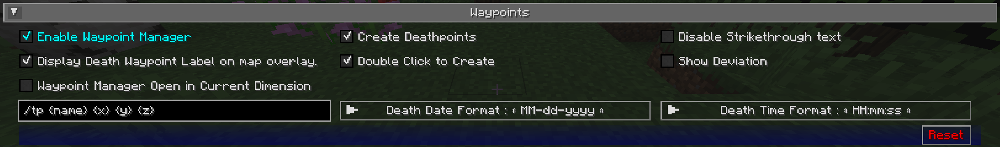

# **Waypoint Settings**

This category allows you to change some settings relating to how [waypoints](../waypoints.md) behave and are displayed.
Waypoints also have a number of individual settings - you can find out about those
on [the waypoints page.](../waypoints.md)

{: .center}

## **Toggles**

The **bold** toggle settings below are enabled by default.

| Toggle                                              | Description                                                                                       |
|-----------------------------------------------------|---------------------------------------------------------------------------------------------------|
| **Enable Waypoint Manager**                         | Enable the waypoint manager - you can disable this if you use another  mod to manage waypoints |
| **Create Deathpoints**                              | Whether death waypoints should be created when you die                                            |
| Disable Strikethrough text                          | Disables the strike through of the waypoint text                                                  |                                                 |
| **Display Death Waypoint Label  on map overlay** | Whether to show the name for death waypoints on your minimap and  full-screen map              |
| **Double click to create**                          | Double clicking on the fullscreen map will create a waypoint at the location                      |
| Show Deviation                                      | Show the vector deviation between player and waypoint                                             |
| Waypoint Manager Open in Current Dimension          | Opens the waypoint manager in the current dimension                                               |

## **Other Settings**

The default option for each setting below is marked with **bold text.**

| Setting                          | Options                                                                                                                                                                                                  | Description                                                                                                                                                                                                                                                                                                                                                                                                                                                                         |
|----------------------------------|----------------------------------------------------------------------------------------------------------------------------------------------------------------------------------------------------------|-------------------------------------------------------------------------------------------------------------------------------------------------------------------------------------------------------------------------------------------------------------------------------------------------------------------------------------------------------------------------------------------------------------------------------------------------------------------------------------|
| Custom Waypoint Teleport Command | Text input: **/tp {name} {x} {y} {z}**                                                                                                                                                                   | The teleport command that should be used when you teleport to a waypoint, using the following placeholders: <ul><li>**{name}**: Your player name</li><li>**{dim}**: The target dimension</li><li>**{x}**: The waypoint's X coordinate</li><li>**{y}**: The waypoint's Y coordinate</li><li>**{z}**: The waypoint's Z coordinate</li></ul> This setting is ignored in single player or if JourneyMap is installed on a server; teleportation happens without a command in that case. |
| Death Date Format                | <ul><li>**MM-dd-yyyy**</li><li>MM-dd-yy</li><li>dd-MM-yyyy</li><li>dd-MM-yy</li><li>yyyy-MM-dd</li><li>yy-MM-dd</li></ul>                                                                                | The text format of the date of death, as shown in the death waypoint label <ul><li>**dd**: Day</li><li>**MM**: Month</li><li>**yy**: Year (2 digits)</li><li>**yyyy**: Year (4 digits)</li></ul>                                                                                                                                                                                                                                                                                    |
| Death Time Format                | <ul><li>**HH:mm:ss**</li><li>H:mm:ss</li><li>HH:mm</li><li>H:mm</li><li>hh:mm:ss a</li><li>h:mm:ss a</li><li>hh:mm:ss</li><li>h:mm:ss</li><li>h:mm a</li><li>h:mm a</li><li>hh:mm</li><li>h:mm</li></ul> | The text format of the time of death, as shown in the death waypoint label                                                                                                                                                                                                                                                                                                                                                                                                          |
