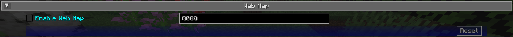

# **Webmap Settings**

The webmap is an entirely different way to view your map - in a web browser instead of from directly within Minecraft. This allows you to have a map view visible on another screen, or even another device!

{: .center}

!!! info "Important"

    There are a lot of settings in this category that don’t do anything at the moment. Instead, the webmap is configured using its own interface - see the webmap page for more information on this.

    Because of this, only the settings that actually do anything are documented below.

## **Toggles**

By default, **none** of the following toggle settings are enabled. You will need to enable the webmap before you can use it.

| Toggle         | Description                                         |
|----------------|-----------------------------------------------------|
| Enable Web Map | Whether the webmap should be enabled and accessible |

!!! note "Note"

    While there is an input to provide a port for the webmap to use, it is currently ignored. JourneyMap will attempt to use port 8080 by default - if that isn’t available, it’ll attempt to find a port that is.

    The correct port is always shown in chat when the webmap is enabled.
