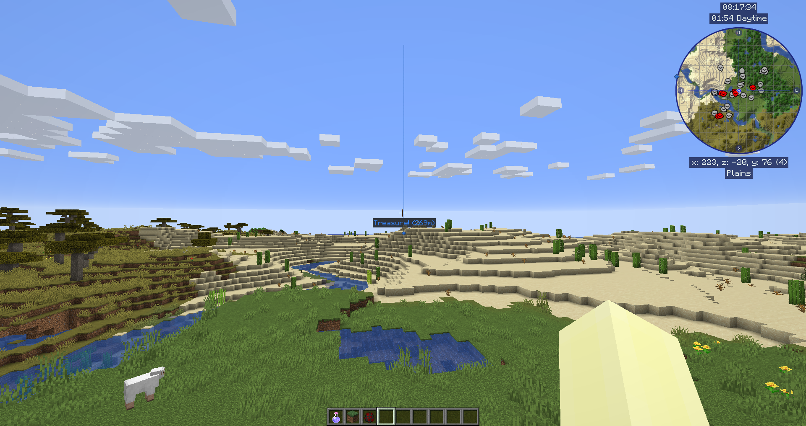

# **Waypoints**

Waypoints allow you to mark specific locations on your map, in order to keep track of those locations or easily find your way back to them later.

Additionally, death waypoints are created when, for example, you’re blown off the edge of a cliff by [a trumpet-wielding skeleton](https://www.curseforge.com/minecraft/mc-mods/trumpet-skeleton-redooted).

By default, they’re shown using a coloured beacon beam, and the name and icon for the waypoint will be displayed when you look towards it - but this behavior can be changed in the [settings manager](settings/overview.md). Death waypoints may also be disabled there, if preferred.

!!! warning "Warning"

    If you’re using OptiFine, it’s likely that you won’t be able to see waypoints in the world. We’re not sure what causes this. For more information, please see our our troubleshooting page.

{: .center}

You can create waypoints using one of the following methods:

- By pressing ++b++ ingame to create one where you’re standing
- By double-clicking or pressing ++b++ in the [full-screen map](full-screen-map.md) to create a waypoint at the cursor
- By opening the waypoint manager and manually creating a waypoint

## **Waypoint Management**

The waypoint manager provides a single place for - as you may expect - managing your waypoints. You can open it in the following ways:

- By pressing ++ctrl+b++ ingame
- By opening the [full-screen map](full-screen-map.md) and clicking on the waypoint manager button at the bottom

{: .center}

The waypoint manager gives you a list of all of your waypoints, and provides some options to manage them. At the bottom are the following buttons:

- **Options**: Open the [settings manager](settings/overview.md)
- **New**: Create a new waypoint
- **Dimension**: Filter shown waypoints based on dimension
- **Close**: Close the waypoint manager

Each waypoint has the following options available:

- **Teleport**: If allowed by the server, teleport directly to the waypoint
- **Find**: Find the waypoint on the [full-screen map](full-screen-map.md)
- **On/Off**: Toggle the waypoint’s visibility ingame
- **Remove**: Delete the waypoint
- **Edit**: Open the waypoint editor
- **Chat**: Copy the waypoint’s information to the chat box, as shown:
{: .center}

## **Editing Waypoints**

When creating or editing a waypoint, the following screen is shown:

{: .center}

The waypoint editor provides the following settings for each waypoint:

- **Name**: This display name for the waypoint
- **Location**: The position for this waypoint
- **Dimensions**: Toggles for the dimensions the waypoint should be enabled within
- **Enabled**: Whether this waypoint is enabled and should be visible
- **Colour**: The waypoint’s color, given as red, green and blue values

You can also click on the colour wheel to pick a colour, or click on the Random Colour button to get a new colour

Here’s what each of the other buttons do:

- **Remove**: Delete the waypoint entirely
- **Reset**: Undo your edits to the current waypoint
- **Save**: Save the changes you’ve made to the waypoint
- **Close**: Close the editor and discard your changes

## **Sharing Waypoints**

As of JourneyMap 5.2, you can now easily share waypoints and locations with other players on the server. The goal of this feature was to add convenience for everyone using JourneyMap, but not make it annoying for people who don't. If a player doesn't have JourneyMap, they will still see the location in their chat in a human-friendly format.

When a properly-formatted location appears in Minecraft's chat, you can either **click** on it (to create a waypoint) or **control-click** on it (to view the location in your Fullscreen map.)

## **Waypoint Commands**

In JourneyMap 5.8.5, a new command was added which allows you to create, delete and reload waypoints from the chat.

**Reload Waypoints**

- Reloads waypoints in the waypoint directory without having to restart.
- Primarily used when dropping waypoint files into the folder while the game is running.

```text
/jm reload
```

The create and delete commands are only available when the server has JourneyMap installed and if the player has op permissions. You can find more information about the add and delete commands [here](../Server%20Docs/Commands/waypoint_command.md).

## **How to Share Waypoints and Locations**

You can share Waypoints and locations in one of three ways:

1. In the Waypoint Manager, press the new **Chat** button next to a Waypoint.  The location will be pasted into the chat UI for you. Add some context if desired, then press Enter.  You can use this with /msg or server channels (if present).
2. In the chat UI, type <code>/jm ~</code> and press Enter.  The command will be replaced with your current location.  Add information or edit as needed, then press Enter.
3. In the chat UI, manually type in a location between square brackets.   See location format options below:

## **Location Format**

A location must minimally have the x and z coordinates, but any of the following is possible, and the order you use doesn't matter:

- [x:#, z:#]
- [x:#, y:#, z:#]
- [x:#, y:#, z:#, dim:#]
- [x:#, y:#, z:#, dim:#, name:text]
- [ name:text, dim:#, x:#, z:#, y:#]

A location consists of 2 or more ''name:value'' pairs, separated with commas.  Any of the following values is supported:

- x (integer) **required**
- y (integer)
- z (integer) **required**
- dim (integer)
- name (string, no quotes, no commas)
