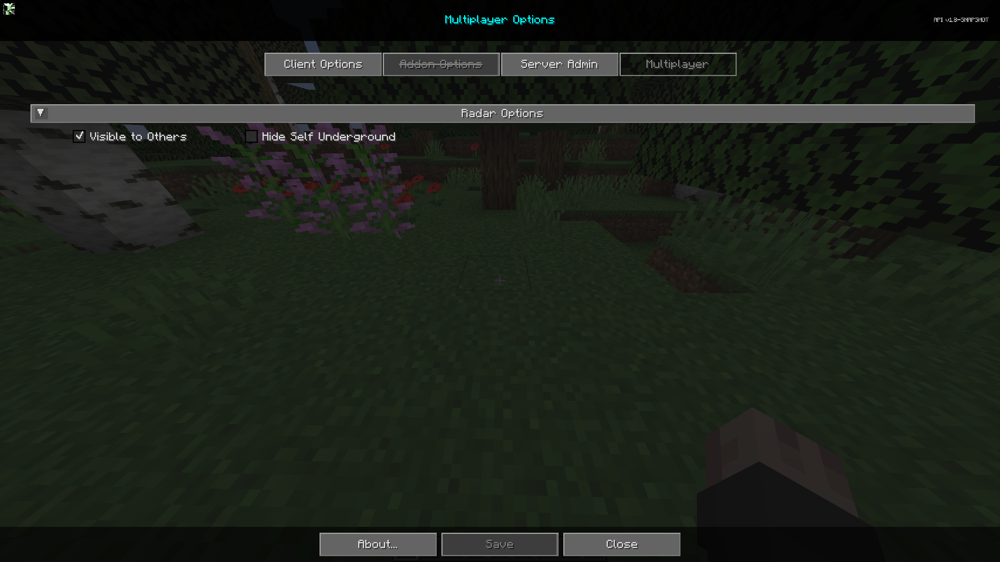

# **Settings**

The Multiplayer section is a section designed to give users control on how they are viewed on other clients using the JourneyMap mod, and how they are displayed on the map. This section is only unlocked when the server is running the JourneyMap mod and can be disabled by the server.

{: .center}

To get to the Multiplayer tab, open the full-screen map and click the settings button at the bottom, or press the ++o++ key. Finally at the top, click the Multiplayer tab to get to the multiplayer settings for the mod. Each entry in the list represents a specific category of settings - click on it to expand and see the settings within.

## **Radar Options**

The Radar Options section is a section to control how others see you on the map. Note, these options only work when expanded radar is enabled.

{: .center}

## **Toggles**

| Toggle                | Description                                                                                                                        |
|-----------------------|------------------------------------------------------------------------------------------------------------------------------------|
| Visible to Others     | Hide yourself from being seen on the map. Note: Ops can still see players even if they have disabled themselves from other's radar |
| Hide self underground | Disable others from seeing you when you're underground.                                                                            |
