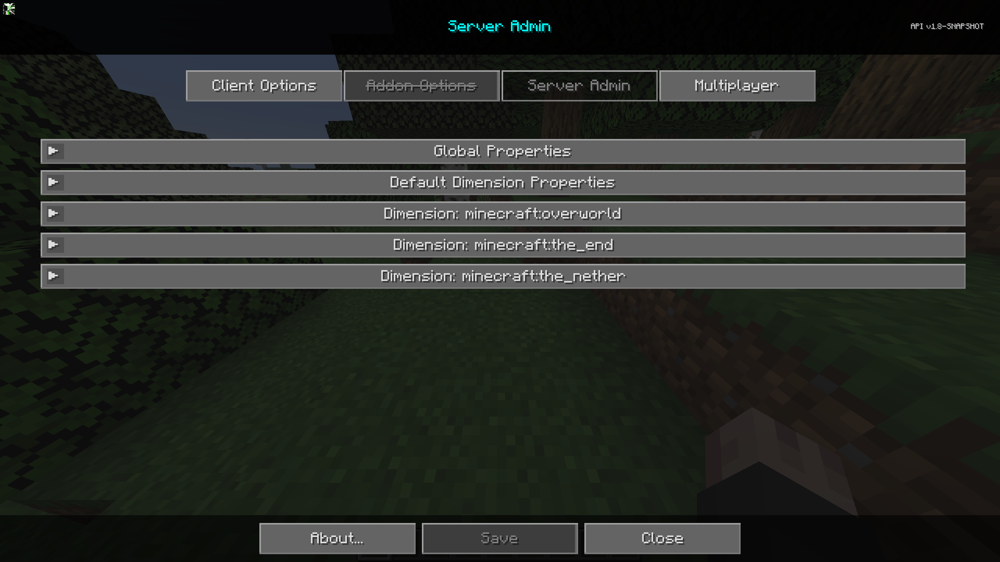
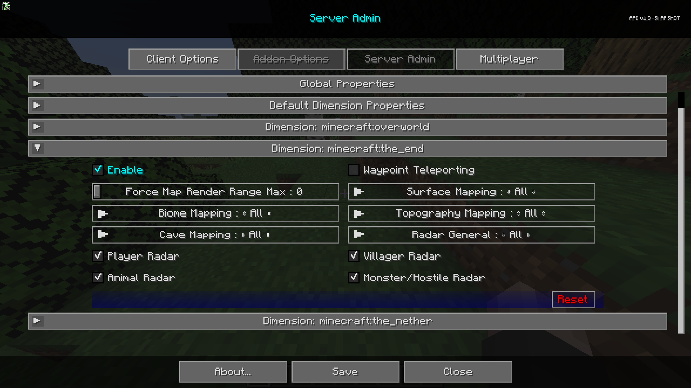
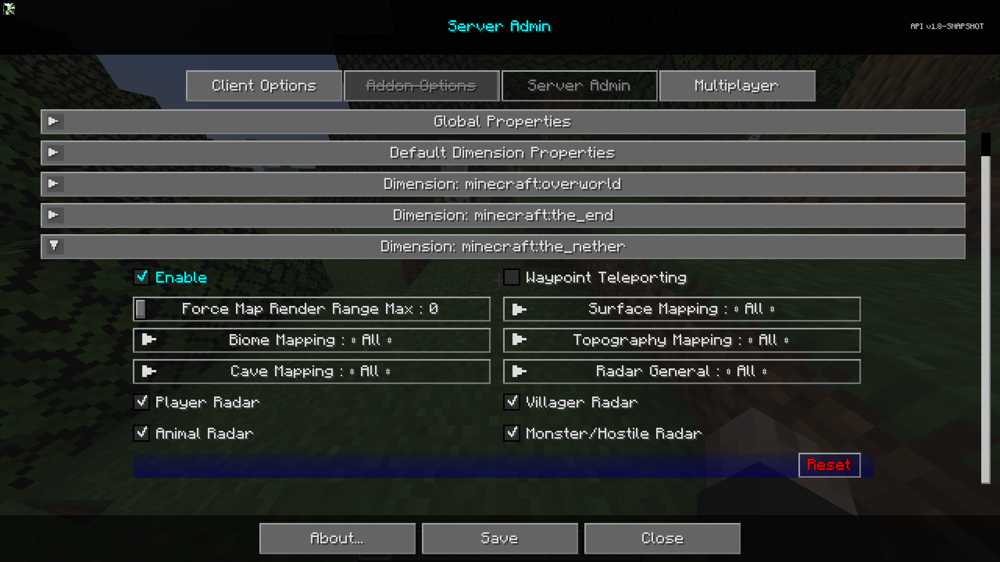

## **Settings**

JourneyMap Server provides a few configuration options, allowing you to customize the behaviour of clients connecting with the JourneyMap mod and many different aspects of the mod. All of these settings are made available through the Server Admin tab in the settings manager.

{: .center}

To get to the Server Admin tab, open the full-screen map and click the settings button at the bottom, or press the ++o++ key. Finally at the top, click the Server Admin tab to get to the server side settings for the mod. Each entry in the list represents a specific category of settings - click on it to expand and see the settings within.

!!! note "Note"

    Each category has a Reset button. Please note that pressing this button will reset the settings in that category to the default settings bundled with JourneyMap Server, instead of simply discarding your changes.

Some of these categories have quite a few settings. Feel free to skip to a specific category by clicking on the links on the right side.

## **Global Properties**

The Global Properties category contains settings that affect the server side behaviour of the mod. These are the default properties for the server.

{: .center}

## **Toggles**

| Toggle                  | Description                                                                                                                                                |
|-------------------------|------------------------------------------------------------------------------------------------------------------------------------------------------------|
| Allow JourneyMap        | Whether to allow journeymap to function for non-ops.                                                                                                       |
| World ID                | Enabling will change the save directory for this servers mapping data. If disabled and then enabling on an active server will reset all user mapping data. |
| Allow Server Admin View | Whether non op users can view server admin screen in read-only mode.                                                                                       |
| Hide Ops                | Hide Ops on radar when Expanded Radar is enabled.                                                                                                          |
| Allow Death Waypoints   | Whether to allow Death Waypoints to be created on user death.                                                                                              |
| Allow Waypoint Beacons  | Whether to allow rendering of In-Game beacons to render. (does not disable map waypoints)                                                                  |
| Allow Waypoints         | Whether to allow waypoints, fully disables map and in-game beacon rendering and associated screens.                                                        |
| Hide Spectators         | Whether to hide spectators on the radar.                                                                                                                   |
| Waypoint Teleporting    | Allows or prevents teleport teleporting via waypoint manager.                                                                                              |
| Player Radar            | If players can see other players on the map.                                                                                                               |
| Villager Radar          | If players can see villagers on the map.                                                                                                                   |
| Animal Radar            | If players can see animals on the map.                                                                                                                     |
| Monster/Hostile Radar   | If players can see monsters or hostile entities on the map.                                                                                                |

## **Other Settings**

The default option for each setting below is marked with **bold** text.

| Setting                    | Options                                           | Description                                                                                                                                              |
|----------------------------|---------------------------------------------------|----------------------------------------------------------------------------------------------------------------------------------------------------------|
| Expanded Radar             | <ul><li>**All**</li><li>Op</li><li>None</li></ul> | The format of your coordinates, as shown in an info slot                                                                                                 |
| Multiplayer Settings       | <ul><li>**All**</li><li>Op</li><li>None</li></ul> | Allow All players, Op players, or No players to use the multiplayer settings menu.                                                                       |
| Ticks per player update    | <ul><li>Range: 1 - 20 **Default is 5**</li></ul>  | How often the server will send player location updates.                                                                                                  |
| See underground players    | <ul><li>**All**</li><li>Op</li><li>None</li></ul> | Whether underground players are visible on the radar.                                                                                                    |
| Force Map Render Range Max | <ul><li>Range: 0 - 32 **Default is 0**</li></ul>  | Force all players to a maximum chunk render distance for the map.                                                                                        |
| Surface Mapping            | <ul><li>**All**</li><li>Op</li><li>None</li></ul> | Surface Mapping for All, Ops, None                                                                                                                       |
| Biome Mapping              | <ul><li>**All**</li><li>Op</li><li>None</li></ul> | Biome Mapping for All, Ops, None.                                                                                                                        |
| Topography Mapping         | <ul><li>**All**</li><li>Op</li><li>None</li></ul> | Topography Mapping for All, Ops, None.                                                                                                                   |
| Cave Mapping               | <ul><li>**All**</li><li>Op</li><li>None</li></ul> | Cave Mapping for All, Ops, None.                                                                                                                         |
| Radar General              | <ul><li>**All**</li><li>Op</li><li>None</li></ul> | <ul><li>All: Radar works for everyone</li><li>Op: Fully disables radar for everyone but OP users</li><li>None: Radar is disabled for everyone.</li></ul> |

## **Default Dimension Properties**

The Default Dimension Properties category contains settings that will be the default settings for all new dimensions created. These settings can be overridden on a per-dimension basis.

{: .center}

## **Toggles**

| Toggle                | Description                                                                                                                                                |
|-----------------------|------------------------------------------------------------------------------------------------------------------------------------------------------------|
| Enable                | Enabling this dimension will override the global properties for this dimension.                                                                            |
| Waypoint Teleporting  | Enabling will change the save directory for this servers mapping data. If disabled and then enabling on an active server will reset all user mapping data. |
| Player Radar          | If players can see other players on the map.                                                                                                               |
| Villager Radar        | If players can see villagers on the map.                                                                                                                   |
| Animal Radar          | If players can see animals on the map.                                                                                                                     |
| Monster/Hostile Radar | If players can see monsters or hostile entities on the map.                                                                                                |

## **Other Settings**

The default option for each setting below is marked with **bold** text.

| Setting                    | Options                                           | Description                                                                                                                                              |
|----------------------------|---------------------------------------------------|----------------------------------------------------------------------------------------------------------------------------------------------------------|
| Force Map Render Range Max | <ul><li>Range: 0 - 32 **Default is 0**</li></ul>  | Force all players to a maximum chunk render distance for the map.                                                                                        |
| Surface Mapping            | <ul><li>**All**</li><li>Op</li><li>None</li></ul> | Surface Mapping for All, Ops, None                                                                                                                       |
| Biome Mapping              | <ul><li>**All**</li><li>Op</li><li>None</li></ul> | Biome Mapping for All, Ops, None.                                                                                                                        |
| Topography Mapping         | <ul><li>**All**</li><li>Op</li><li>None</li></ul> | Topography Mapping for All, Ops, None.                                                                                                                   |
| Cave Mapping               | <ul><li>**All**</li><li>Op</li><li>None</li></ul> | Cave Mapping for All, Ops, None.                                                                                                                         |
| Radar General              | <ul><li>**All**</li><li>Op</li><li>None</li></ul> | <ul><li>All: Radar works for everyone</li><li>Op: Fully disables radar for everyone but OP users</li><li>None: Radar is disabled for everyone.</li></ul> |

## **Dimension: minecraft:overworld**

The Dimension: minecraft:overworld category contains settings that will be the default settings for the overworld dimension.

{: .center}

## **Toggles**

| Toggle                | Description                                                                                                                                                |
|-----------------------|------------------------------------------------------------------------------------------------------------------------------------------------------------|
| Enable                | Enabling this dimension will override the global properties for this dimension.                                                                            |
| Waypoint Teleporting  | Enabling will change the save directory for this servers mapping data. If disabled and then enabling on an active server will reset all user mapping data. |
| Player Radar          | If players can see other players on the map.                                                                                                               |
| Villager Radar        | If players can see villagers on the map.                                                                                                                   |
| Animal Radar          | If players can see animals on the map.                                                                                                                     |
| Monster/Hostile Radar | If players can see monsters or hostile entities on the map.                                                                                                |

## **Other Settings**

The default option for each setting below is marked with **bold** text.

| Setting                    | Options                                           | Description                                                                                                                                              |
|----------------------------|---------------------------------------------------|----------------------------------------------------------------------------------------------------------------------------------------------------------|
| Force Map Render Range Max | <ul><li>Range: 0 - 32 **Default is 0**</li></ul>  | Force all players to a maximum chunk render distance for the map.                                                                                        |
| Surface Mapping            | <ul><li>**All**</li><li>Op</li><li>None</li></ul> | Surface Mapping for All, Ops, None                                                                                                                       |
| Biome Mapping              | <ul><li>**All**</li><li>Op</li><li>None</li></ul> | Biome Mapping for All, Ops, None.                                                                                                                        |
| Topography Mapping         | <ul><li>**All**</li><li>Op</li><li>None</li></ul> | Topography Mapping for All, Ops, None.                                                                                                                   |
| Cave Mapping               | <ul><li>**All**</li><li>Op</li><li>None</li></ul> | Cave Mapping for All, Ops, None.                                                                                                                         |
| Radar General              | <ul><li>**All**</li><li>Op</li><li>None</li></ul> | <ul><li>All: Radar works for everyone</li><li>Op: Fully disables radar for everyone but OP users</li><li>None: Radar is disabled for everyone.</li></ul> |

## **Dimension: minecraft:the_end**

The Dimension: minecraft:the_end category contains settings that will be the default settings for the end dimension.

{: .center}

## **Toggles**

| Toggle                | Description                                                                                                                                                |
|-----------------------|------------------------------------------------------------------------------------------------------------------------------------------------------------|
| Enable                | Enabling this dimension will override the global properties for this dimension.                                                                            |
| Waypoint Teleporting  | Enabling will change the save directory for this servers mapping data. If disabled and then enabling on an active server will reset all user mapping data. |
| Player Radar          | If players can see other players on the map.                                                                                                               |
| Villager Radar        | If players can see villagers on the map.                                                                                                                   |
| Animal Radar          | If players can see animals on the map.                                                                                                                     |
| Monster/Hostile Radar | If players can see monsters or hostile entities on the map.                                                                                                |

## **Other Settings**

The default option for each setting below is marked with **bold** text.

| Setting                    | Options                                           | Description                                                                                                                                              |
|----------------------------|---------------------------------------------------|----------------------------------------------------------------------------------------------------------------------------------------------------------|
| Force Map Render Range Max | <ul><li>Range: 0 - 32 **Default is 0**</li></ul>  | Force all players to a maximum chunk render distance for the map.                                                                                        |
| Surface Mapping            | <ul><li>**All**</li><li>Op</li><li>None</li></ul> | Surface Mapping for All, Ops, None                                                                                                                       |
| Biome Mapping              | <ul><li>**All**</li><li>Op</li><li>None</li></ul> | Biome Mapping for All, Ops, None.                                                                                                                        |
| Topography Mapping         | <ul><li>**All**</li><li>Op</li><li>None</li></ul> | Topography Mapping for All, Ops, None.                                                                                                                   |
| Cave Mapping               | <ul><li>**All**</li><li>Op</li><li>None</li></ul> | Cave Mapping for All, Ops, None.                                                                                                                         |
| Radar General              | <ul><li>**All**</li><li>Op</li><li>None</li></ul> | <ul><li>All: Radar works for everyone</li><li>Op: Fully disables radar for everyone but OP users</li><li>None: Radar is disabled for everyone.</li></ul> |

## **Dimension: minecraft:the_nether**

The Dimension: minecraft:the_nether category contains settings that will be the default settings for the nether dimension.

{: .center}

## **Toggles**

| Toggle                | Description                                                                                                                                                |
|-----------------------|------------------------------------------------------------------------------------------------------------------------------------------------------------|
| Enable                | Enabling this dimension will override the global properties for this dimension.                                                                            |
| Waypoint Teleporting  | Enabling will change the save directory for this servers mapping data. If disabled and then enabling on an active server will reset all user mapping data. |
| Player Radar          | If players can see other players on the map.                                                                                                               |
| Villager Radar        | If players can see villagers on the map.                                                                                                                   |
| Animal Radar          | If players can see animals on the map.                                                                                                                     |
| Monster/Hostile Radar | If players can see monsters or hostile entities on the map.                                                                                                |

## **Other Settings**

The default option for each setting below is marked with **bold** text.

| Setting                    | Options                                           | Description                                                                                                                                              |
|----------------------------|---------------------------------------------------|----------------------------------------------------------------------------------------------------------------------------------------------------------|
| Force Map Render Range Max | <ul><li>Range: 0 - 32 **Default is 0**</li></ul>  | Force all players to a maximum chunk render distance for the map.                                                                                        |
| Surface Mapping            | <ul><li>**All**</li><li>Op</li><li>None</li></ul> | Surface Mapping for All, Ops, None                                                                                                                       |
| Biome Mapping              | <ul><li>**All**</li><li>Op</li><li>None</li></ul> | Biome Mapping for All, Ops, None.                                                                                                                        |
| Topography Mapping         | <ul><li>**All**</li><li>Op</li><li>None</li></ul> | Topography Mapping for All, Ops, None.                                                                                                                   |
| Cave Mapping               | <ul><li>**All**</li><li>Op</li><li>None</li></ul> | Cave Mapping for All, Ops, None.                                                                                                                         |
| Radar General              | <ul><li>**All**</li><li>Op</li><li>None</li></ul> | <ul><li>All: Radar works for everyone</li><li>Op: Fully disables radar for everyone but OP users</li><li>None: Radar is disabled for everyone.</li></ul> |
