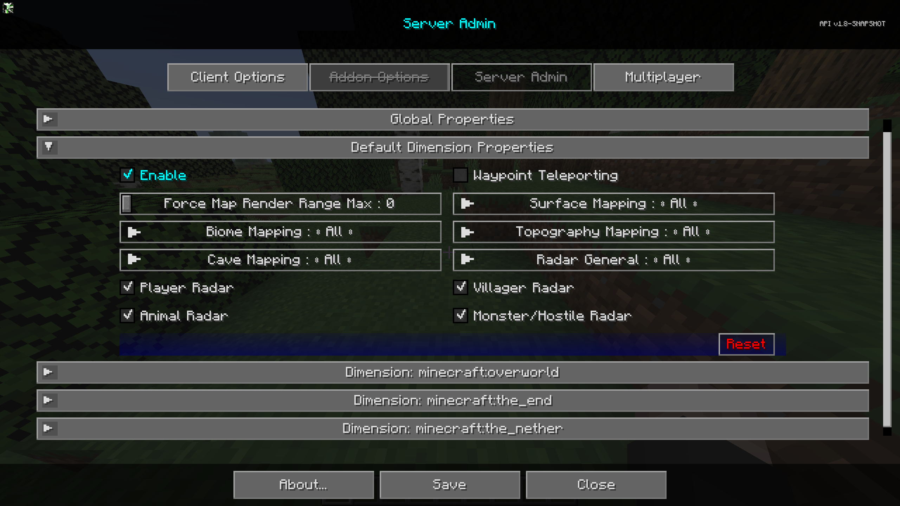

# **Default Dimension Properties**

The Default Dimension Properties category contains settings that will be the default settings for all new dimensions
created. These settings can be overridden on a per-dimension basis.

{: .center}

## **Toggles**

| Toggle                | Description                                                                              |
|-----------------------|------------------------------------------------------------------------------------------|
| Enable                | Enabling this dimension will override the global properties for this dimension.          |
| Waypoint Teleporting  | Allows or prevents teleport teleporting via waypoint manager and fullscreen context menu |
| Player Radar          | If players can see other players on the map.                                             |
| Villager Radar        | If players can see villagers on the map.                                                 |
| Animal Radar          | If players can see animals on the map.                                                   |
| Monster/Hostile Radar | If players can see monsters or hostile entities on the map.                              |
