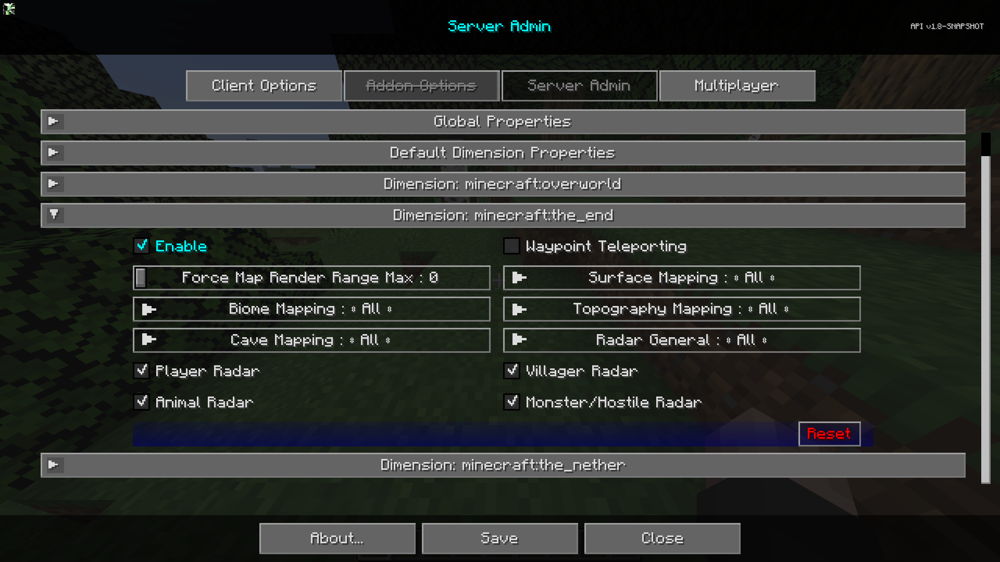

# **Dimension: minecraft:the_end**

The Dimension: minecraft:the_end category contains settings that will be the default settings for the end dimension.

{: .center}

## **Toggles**

| Toggle                | Description                                                                              |
|-----------------------|------------------------------------------------------------------------------------------|
| Enable                | Enabling this dimension will override the global properties for this dimension.          |
| Waypoint Teleporting  | Allows or prevents teleport teleporting via waypoint manager and fullscreen context menu |
| Player Radar          | If players can see other players on the map.                                             |
| Villager Radar        | If players can see villagers on the map.                                                 |
| Animal Radar          | If players can see animals on the map.                                                   |
| Monster/Hostile Radar | If players can see monsters or hostile entities on the map.                              |

## **Other Settings**

The default option for each setting below is marked with **bold** text.

| Setting                    | Options                                           | Description                                                                                                                                              |
|----------------------------|---------------------------------------------------|----------------------------------------------------------------------------------------------------------------------------------------------------------|
| Force Map Render Range Max | <ul><li>Range: 0 - 32 **Default is 0**</li></ul>  | Force all players to a maximum chunk render distance for the map.                                                                                        |
| Surface Mapping            | <ul><li>**All**</li><li>Op</li><li>None</li></ul> | Surface Mapping for All, Ops, None                                                                                                                       |
| Biome Mapping              | <ul><li>**All**</li><li>Op</li><li>None</li></ul> | Biome Mapping for All, Ops, None.                                                                                                                        |
| Topography Mapping         | <ul><li>**All**</li><li>Op</li><li>None</li></ul> | Topography Mapping for All, Ops, None.                                                                                                                   |
| Cave Mapping               | <ul><li>**All**</li><li>Op</li><li>None</li></ul> | Cave Mapping for All, Ops, None.                                                                                                                         |
| Radar General              | <ul><li>**All**</li><li>Op</li><li>None</li></ul> | <ul><li>All: Radar works for everyone</li><li>Op: Fully disables radar for everyone but OP users</li><li>None: Radar is disabled for everyone.</li></ul> |
