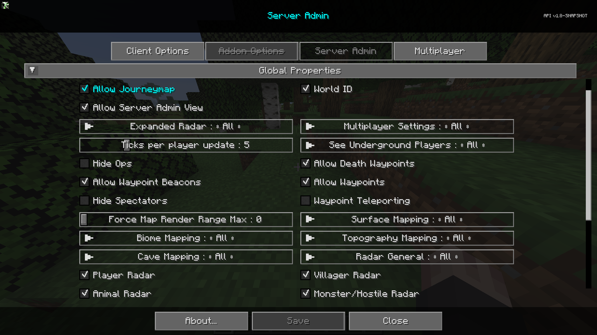

# **Global Properties**

The Global Properties category contains settings that affect the server side behaviour of the mod. These are the default
properties for the server.

{: .center}

## **Toggles**

| Toggle                  | Description                                                                                                                                                                                                                                                                                                                                                                                               |
|-------------------------|-----------------------------------------------------------------------------------------------------------------------------------------------------------------------------------------------------------------------------------------------------------------------------------------------------------------------------------------------------------------------------------------------------------|
| Allow JourneyMap        | Whether to allow journeymap to function for non-ops.                                                                                                                                                                                                                                                                                                                                                      |
| World ID                | Enabling will change the save directory for this servers mapping data. If disabled and then enabling on an active server will reset all user mapping data. The primary use is to prevent maps and settings from being over-written when using a multi-world setup and when users do not give servers unique names. If disabled and then enabled on an active server, it will reset all user mapping data. |
| Allow Server Admin View | Whether non op users can view server admin screen in read-only mode.                                                                                                                                                                                                                                                                                                                                      |
| Hide Ops                | Hide Ops on radar when Expanded Radar is enabled.                                                                                                                                                                                                                                                                                                                                                         |
| Allow Death Waypoints   | Whether to allow Death Waypoints to be created on user death.                                                                                                                                                                                                                                                                                                                                             |
| Allow Waypoint Beacons  | Whether to allow rendering of In-Game beacons to render. (does not disable map waypoints)                                                                                                                                                                                                                                                                                                                 |
| Allow Waypoints         | Whether to allow waypoints, fully disables map and in-game beacon rendering and associated screens.                                                                                                                                                                                                                                                                                                       |
| Hide Spectators         | Whether to hide spectators on the radar.                                                                                                                                                                                                                                                                                                                                                                  |
| Waypoint Teleporting    | Allows or prevents teleport teleporting via waypoint manager and fullscreen context menu                                                                                                                                                                                                                                                                                                                  |
| Player Radar            | If players can see other players on the map.                                                                                                                                                                                                                                                                                                                                                              |
| Villager Radar          | If players can see villagers on the map.                                                                                                                                                                                                                                                                                                                                                                  |
| Animal Radar            | If players can see animals on the map.                                                                                                                                                                                                                                                                                                                                                                    |
| Monster/Hostile Radar   | If players can see monsters or hostile entities on the map.                                                                                                                                                                                                                                                                                                                                               |

## **Other Settings**

The default option for each setting below is marked with **bold** text.

| Setting                    | Options                                           | Description                                                                                                                                              |
|----------------------------|---------------------------------------------------|----------------------------------------------------------------------------------------------------------------------------------------------------------|
| Expanded Radar             | <ul><li>**All**</li><li>Op</li><li>None</li></ul> | Let's the players see other players on the map outside of render range, anywhere in their current dimension.                                             |
| Multiplayer Settings       | <ul><li>**All**</li><li>Op</li><li>None</li></ul> | Allow All players, Op players, or No players to use the multiplayer settings menu.                                                                       |
| Ticks per player update    | <ul><li>Range: 1 - 20 **Default is 5**</li></ul>  | How often the server will send player location updates.                                                                                                  |
| See underground players    | <ul><li>**All**</li><li>Op</li><li>None</li></ul> | Whether underground players are visible on the radar.                                                                                                    |
| Force Map Render Range Max | <ul><li>Range: 0 - 32 **Default is 0**</li></ul>  | Force all players to a maximum chunk render distance for the map.                                                                                        |
| Surface Mapping            | <ul><li>**All**</li><li>Op</li><li>None</li></ul> | Surface Mapping for All, Ops, None                                                                                                                       |
| Biome Mapping              | <ul><li>**All**</li><li>Op</li><li>None</li></ul> | Biome Mapping for All, Ops, None.                                                                                                                        |
| Topography Mapping         | <ul><li>**All**</li><li>Op</li><li>None</li></ul> | Topography Mapping for All, Ops, None.                                                                                                                   |
| Cave Mapping               | <ul><li>**All**</li><li>Op</li><li>None</li></ul> | Cave Mapping for All, Ops, None.                                                                                                                         |
| Radar General              | <ul><li>**All**</li><li>Op</li><li>None</li></ul> | <ul><li>All: Radar works for everyone</li><li>Op: Fully disables radar for everyone but OP users</li><li>None: Radar is disabled for everyone.</li></ul> |
