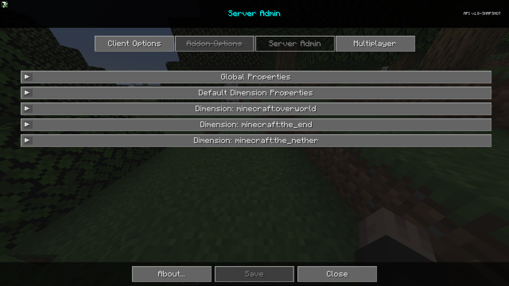

# **Settings**

JourneyMap Server provides a few configuration options, allowing you to customize the behaviour of clients connecting with the JourneyMap mod and many different aspects of the mod. All of these settings are made available through the Server Admin tab in the settings manager.

{: .center}

To get to the Server Admin tab, open the full-screen map and click the settings button at the bottom, or press the ++o++ key. Finally at the top, click the Server Admin tab to get to the server side settings for the mod. Each entry in the list represents a specific category of settings - click on it to expand and see the settings within.

!!! note "Note"

    Each category has a Reset button. Please note that pressing this button will reset the settings in that category to the default settings bundled with JourneyMap Server, instead of simply discarding your changes.
