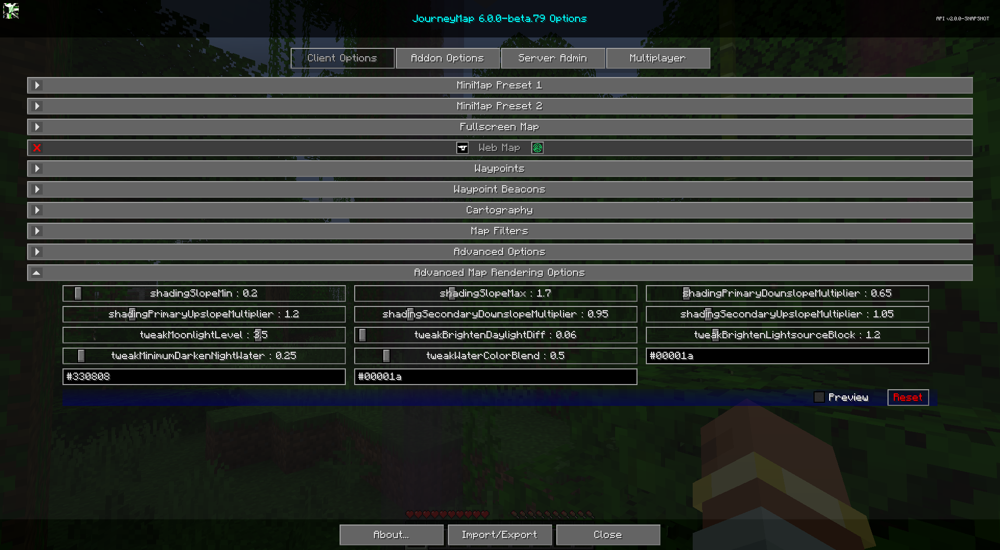

# **Advanced Map Rendering Options**

!!! warning "Caution"

    These options significantly change how the map is rendered. After
    changing a value it takes time for the change to appear, because
    every chunk has to be redrawn. Only adjust these if you know what
    you are doing; use the Reset button to return to the defaults.

This category fine-tunes the shading and lighting math the map renderer
uses. The defaults are tuned to look good in most worlds.

{: .center}

## **Slope shading**

These control the hillshading effect that gives the map its sense of
elevation.

| Setting                            | Range (Default)   | Description                                                              |
|-------------------------------------|-------------------|--------------------------------------------------------------------------|
| shadingSlopeMin                     | 0 - 5 (**0.2**)   | Lower bound for the slope shading range. Slopes below this are flattened. |
| shadingSlopeMax                     | 0 - 5 (**1.7**)   | Upper bound for the slope shading range. Slopes above this are clamped.   |
| shadingPrimaryDownslopeMultiplier   | 0 - 5 (**0.65**)  | How much downward-facing slopes are darkened (primary pass).             |
| shadingPrimaryUpslopeMultiplier     | 0 - 5 (**1.20**)  | How much upward-facing slopes are brightened (primary pass).             |
| shadingSecondaryDownslopeMultiplier | 0 - 5 (**0.95**)  | Downslope darkening for the secondary shading pass.                      |
| shadingSecondaryUpslopeMultiplier   | 0 - 5 (**1.05**)  | Upslope brightening for the secondary shading pass.                      |

## **Light and brightness tweaks**

| Setting                       | Range (Default)   | Description                                                            |
|-------------------------------|-------------------|------------------------------------------------------------------------|
| tweakMoonlightLevel           | 0 - 5 (**3.5**)   | The light level used as moonlight when rendering the night map.        |
| tweakBrightenDaylightDiff     | 0 - 5 (**0.06**)  | How much the day map is brightened.                                    |
| tweakBrightenLightsourceBlock | 0 - 5 (**1.2**)   | How much light-emitting blocks are brightened on the map.              |
| tweakMinimumDarkenNightWater  | 0 - 5 (**0.25**)  | The minimum amount water is darkened on the night map.                 |
| tweakWaterColorBlend          | 0 - 5 (**0.5**)   | How strongly water color is blended with the terrain below it.         |

## **Ambient colors**

These set the ambient tint applied to the map in each environment. Each
value is a hex color (`#rrggbb`).

| Setting                 | Default     | Description                                  |
|-------------------------|-------------|----------------------------------------------|
| tweakSurfaceAmbientColor | **#00001a** | Ambient tint for the Overworld surface map.  |
| tweakNetherAmbientColor  | **#330808** | Ambient tint for the Nether map.             |
| tweakEndAmbientColor     | **#00001a** | Ambient tint for the End map.                |
