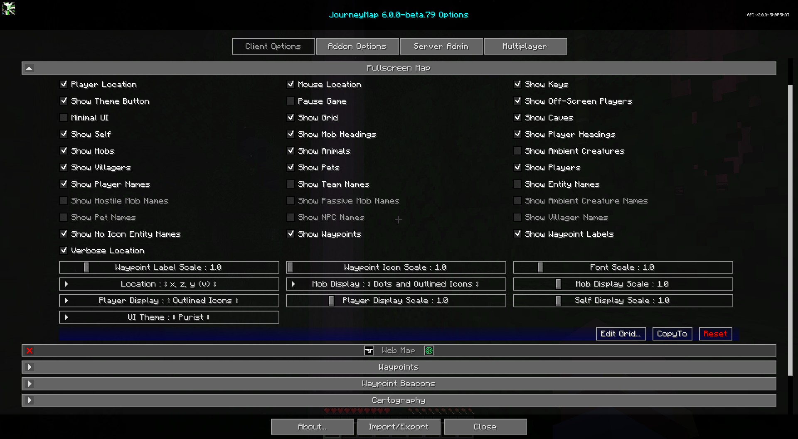

# **Full-Screen Map Settings**

The full-screen map provides a large, scrollable view of your entire map. Just like the minimap presets, it can be
customized to a great deal.

To switch open the full-screen map, press the full-screen map key (the ++j++ key by default).

{: .center}

!!! note "Note"

    A handful of the following options are also available as buttons on the full-screen map view itself. For more information on this, please see the [full-screen map page](../full-screen-map.md).

## **Toggles**

The default state of each toggle is shown in the table below. Toggles that are **bold** are enabled by default.

| Toggle                       | Description                                                                                                  |
|------------------------------|--------------------------------------------------------------------------------------------------------------|
| **Mouse Location**           | Show mouse block location above the buttons                                                                  |
| **Pause Game**               | Pauses the game while the fullscreen map is open. Only affects singleplayer worlds                           |
| **Player Location**          | Show player location below the top buttons                                                                   |
| **Show Animals**             | Nearby passive mobs are shown on the map                                                                     |
| Show Ambient Creatures       | Nearby ambient creatures, like bats, are shown on the map                                                    |
| **Show Caves**               | Switch to Cave map when underground or indoors                                                               |
| Show Entity Names            | Show names of pets, NPCs, etc. on the map                                                                    |
| **Show Grid**                | Show a grid of chunk boundaries on the map                                                                   |
| Show Hostile Mob Names       | Show names of hostile mobs on the map                                                                        |
| **Show Keys**                | Show key bindings and descriptions                                                                           |
| Show Mob Headings            | Show which direction mobs are looking                                                                        |
| **Show Mobs**                | Nearby hostile mobs are shown on the map                                                                     |
| Show NPC Names               | Show names of NPCs on the map                                                                                |
| Show No Icon Entity Names    | Show names for entities that have no icon. This overrides all other show name fields                         |
| **Show Off-Screen Players**  | Visible players that are offscreen will have their icon rendered on the border of the map                    |
| Show Ambient Creature Names  | Show names of ambient creatures on the map                                                                   |
| Show Passive Mob Names       | Show names of passive mobs on the map                                                                        |
| Show Pet Names               | Show names of pets on the map                                                                                |
| **Show Pets**                | Nearby pets are shown on the map                                                                             |
| Show Player Headings         | Show which direction other players are looking                                                               |
| Show Player Names            | Show names of players on the map                                                                             |
| **Show Players**             | Nearby players are shown on the map                                                                          |
| **Show Self**                | Your locator icon is shown on the map                                                                        |
| **Show Team Names**          | Show names of teams on the map                                                                               |
| **Show Theme Button**        | Shows the theme selection button on the fullscreen map                                                       |
| Show Villager Names          | Show names of villagers on the map                                                                           |
| **Show Villagers**           | Nearby villagers are shown on the map                                                                        |
| **Show Waypoint Labels**     | Show waypoint labels on the map                                                                              |
| **Show Waypoints**           | Nearby waypoints are shown on the map                                                                        |
| **Verbose Location**         | Location shows coordinate names (x, y, z) with the numbers                                                   |

!!! note "Minimal UI"

    Minimal UI is a new fullscreen-only toggle in JourneyMap 6.0. It is **disabled** by default. When enabled, it hides a bunch of the buttons to make the fullscreen map UI a bit more minimal.

## **Other Settings**

The default option for each setting below is marked with **bold** text.

| Setting              | Options                                                                                            | Description                                                       |
|----------------------|----------------------------------------------------------------------------------------------------|-------------------------------------------------------------------|
| Font Scale           | <ul><li>Range: 0.5 - 5  **Default is 1**</li></ul>                                              | The font scale for labels and text                                |
| Location             | <ul><li>**x, z, y (v)**</li><li>x, y (v), z</li><li>x, z, y</li><li>x, y, z</li><li>x, z</li></ul> | Format of how location coordinates are displayed. 'v' stands for vertical chunk |
| Mob Display          | <ul><li>Dots</li><li>Icons</li><li>Outlined Icons</li><li>Dots and Icons</li><li>**Dots and Outlined Icons**</li></ul> | Show mobs as icons or colored dots                |
| Mob Display Scale    | <ul><li>Range: 0.01 - 5  **Default is 1**</li></ul>                                             | The scale for Mob icons and dots                                  |
| Player Display       | <ul><li>Dots</li><li>Icons</li><li>**Outlined Icons**</li><li>Dots and Icons</li><li>Dots and Outlined Icons</li></ul> | Show players as icons or colored dots          |
| Player Display Scale | <ul><li>Range: 0.01 - 5  **Default is 1**</li></ul>                                             | The scale for Player icons and dots                               |
| Self Display Scale   | <ul><li>Range: 0.01 - 5  **Default is 1**</li></ul>                                             | The scale for the self icon                                       |
| Waypoint Icon Scale  | <ul><li>Range: 1 - 5  **Default is 1**</li></ul>                                                | The scale for waypoint icons on the map                           |
| Waypoint Label Scale | <ul><li>Range: 0.5 - 5  **Default is 1**</li></ul>                                              | The font scale for waypoint labels on the map                     |
