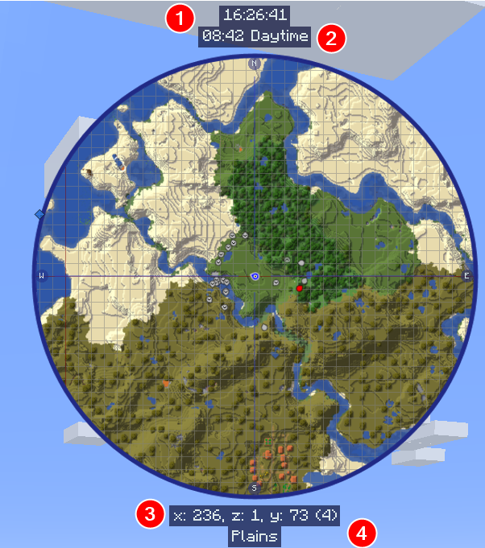

# **Minimap Settings**

JourneyMap allows you to have two minimap presets. Each preset represents a separate set of settings - essentially allowing you to have two distinct minimaps available to switch between.

!!! note "Note"

    The settings for each minimap are identical, so we'll only cover a single preset below.

To switch between minimap presets, press the switch minimap preset key (the ++backslash++ key by default).

{: .center}

## **Toggles**

The toggles whose names are shown in **bold** are enabled by default.

| Toggle                       | Description                                                                       |
|------------------------------|-----------------------------------------------------------------------------------|
| **Enable MiniMap**           | Display the MiniMap in-game                                                       |
| **Show Day/Night**           | Switch to Day or Night map automatically                                          |
| **Show Caves**               | Switch to Cave map when underground or indoors                                    |
| **Show Compass**             | Show compass points on the MiniMap frame                                          |
| **Show Reticle**             | Show a reticle (crosshairs) on the MiniMap                                         |
| **Show Grid**                | Show a grid of chunk boundaries on the map                                        |
| **Show Self**                | Your locator icon is shown on the map                                             |
| **Show Player Headings**     | Show which direction other players are looking                                    |
| **Show Mob Headings**        | Show which direction mobs are looking                                             |
| **Show Mobs**                | Nearby hostile mobs are shown on the map                                          |
| **Show Animals**             | Nearby passive mobs are shown on the map                                          |
| Show Ambient Creatures       | Nearby ambient creatures, like bats, are shown on the map                         |
| **Show Villagers**           | Nearby villagers are shown on the map                                             |
| **Show Pets**                | Nearby pets are shown on the map                                                  |
| **Show Players**             | Nearby players are shown on the map                                               |
| **Show Off-Screen Players**  | Visible players that are off-screen have their icon rendered on the minimap border |
| **Show Waypoints**           | Nearby waypoints are shown on the map                                             |
| **Show Waypoint Labels**     | Show waypoint labels on the map                                                   |
| **Verbose Location**         | Location shows coordinate names (x, y, z) with the numbers                        |
| **Show Player Names**        | Show names of players on the map                                                  |
| **Show Team Names**          | Show names of teams on the map                                                    |
| Show Entity Names            | Show names of pets, NPCs, etc. on the map                                         |
| Show Hostile Mob Names       | Show names of hostile mobs on the map                                             |
| Show Passive Mob Names       | Show names of passive mobs on the map                                             |
| Show Ambient Creature Names  | Show names of ambient creatures on the map                                        |
| Show Pet Names               | Show names of pets on the map                                                     |
| Show NPC Names               | Show names of NPCs on the map                                                     |
| Show Villager Names          | Show names of villagers on the map                                                |
| **Show No Icon Entity Names**| Show names for entities that have no icon. This overrides all other name toggles  |

## **Info Slots**

Info slots are text areas above and below the minimap that show extra contextual information. There are four of
them, numbered 1 through 4. Each slot has its own label source (what it shows) and a position (Top or Bottom of
the minimap).

{: .center}

Each info slot label source can be set to one of the following:

- **Blank**: Nothing, hide this info slot
- **Biome**: The biome of your location
- **Dimension**: The dimension you are currently in
- **FPS**: The current Frames Per Second
- **Game Time**: The world time (20 minute cycle), with a new day at 6am. This is the default Minecraft time
- **Game Time with Offset**: The world time offset by 6 hours, so a new day starts at midnight
- **Light Level**: The light level of the block at your feet
- **Location**: Your current coordinates
- **Minecraft Day**: The current day number in the world
- **Moon Phase**: The current moon phase
- **Movement Speed**: Your movement speed in blocks per second
- **Region**: Your current region coordinates
- **System Time**: The current time according to your computer's clock
- **Weather**: The current weather for the dimension

Each info slot also has a position setting:

| Setting              | Options                                  | Description                          |
|----------------------|------------------------------------------|--------------------------------------|
| Info Slot 1 Position | <ul><li>**Top**</li><li>Bottom</li></ul>  | Whether Info Slot 1 sits above or below the minimap |
| Info Slot 2 Position | <ul><li>**Top**</li><li>Bottom</li></ul>  | Whether Info Slot 2 sits above or below the minimap |
| Info Slot 3 Position | <ul><li>Top</li><li>**Bottom**</li></ul>  | Whether Info Slot 3 sits above or below the minimap |
| Info Slot 4 Position | <ul><li>Top</li><li>**Bottom**</li></ul>  | Whether Info Slot 4 sits above or below the minimap |

By default, Info Slot 1 is Blank, Info Slot 2 shows Game Time, Info Slot 3 shows Location, and Info Slot 4 shows
Biome.

## **Other Settings**

The default option for each setting below is marked with **bold** text.

| Setting                      | Options                                                                                                                                                                                                  | Description                                                                                                |
|------------------------------|----------------------------------------------------------------------------------------------------------------------------------------------------------------------------------------------------------|------------------------------------------------------------------------------------------------------------|
| Map Type                     | <ul><li>**Default**</li><li>Day</li><li>Night</li><li>Cave/Underground</li><li>Topo</li><li>Biome</li></ul>                                                                                               | Locks the Map Type to this value. (Nether is always cave, but you can force a slice when set to underground) |
| Cave Layer                   | <ul><li>Range: -4 - 15  **Default is 4**</li></ul>                                                                                                                                                    | The vertical slice to lock the minimap to when Map Type is set to underground. Disabled otherwise.          |
| Shape                        | <ul><li>**Circle**</li><li>Square</li><li>Horizontal Rectangle</li><li>Vertical Rectangle</li></ul>                                                                                                      | The shape of the MiniMap. Note: Only Circle supports the "My Heading" Map Heading.                          |
| Size                         | <ul><li>Range: 1 - 100  **Default is 30**</li></ul>                                                                                                                                                   | The size of the MiniMap, as a percentage of the window size. Sizes over 768px may hurt performance.        |
| Map Heading                  | <ul><li>**North**</li><li>Old North</li><li>My Heading</li></ul>                                                                                                                                         | The orientation (rotation) of the MiniMap. Note: Only Circle supports the "My Heading" Map Heading.        |
| Reticle Heading              | <ul><li>**Compass**</li><li>My Heading</li></ul>                                                                                                                                                         | The orientation (rotation) of the reticle on the MiniMap.                                                  |
| Frame Opacity                | <ul><li>Range: 0 - 100  **Default is 100**</li></ul>                                                                                                                                                  | How opaque the MiniMap frame is (as a percentage).                                                         |
| Map Opacity                  | <ul><li>Range: 0 - 100  **Default is 100**</li></ul>                                                                                                                                                  | How opaque the map is (as a percentage).                                                                   |
| Map Background Opacity       | <ul><li>Range: 0 - 1  **Default is 0.8**</li></ul>                                                                                                                                                    | How opaque the map background is.                                                                          |
| Compass Font Scale           | <ul><li>Range: 0.5 - 4  **Default is 1**</li></ul>                                                                                                                                                    | The font scale used for compass point labels.                                                              |
| Font Scale                   | <ul><li>Range: 0.5 - 5  **Default is 1**</li></ul>                                                                                                                                                    | The font scale for labels and text.                                                                        |
| Info Slot Font Scale         | <ul><li>Range: 0.5 - 5  **Default is 1**</li></ul>                                                                                                                                                    | The font scale used for info slots.                                                                        |
| Info Slot Background Opacity | <ul><li>Range: 0 - 1  **Default is 0.7**</li></ul>                                                                                                                                                    | The opacity of the Info Slot background.                                                                   |
| Info Slot Game Time Format   | <ul><li>**HH:mm:ss**</li><li>H:mm:ss</li><li>HH:mm</li><li>H:mm</li><li>hh:mm:ss a</li><li>h:mm:ss a</li><li>hh:mm:ss</li><li>h:mm:ss</li><li>hh:mm a</li><li>h:mm a</li><li>hh:mm</li><li>h:mm</li></ul> | Time format for the game time info slot.                                                                   |
| System Time Format           | <ul><li>**HH:mm:ss**</li><li>H:mm:ss</li><li>HH:mm</li><li>H:mm</li><li>hh:mm:ss a</li><li>h:mm:ss a</li><li>hh:mm:ss</li><li>h:mm:ss</li><li>hh:mm a</li><li>h:mm a</li><li>hh:mm</li><li>h:mm</li></ul> | Time format for the System Time info slot.                                                                 |
| Location                     | <ul><li>**x, z, y (v)**</li><li>x, y (v), z</li><li>x, z, y</li><li>x, y, z</li><li>x, z</li></ul>                                                                                                       | The format of how location coordinates are displayed. Note: 'v' stands for vertical chunk.                 |
| Mob Display                  | <ul><li>**Dots and Outlined Icons**</li><li>Dots</li><li>Icons</li><li>Outlined Icons</li><li>Dots and Icons</li></ul>                                                                                    | How mobs should be displayed on the map.                                                                   |
| Mob Display Scale            | <ul><li>Range: 0.01 - 5  **Default is 1**</li></ul>                                                                                                                                                   | The scale for Mob icons and dots.                                                                          |
| Player Display               | <ul><li>**Outlined Icons**</li><li>Dots</li><li>Icons</li><li>Dots and Icons</li><li>Dots and Outlined Icons</li></ul>                                                                                    | How other players should be displayed on the map.                                                          |
| Player Display Scale         | <ul><li>Range: 0.01 - 5  **Default is 1**</li></ul>                                                                                                                                                   | The scale for Player icons and dots.                                                                       |
| Self Display Scale           | <ul><li>Range: 0.01 - 5  **Default is 1**</li></ul>                                                                                                                                                   | The scale for your own icon.                                                                               |
| Waypoint Icon Scale          | <ul><li>Range: 1 - 5  **Default is 1**</li></ul>                                                                                                                                                      | The scale for waypoint icons on the map.                                                                   |
| Waypoint Label Scale         | <ul><li>Range: 0.5 - 5  **Default is 1**</li></ul>                                                                                                                                                    | The font scale for waypoint labels on the map.                                                             |
