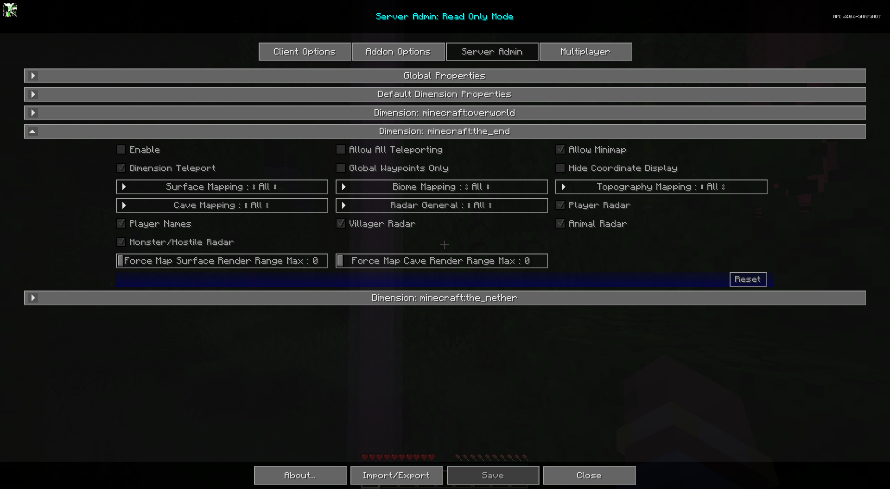

# **Dimension: minecraft:the_end**

The Dimension: minecraft:the_end category contains settings that will be the default settings for the end dimension.

{: .center}

## **Toggles**

| Toggle                  | Description                                                                                                                                                                              |
|-------------------------|------------------------------------------------------------------------------------------------------------------------------------------------------------------------------------------|
| Enable                  | Enabling this dimension will override the global properties for this dimension.                                                                                                           |
| Allow Minimap           | Enable or disable the minimap.                                                                                                                                                           |
| Hide Coordinate Display | Hides all coordinate displays, prevents editing of coordinate values for waypoints. Replaces most coordinate displays with "Unknown Location" text. Does not affect existing waypoint names. |
| Global Waypoints Only   | When enabled, players can only view and toggle the visibility of global waypoints. Creating, editing, and deleting personal waypoints is disabled.                                        |
| Allow All Teleporting   | Allows Waypoint and Fullscreen Context menu teleporting. Waypoint Only Teleporting takes priority.                                                                                        |
| Dimension Teleport      | Enable Cross Dimension Waypoint teleporting for non-op users. OP users can use it always.                                                                                                |
| Player Radar            | If players can see other players on the map.                                                                                                                                             |
| Player Names            | If players can see other player's names on the map.                                                                                                                                      |
| Villager Radar          | If players can see villagers on the map.                                                                                                                                                 |
| Animal Radar            | If players can see animals on the map.                                                                                                                                                   |
| Monster/Hostile Radar   | If players can see monsters or hostile entities on the map.                                                                                                                              |

## **Other Settings**

The default option for each setting below is marked with **bold** text.

| Setting                            | Options                                           | Description                                                                                                                                                                                                                                              |
|-------------------------------------|---------------------------------------------------|--------------------------------------------------------------------------------------------------------------------------------------------------------------------------------------------------------------------------------------------------------|
| Force Map Surface Render Range Max  | <ul><li>Range: 0 - 32 **Default is 0**</li></ul>  | Force all players to a maximum chunk surface render distance for the map. 0 to use client settings. This setting only forces the max, it does not increase their render range. This value is not reflected in the client's Cartography options.            |
| Force Map Cave Render Range Max     | <ul><li>Range: 0 - 32 **Default is 0**</li></ul>  | Force all players to a maximum chunk cave render distance for the map. 0 to use client settings. This setting only forces the max, it does not increase their render range. This value is not reflected in the client's Cartography options.               |
| Surface Mapping                     | <ul><li>**All**</li><li>Op</li><li>None</li></ul> | Surface Mapping for All, Ops, None.                                                                                                                                                                                                                      |
| Topography Mapping                  | <ul><li>**All**</li><li>Op</li><li>None</li></ul> | Topography Mapping for All, Ops, None.                                                                                                                                                                                                                   |
| Biome Mapping                       | <ul><li>**All**</li><li>Op</li><li>None</li></ul> | Biome Mapping for All, Ops, None.                                                                                                                                                                                                                        |
| Cave Mapping                        | <ul><li>**All**</li><li>Op</li><li>None</li></ul> | Cave Mapping for All, Ops, None.                                                                                                                                                                                                                         |
| Radar General                       | <ul><li>**All**</li><li>Op</li><li>None</li></ul> | <ul><li>All: Radar works for everyone, use individual check boxes to disable specific.</li><li>Op: Fully disables radar for everyone but OP users, check boxes work for Ops.</li><li>None: Radar is disabled for everyone.</li></ul>                       |
