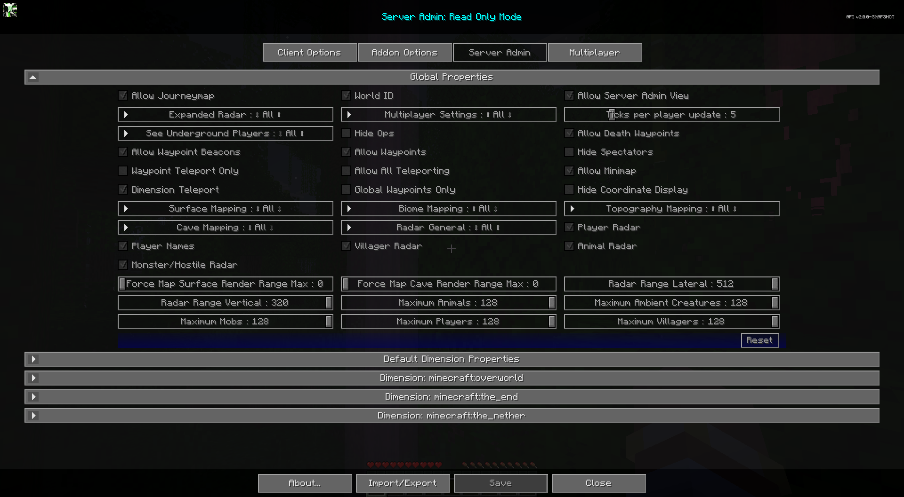

# **Global Properties**

The Global Properties category contains settings that affect the server side behaviour of the mod. These are the default
properties for the server.

{: .center}

## **Toggles**

The default state for each toggle below is marked with **bold** text.

| Toggle                      | Description                                                                                                                                                                          |
|-----------------------------|--------------------------------------------------------------------------------------------------------------------------------------------------------------------------------------|
| **Allow Journeymap**        | Whether to allow journeymap to function for non-ops.                                                                                                                                 |
| **World ID**                | Enabling will change the save directory for this server's mapping data. The primary use is to prevent maps and settings from being over-written when using a multi-world setup and when users do not give servers unique names. WARNING: If disabled and then enabled on an active server it will reset all user mapping data. |
| **Allow Server Admin View** | Whether non op users can view the server admin screen in read-only mode.                                                                                                             |
| **Allow Minimap**           | Whether to allow the client minimap. When disabled the minimap is unavailable to players.                                                                                            |
| Hide Coordinate Display     | Hides all coordinate displays and prevents editing of coordinate values for waypoints. Replaces most coordinate displays with "Unknown Location" text. Note: This does not affect existing waypoint names. |
| **Allow Waypoints**         | Whether to allow waypoints. Fully disables map and in-game beacon rendering and associated screens.                                                                                   |
| **Allow Waypoint Beacons**  | Whether to allow rendering of in-game beacons. (does not disable map waypoints)                                                                                                       |
| **Allow Death Waypoints**   | Whether to allow Death Waypoints to be created on user death.                                                                                                                        |
| Global Waypoints Only       | When enabled, players can only view and toggle the visibility of global waypoints. Creating, editing, and deleting personal waypoints is disabled.                                    |
| Allow All Teleporting       | Allows Waypoint and Fullscreen Context menu teleporting. Waypoint Only Teleporting takes priority!                                                                                    |
| Waypoint Teleport Only      | When enabled, players may only teleport via waypoints. Arbitrary map right-click teleport is disabled.                                                                                |
| **Dimension Teleport**      | Enable Cross Dimension Waypoint teleporting for non-op users. OP Users can use it always.                                                                                            |
| **Player Radar**            | If players can see other players on the map.                                                                                                                                         |
| **Player Names**            | If players can see other player's names on the map.                                                                                                                                  |
| **Villager Radar**          | If players can see villagers on the map.                                                                                                                                             |
| **Animal Radar**            | If players can see animals on the map.                                                                                                                                               |
| **Monster/Hostile Radar**   | If players can see monsters or hostile entities on the map.                                                                                                                          |
| Hide Ops                    | Hide Ops on radar when Expanded Radar is enabled.                                                                                                                                    |
| Hide Spectators             | Whether to hide spectators on the radar.                                                                                                                                             |

## **Other Settings**

The default option for each setting below is marked with **bold** text.

| Setting                         | Options                                              | Description                                                                                                                                              |
|---------------------------------|------------------------------------------------------|----------------------------------------------------------------------------------------------------------------------------------------------------------|
| Multiplayer Settings            | <ul><li>**All**</li><li>Op</li><li>None</li></ul>    | Whether to allow All players, Op players, or No players to use the multiplayer settings menu.                                                            |
| Radar General                   | <ul><li>**All**</li><li>Op</li><li>None</li></ul>    | <ul><li>All: Radar works for everyone</li><li>Op: Fully disables radar for everyone but OP users</li><li>None: Radar is disabled for everyone.</li></ul> |
| Expanded Radar                  | <ul><li>**All**</li><li>Op</li><li>None</li></ul>    | If player radar is enabled, allows the server to track players outside of the client's range. Players can see each other anywhere in the same dimension. |
| See Underground Players         | <ul><li>**All**</li><li>Op</li><li>None</li></ul>    | Expanded Radar only. Whether underground players are visible on the radar. The Nether is unaffected by this setting.                                     |
| Ticks per player update         | <ul><li>Range: 1 - 20 **Default is 5**</li></ul>     | How often the server will send player location updates.                                                                                                  |
| Radar Range Lateral             | <ul><li>Range: 16 - 512 **Default is 512**</li></ul> | Lateral distance (in blocks) to search for and display entities on Radar. Larger numbers may cause significant lag.                                       |
| Radar Range Vertical            | <ul><li>Range: 8 - 320 **Default is 320**</li></ul>  | Vertical distance (in blocks) to search for and display entities on Radar. Larger numbers may cause significant lag.                                      |
| Maximum Players                 | <ul><li>Range: 1 - 128 **Default is 128**</li></ul>  | The maximum number of players displayed on Radar. Larger numbers may cause lag.                                                                          |
| Maximum Villagers               | <ul><li>Range: 1 - 128 **Default is 128**</li></ul>  | The maximum number of villagers displayed on Radar. Larger numbers may cause lag.                                                                        |
| Maximum Animals                 | <ul><li>Range: 1 - 128 **Default is 128**</li></ul>  | The maximum number of passive mobs displayed on Radar. Larger numbers may cause lag.                                                                     |
| Maximum Ambient Creatures       | <ul><li>Range: 1 - 128 **Default is 128**</li></ul>  | The maximum number of ambient mobs displayed on Radar. Larger numbers may cause lag.                                                                     |
| Maximum Mobs                    | <ul><li>Range: 1 - 128 **Default is 128**</li></ul>  | The maximum number of hostile mobs displayed on Radar. Larger numbers may cause lag.                                                                     |
| Surface Mapping                 | <ul><li>**All**</li><li>Op</li><li>None</li></ul>    | Surface Mapping for All, Ops, None.                                                                                                                      |
| Topography Mapping              | <ul><li>**All**</li><li>Op</li><li>None</li></ul>    | Topography Mapping for All, Ops, None.                                                                                                                   |
| Biome Mapping                   | <ul><li>**All**</li><li>Op</li><li>None</li></ul>    | Biome Mapping for All, Ops, None.                                                                                                                        |
| Cave Mapping                    | <ul><li>**All**</li><li>Op</li><li>None</li></ul>    | Cave Mapping for All, Ops, None.                                                                                                                         |
| Force Map Surface Render Range Max | <ul><li>Range: 0 - 32 **Default is 0**</li></ul>  | Force all players to a maximum chunk surface render distance for the map. 0 to use client settings. This setting only forces the max, it does not increase render range. |
| Force Map Cave Render Range Max | <ul><li>Range: 0 - 32 **Default is 0**</li></ul>     | Force all players to a maximum chunk cave render distance for the map. 0 to use client settings. This setting only forces the max, it does not increase render range. |
