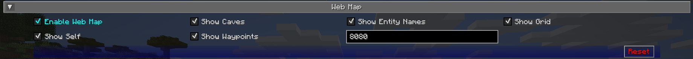

# **Webmap Settings**

The Webmap is configured from JourneyMap's options, under the **Webmap**
category. Open JourneyMap's options (press `O`, or use the Options
button on the fullscreen map) and select **Webmap**.

{: .center}

## **Toggles**

This toggle is **off** by default.

| Toggle         | Description                                          |
|----------------|------------------------------------------------------|
| Enable Web Map | Whether the Webmap server is enabled and accessible. |

## **Other Settings**

| Setting | Options                                  | Description                                  |
|---------|------------------------------------------|----------------------------------------------|
| Port    | Range: 80 - 65535 (Default: **8080**)    | The port the Webmap server tries to bind to. |

## **How port selection works**

When the Webmap starts, it tries to bind the port you configured
(8080 by default).

If that port is already in use, the Webmap falls back to a free port
chosen by the operating system instead of failing to start. This means
the port the Webmap ends up on can differ from the one you set.

To find the port actually in use:

- If the **Announce Mod** advanced option is enabled (it is by
  default), JourneyMap posts the Webmap address in chat once when you
  join a world.
- The resolved port is also written to the game log
  (`WebMap is now listening on port ...`).
