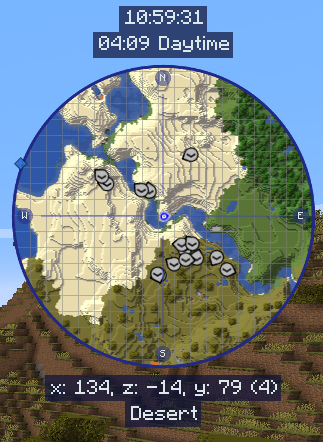
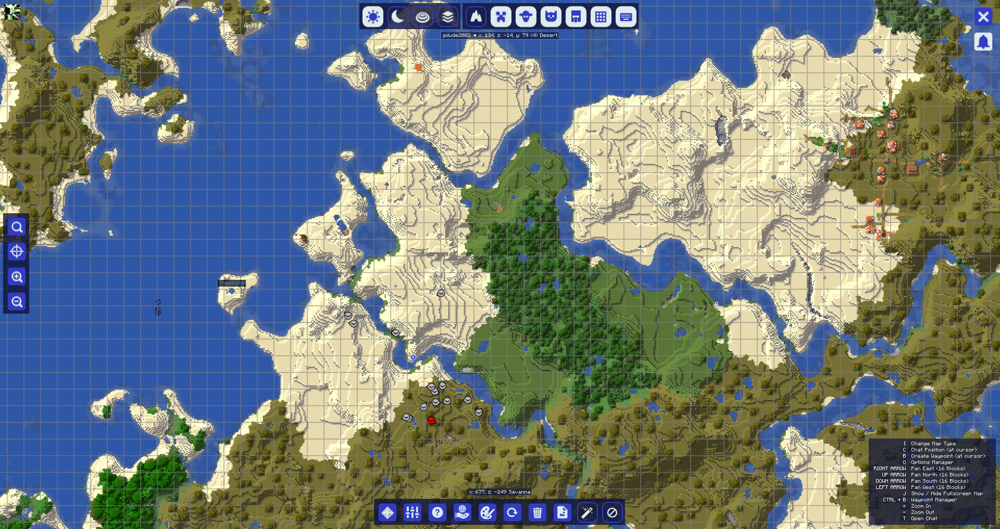
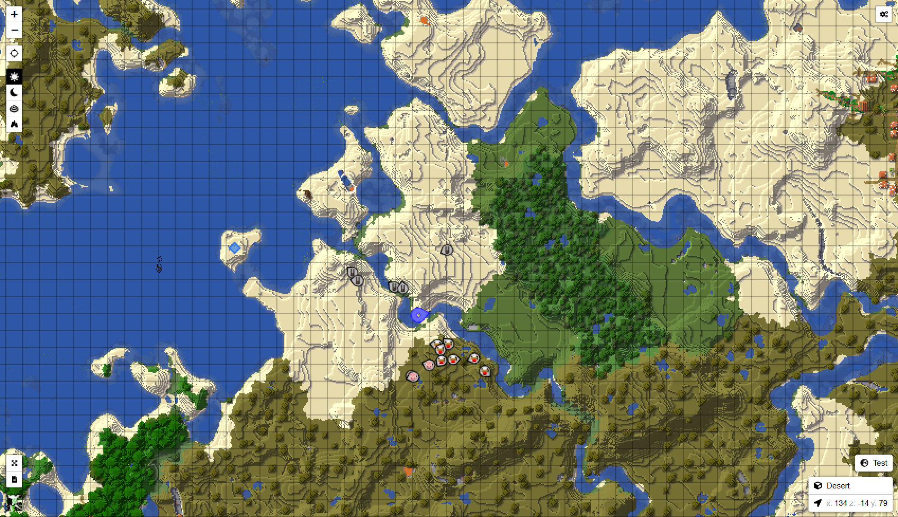

## **Uso básico**

!!! warning "Translation needed for 6.0"

    This page was updated for JourneyMap 6.0. Some sections shown are
    the English source pending translation. See Contributing to help
    translate the docs.

Una vez que tenga JourneyMap [instalado](installing.md), todo lo que necesita hacer es unirse a un servidor o cargar un mundo para un solo jugador.

En su mayor parte, JourneyMap funciona desde el primer momento. ¡Todo lo que necesitas hacer para empezar  a mapear tu mundo es comenzar a explorarlo! El área a su alrededor se mapeará automáticamente a medida que viaje y será visible en cada uno de los tres tipos de mapas que admite JourneyMap.

## **Asignaciones de Teclas**

The following key mappings are available by default when you are playing on a world or multiplayer server.

- ++j++ - Show or hide the full-screen map
- ++ctrl+j++ - Show or hide the minimap. On Fabric this is ++m++ instead, because Fabric does not support modifier keys for keybinds
- ++equal++ / ++minus++ - Zoom the minimap in and out
- ++bracket-left++ - Cycle the map type shown in the minimap
- ++backslash++ - Switch between minimap presets
- ++b++ - Create [a waypoint](waypoints.md) where you are standing
- ++n++ - Open the [waypoint manager](waypoints.md)
- ++g++ - Toggle entity name labels

JourneyMap also has keybinds for toggling waypoint rendering (all waypoints, in-world only, or on-map only). These are unbound by default - assign them in Minecraft's Controls if you want them.

All keys specified in the documentation can be customized in Minecraft's own settings. Just open the menu (by default, with the ++esc++ key), click on Options and then Controls, and you will see two new categories for all of JourneyMap's keys.

## **Marcadores**

Todos los tipos de mapas contienen marcadores. Estos marcadores denotan diversos datos, como la posición de una entidad o [un punto de ruta](waypoints.md) en el mapa.

| Icono                                                         | Descripción                                                                    |
|---------------------------------------------------------------|--------------------------------------------------------------------------------|
| {: .center} | Tu posición en el mapa. *Nota: este ícono tiene un borde  blanco dentro del juego.*     |
| {: .center}           | [Un punto de ruta](waypoints.md). El color se puede configurar en el administrador de puntos de ruta. |
| {: .center}     | [Un Punto de muerte](waypoints.md)                                               |

| Icono                                                                  | Descripción                                                                                      |
|-----------------------------------------------------------------------|--------------------------------------------------------------------------------------------------|
| {: .center}           | Un marcador que indica una entidad en el mapa. El color  del marcador indica el tipo de entidad. |
| {: .center} | Una entidad por debajo de usted.                                                                             |
| {: .center}     | Una entidad por encima de ti.                                                                             |

| Icono                                                       | Descripción                       |
|-------------------------------------------------------------|-----------------------------------|
| {: .center}   | Una entidad neutral, como un animal. |
| {: .center} | Un aldeano                       |
| {: .center}   | Otro jugador                   |
| {: .center}     | Una entidad hostil, como un monstruo. |

Los marcadores y su visualización se pueden personalizar en el [administrador de configuración](settings/minimap.md).

## **Mini-Mapa**

De forma predeterminada, el mini-mapa se mostrará en la esquina superior derecha de la pantalla.

{: .center}

Este es tu mini-mapa. De forma predeterminada, muestra el área alrededor de tu personaje, así como información básica y las posiciones de tu personaje, otros jugadores, animales y monstruos.

El mini-mapa se puede acercar y alejar en cualquier momento presionando cualquiera de las teclas de zoom (por defecto, las teclas ++equal++ y ++minus++).

The text above and below the minimap is shown in info slots. There are four of them. By default they show:

- Slot 1: nothing (blank)
- Slot 2: the in-game time
- Slot 3: your coordinates
- Slot 4: the biome you are in

El mini-mapa y sus espacios de información se pueden personalizar en el [administrador de configuración](settings/minimap.md).

## **Mapa en Pantalla Completa**

Al presionar la tecla del mapa de pantalla completa (de forma predeterminada, la tecla J), puede abrir el mapa en pantalla completa.

{: .center}

This map gives you a scrollable view of all the areas of the map you have explored so far, displayed as it was when you discovered them. It also provides access to JourneyMap's Settings and a number of map display options.

Para obtener más información sobre el mapa en pantalla completa, consulte la [página del mapa en pantalla completa](settings/full-screen-map.md).

## **Mapa Web**

The webmap lets you view and explore your map in a web browser, including from another device such as a phone or tablet, while the game is running. As of JourneyMap 6.0 the webmap is a separate addon mod.

{: .center}

See the [Webmap](../webmap/installing.md) section for how to install and use it.
