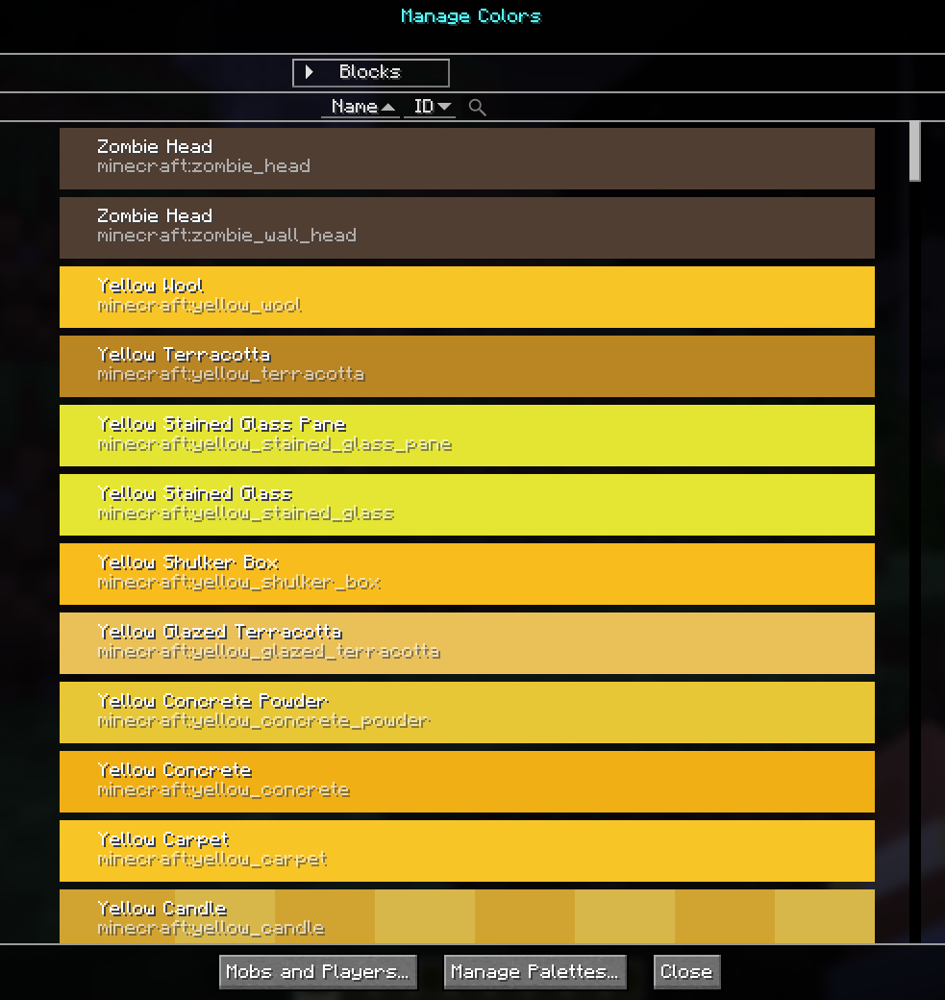
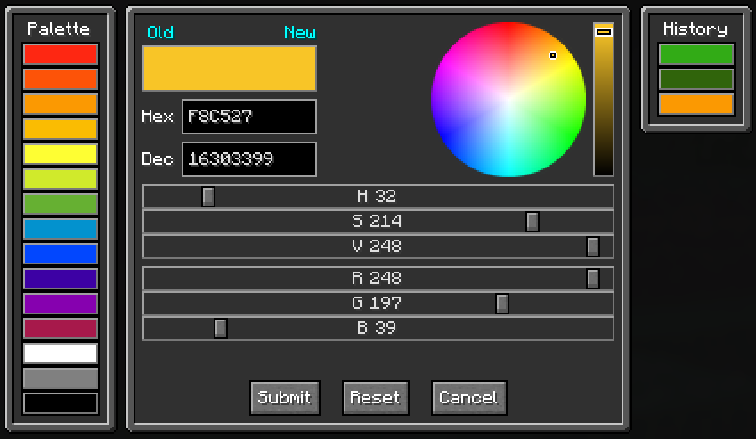
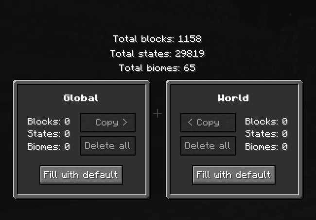

# **Color Palette**

!!! warning "Translation needed for 6.0"

    This page was updated for JourneyMap 6.0 in English. Translation
    is pending; the content shown is the English source. See
    Contributing to help translate the docs.

The Color Palette is a client-side editor for the colors JourneyMap uses
when rendering the map. You can recolor individual blocks, biome tints
(foliage, grass, water, fog), and the dot and label colors used for mobs
and players on the map.

{: .center}

## **Opening the Color Palette**

Open the fullscreen map (default key `J`) and click the **Color Palette**
button in the action bar.

This opens the **Manage Colors** screen. From there, the **Manage
Palettes** button (bottom of the screen) opens the higher-level palette
management screen described in the [Managing Palettes](#managing-palettes)
section below.

## **Manage Colors**

The Manage Colors screen lists every block, biome, or entity color the
map renderer can use. You can filter the list, edit individual colors,
and bulk-edit the entries shown.

### Modes

| Mode    | Shows                                                                                                  |
|---------|--------------------------------------------------------------------------------------------------------|
| Blocks  | Every block (and block state) JourneyMap has a color for. Block colors drive the base map render.      |
| Biomes  | Per-biome tints used by foliage, grass, water, and fog overlays.                                       |

### Mobs and Players

The **Mobs and Players...** button opens a focused editor for the
non-block entries: Hostile Dot/Label, Passive Dot/Label, Pet Dot/Label,
Player Dot/Label, Villager Dot/Label, and the Self Arrow. Use this to
change the colors used for entity dots and name labels on the map.

### Filters

- **Search** - free-text filter against the visible list.
- **Domain** - filter by mod ID, or pick `All`, `Resource Packs`, or
  `Mods` to widen or narrow the scope.
- **Palette** - choose the palette to edit (see Domain Scopes below).
- **Sort** - sort by Name or ID, ascending or descending.

### Editing a single entry

Click **Edit** next to any entry to open the color picker for that
entry. For blocks, the picker lets you set the color for each block
state. For biomes, you set the foliage, grass, water, and fog tints
independently. Save back to either the Global or the World palette.

{: .center}

## **Domain Scopes**

JourneyMap stores up to two palettes:

| Palette  | Scope                                              |
|----------|----------------------------------------------------|
| Global   | Applied across every world you open with JourneyMap. |
| World    | Applied only to the currently loaded singleplayer world or server save. World palette overrides Global where both define a color. |

The active scope is shown in the palette dropdown. Saving an edit to
the World palette only affects the current world; saving to Global
applies it everywhere.

## **Managing Palettes**

The **Manage Palettes** screen (reached via the button on Manage
Colors) shows the Global and World palettes side by side, with the
total block / state / biome counts each one defines.

{: .center}

### Actions per palette

| Action            | Effect                                                                                       |
|-------------------|----------------------------------------------------------------------------------------------|
| Delete all        | Removes every color from that palette (asks for confirmation).                               |
| Fill with default | Copies any missing colors from the JourneyMap default palette into this palette.             |
| Copy >            | Copy from Global to World, with a sub-mode choice (all and replace, existing only, non-existing only). |
| < Copy            | Copy from World to Global, same sub-mode choices.                                            |

### Copy modes

When copying between palettes, you choose how existing entries are
treated:

- **Copy all and replace existing** - overwrite every entry in the
  destination with the source's value.
- **Copy and replace only existing ones** - update destination entries
  whose key already exists; do not add new keys.
- **Copy only non-existing ones** - fill in missing keys only; never
  change a destination entry that already has a value.

## **Storage**

Palettes are saved on disk as JourneyMap color palette files. The
World palette lives alongside the world's JourneyMap data; the Global
palette lives in the top-level JourneyMap config folder. If a palette
file is corrupted, JourneyMap surfaces an error rather than silently
discarding your colors.
