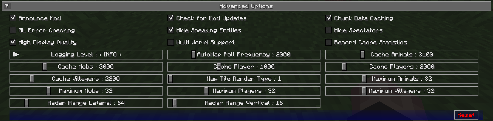

# **Advanced Settings**

!!! warning "Translation needed for 6.0"

    This page was updated for JourneyMap 6.0 in English. Translation
    is pending; the content shown is the English source. See
    Contributing to help translate the docs.

This section contains advanced settings for power users and those that may wish to tweak some of JourneyMap's internals.

!!! warning "Warning"

    The settings in this section can have extreme effects on the performance of your client. We don't recommend touching these settings unless you have a good understanding of what you're doing, or you're directed to do so by a member of the JourneyMap support staff.

    If tweaking these settings crashes your client or causes your computer to lag horribly, don't say we didn't warn you.

{: .center}

## **Toggles**

The **bold** toggle settings below are enabled by default.

| Toggle                          | Description                                                                                                                                          |
|---------------------------------|------------------------------------------------------------------------------------------------------------------------------------------------------|
| **Announce Mod**                | Announces in the chat window that JourneyMap is ready                                                                                                |
| **Check for Mod Updates**       | Turning this off means you won't be notified when there's a new version of JourneyMap available                                                      |
| **Chunk Data Caching**          | Enables or disables chunk caching - when disabled, teleporting or creating waypoints outside of your render range will default to sea level y=64      |
| GL Error Checking               | Enables OpenGL error checking - enabling can decrease performance, and a restart is required after changing this value                               |
| **Hide Sneaking Entities**      | Whether to hide creatures that are trying to sneak (crouch)                                                                                          |
| Hide Spectators                 | Whether to hide spectators on the radar                                                                                                              |
| **LOD Tiles**                   | Enable LOD (level-of-detail) tile rendering when zoomed out on the map - disabling and saving will delete LOD cache files from disk                  |
| **Minimap Preset Number Overlay** | Show or hide the number overlay displayed when switching minimap presets                                                                           |
| **Mob Icon Fade**               | Enable or disable mob icons fading based on vertical distance from the player                                                                        |
| Multi World Support             | Experimental: prevents map overwriting in multi-world server setups - only takes effect after rejoining the server                                   |
| **Player Icon Fade**            | Enable or disable player icons fading based on vertical distance from the player                                                                     |
| Record Cache Statistics         | Whether to enable caches to record their statistics - may slightly hurt performance if enabled - intended for beta testers                           |
| **Render Minimap behind Screens** | Allow the minimap to render behind open screens                                                                                                    |
| Use Legacy Icons                | Use the mob icons that come with JourneyMap instead of automatically generated ones or those that come in resource packs                             |
| Use Server IP                   | Use the server IP address in data saving to help keep maps unique - only takes effect after rejoining the server                                     |

## **Other Settings**

The default option for each setting below is marked with **bold text.**

| Setting                | Options                                                                                                                | Description                                                                                                                       |
|------------------------|------------------------------------------------------------------------------------------------------------------------|-----------------------------------------------------------------------------------------------------------------------------------|
| Logging Level          | <ul><li>**INFO**</li><li>ALL</li><li>DEBUG</li><li>ERROR</li><li>FATAL</li><li>OFF</li><li>TRACE</li><li>WARN</li></ul> | Set how verbose JourneyMap's logs are - caution, some logging levels will hurt performance, keep the default unless instructed     |
| AutoMap Poll Frequency | Range: 500 - 10000 (in ms)  Default is **2000**                                                                     | Delay between AutoMap region tasks - lower values will decrease time to AutoMap, but can hurt performance                          |
| Cache Animals          | Range: 1000 - 10000 (in ms)  Default is **3100**                                                                    | Duration radar data is cached before checking for new animals - lower values can hurt performance                                 |
| Cache Mobs             | Range: 1000 - 10000 (in ms)  Default is **3000**                                                                    | Duration radar data is cached before checking for new mobs - lower values can hurt performance                                    |
| Cache Player           | Range: 500 - 2000 (in ms)  Default is **1000**                                                                      | Duration status data about you is cached before being rechecked - lower values can hurt performance                               |
| Cache Players          | Range: 1000 - 10000 (in ms)  Default is **2000**                                                                    | Duration radar data is cached before checking for new players - lower values can hurt performance                                 |
| Cache Villagers        | Range: 1000 - 10000 (in ms)  Default is **2200**                                                                    | Duration radar data is cached before checking for new villagers - lower values can hurt performance                               |
| Maximum Animals        | Range: 1 - 128  Default is **32**                                                                                   | The maximum number of passive mobs displayed on the radar - larger numbers may cause lag                                          |
| Maximum Ambient Creatures | Range: 1 - 128  Default is **32**                                                                                | The maximum number of ambient mobs displayed on the radar - larger numbers may cause lag                                          |
| Maximum Mobs           | Range: 1 - 128  Default is **32**                                                                                   | The maximum number of hostile mobs displayed on the radar - larger numbers may cause lag                                          |
| Maximum Players        | Range: 1 - 128  Default is **32**                                                                                   | The maximum number of players displayed on the radar - larger numbers may cause lag                                               |
| Maximum Villagers      | Range: 1 - 128  Default is **32**                                                                                   | The maximum number of villagers displayed on the radar - larger numbers may cause lag                                             |
| Radar Range Lateral    | Range: 16 - 512 (in blocks)  Default is **64**                                                                      | Lateral distance to search for and display entities on the radar - larger numbers may cause significant lag                       |
| Radar Range Vertical   | Range: 8 - 320 (in blocks)  Default is **16**                                                                       | Vertical distance to search for and display entities on the radar - larger numbers may cause significant lag                      |
