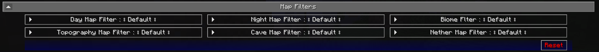

# **Map Filters**

!!! warning "Translation needed for 6.0"

    This page was updated for JourneyMap 6.0 in English. Translation
    is pending; the content shown is the English source. See
    Contributing to help translate the docs.

The Map Filters category lets you apply a color filter shader to each map
type independently. Filters are a client-side overlay only; they do not
modify the map data saved to disk.

{: .center}

## **Filter slots**

There is one filter dropdown per map type. Each can be set independently,
so you can keep your day map in default colors and apply a sepia filter
only to the night map, for example.

| Setting               | Description                                  |
|-----------------------|----------------------------------------------|
| Day Map Filter        | Filter applied to the day map.               |
| Night Map Filter      | Filter applied to the night map.             |
| Biome Filter          | Filter applied to the biome map.             |
| Topography Map Filter | Filter applied to the topography map.        |
| Cave Map Filter       | Filter applied to the cave map.              |
| Nether Map Filter     | Filter applied to the nether cave map.       |

## **Available filters**

The same set of filter presets is available in every slot.

| Filter           | Effect                                                 |
|------------------|--------------------------------------------------------|
| **Default**      | No filter applied (default colors).                    |
| Gray Scale       | Renders the map in grayscale.                          |
| Sepia Variant 1  | Sepia color filter.                                    |
| Sepia Variant 2  | A second sepia variant.                                |
| Sepia Variant 3  | A third sepia variant.                                 |
| Brightness       | Increases map brightness by 0.2.                       |
