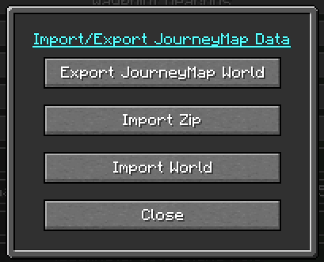

# **Ajustes**

!!! warning "Translation needed for 6.0"

    This page was updated for JourneyMap 6.0. Some sections shown are
    the English source pending translation. See Contributing to help
    translate the docs.

JourneyMap proporciona más de unas pocas opciones de configuración, lo que te permite personalizar el comportamiento y la apariencia de muchos aspectos diferentes del mod. Todas estas configuraciones están disponibles a través del administrador de configuración.

{: .center}

Para acceder al administrador de configuración, abra el mapa en pantalla completa y haga clic en el botón de configuración en la parte inferior, o presione la tecla ++o++. Cada entrada de la lista representa una categoría específica de configuración; haga clic en ella para expandirla y ver las configuraciones que contiene.

!!! note "Nota"

 Cada categoría tiene un botón Restablecer. Tenga en cuenta que al presionar este botón se restablecerán las configuraciones de esa categoría a las configuraciones predeterminadas incluidas con JourneyMap, en lugar de simplemente descartar los cambios.

## **Import / Export**

The settings manager has an **Import/Export** button. It opens the
Import/Export JourneyMap Data dialog, which lets you back up and restore
JourneyMap's data for a world: the generated map tiles and waypoints.

{: .center}

### Exporting

Choose **Export JourneyMap World** to back up the current world. Select
which folders (for example the individual dimensions) to include, then
use **Create Export** to write them out to a zip file.

{: .center}

### Importing

To restore a backup, choose either **Import Zip** to import from a zip
file or **Import World** to import from a folder. Select the source,
choose which folders to bring in, and confirm with **Import Selected
Folders**.

This is handy for moving your explored map and waypoints between
computers, or for restoring them after reinstalling.
