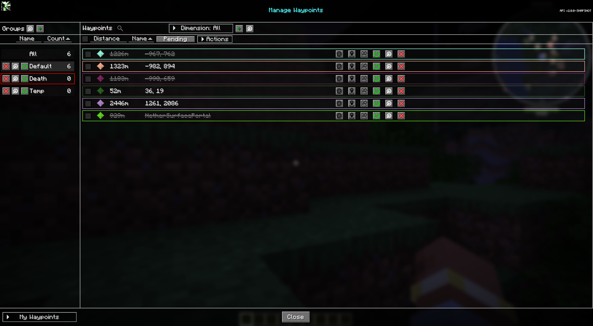
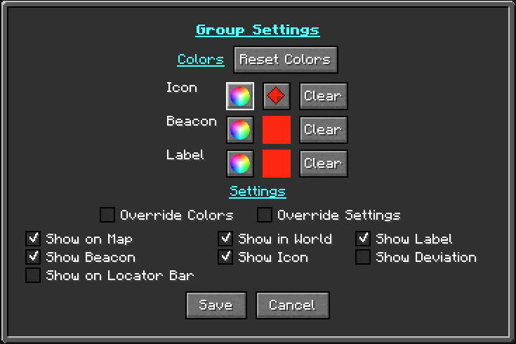

# **Waypoint Groups**

!!! warning "Translation needed for 6.0"

    This page was updated for JourneyMap 6.0 in English. Translation
    is pending; the content shown is the English source. See
    Contributing to help translate the docs.

Waypoint groups let you organize your waypoints into named sets, such as
`Bases`, `Mining`, or `Villages`. Groups are managed from the
[Waypoint Manager](waypoints.md#the-waypoint-manager); the group list is
the panel on one side of the manager.

{: .center}

## **Native groups**

JourneyMap has several built-in groups that always exist:

| Group   | Purpose                                                                 |
|---------|-------------------------------------------------------------------------|
| Default | New waypoints go here unless you pick another group.                    |
| Death   | Death waypoints created when you die.                                   |
| Temp    | Temporary waypoints.                                                    |
| All     | A virtual view that shows every waypoint regardless of its group.       |

When you play on a server that manages waypoints, a **Global** group is
also shown for the waypoints the server shares with players.

Native groups are **locked**: their names cannot be changed. They can
still be configured in other ways (see below).

## **Creating a group**

Use the **New Group** button in the Waypoint Manager, or the
**New Group** option in the [Waypoint Editor](waypoints.md#the-waypoint-editor),
to create a custom group. Custom groups can be renamed, edited, and
deleted freely.

## **Group actions**

Each group in the list has these actions:

- **Enable / Disable Group** - toggle every waypoint in the group on or
  off at once.
- **Edit Group** - open the Edit Group screen (see below).
- **Delete Group** - delete the group. (Native groups cannot be deleted.)

## **Editing a group**

{: .center}

The **Edit Group** screen shows the group's Id, Tag, and waypoint count,
and provides these options:

| Option              | Description                                                                                                |
|---------------------|------------------------------------------------------------------------------------------------------------|
| Name                | The group's display name. Locked (native) groups cannot be renamed.                                        |
| Settings            | Opens the [group Settings popup](#group-settings-and-overrides) for the group's colors, icon, and visibility, including the override toggles. |
| Default             | Marks this group as the default group for new waypoints. Only one group can be the default at a time.       |
| Tag                 | Text prefixed onto every waypoint name in the group, both on the map and in the world. Can be left blank.   |
| Locked              | Shown for native groups whose name cannot be edited.                                                       |

### Group settings and overrides

{: .center}

The **Settings** button opens the same
[Waypoint Settings popup](waypoints.md#the-waypoint-settings-popup) used
for individual waypoints - the Icon/Beacon/Label color table and the
visibility toggles - applied to the group. In group mode it adds an
**Override** checkbox to each color row, plus an **Override Settings**
checkbox below the table:

- **Override** (one per color row - Icon, Icon Color, Beacon, Label) -
  when a row's Override is checked, every waypoint in the group uses the
  group's value for that row instead of its own. The **Icon** row covers
  the group's icon image, **Icon Color** the icon's color, and **Beacon**
  and **Label** those colors. Rows left unchecked let each waypoint keep
  its own, so you can override just the icon, just a color, or any
  combination.
- **Override Settings** - when enabled, every waypoint in the group uses
  the group's visibility toggles instead of its own.

With every override left off, each waypoint keeps its own colors and
settings and the group's are ignored.

### Show on Locator Bar

!!! info "26.1 and newer"

    The locator bar is a Minecraft 1.21.6+ feature, so this option is
    only present in JourneyMap for Minecraft 26.1 and newer (the 26.x
    line, including 26.2). It is not available on the 1.21.1 line
    (1.21.1 / 1.21.11).

**Show on Locator Bar** is one of the visibility toggles in the group's
Settings popup. It shows the group's waypoints on the vanilla locator bar
above the hotbar.

## **Default group**

The group marked as **Default** is where new waypoints are placed unless
you choose a different group while creating them. Setting a new default
clears the flag from whatever group held it before, so there is always
exactly one default group.

## **Temporary waypoints**

The `Temp` group holds temporary waypoints. Waypoints can be added to or
removed from the Temp group, which is handy for short-lived markers you
do not want cluttering your permanent groups.

## **Group panel settings**

The **Edit Group Settings** screen controls how the group list itself is
displayed:

| Setting                  | Description                                              |
|--------------------------|----------------------------------------------------------|
| Hide All Group           | Hides the `All` group from the group panel.              |
| Hide Empty Custom Groups | Hides custom groups that contain no waypoints.           |
| Hide Empty Death Group   | Hides the `Death` group when there are no death points.  |
| Hide Empty Temp Group    | Hides the `Temp` group when there are no temp waypoints. |
