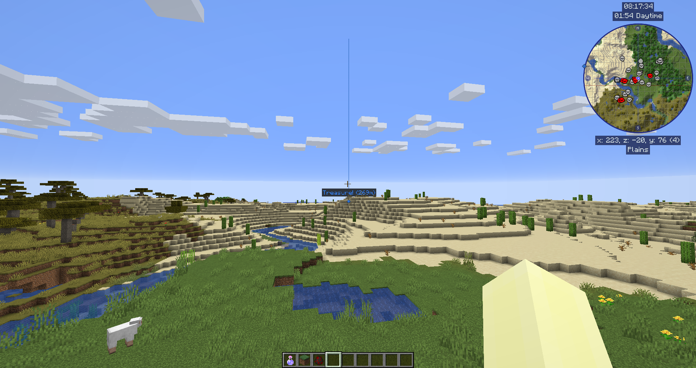
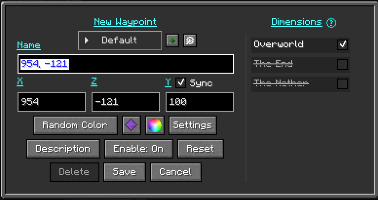
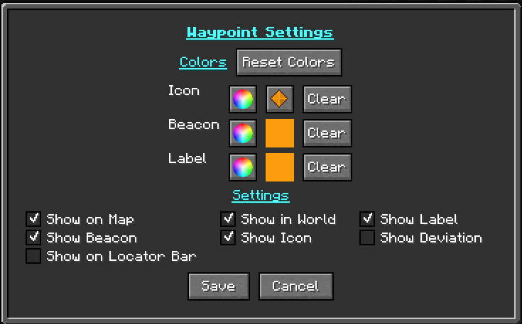

# **Waypoints**

!!! warning "Translation needed for 6.0"

    This page was updated for JourneyMap 6.0 in English. Translation
    is pending; the content shown is the English source. See
    Contributing to help translate the docs.

Waypoints let you mark specific locations on your map so you can keep
track of them or find your way back to them later.

Death waypoints are created automatically when you die, so you can
return to collect your items. Death waypoints can be disabled in the
[settings manager](settings/waypoint.md) if you prefer.

By default a waypoint is shown in the world as a colored beacon beam,
with its name and icon displayed when you look towards it. This and
many other behaviors can be changed in the
[Waypoint settings](settings/waypoint.md) and
[Waypoint Beacon settings](settings/waypoint-beacon.md).

{: .center}

## **Creating Waypoints**

You can create a waypoint in any of these ways:

- Press ++b++ in-game to create a waypoint where you are standing.
- Double-click, or press ++b++, in the [full-screen map](full-screen-map.md)
  to create a waypoint at the cursor.
- Open the Waypoint Manager and use the **New** button.

Each method opens the [Waypoint Editor](#the-waypoint-editor) so you can
name and customize the waypoint before saving it.

## **The Waypoint Manager**

The Waypoint Manager is a single place to manage all of your waypoints
and waypoint groups. Open it in either of these ways:

- Press ++n++ in-game or on the full-screen map.
- Open the [full-screen map](full-screen-map.md) and click the Waypoint
  Manager button.

{: .center}

The manager has two panels: a list of [groups](#waypoint-groups) on one
side and the waypoints in the selected group on the other. A search box
filters the list as you type.

### Manager buttons

| Button             | Action                                                            |
|--------------------|-------------------------------------------------------------------|
| New                | Create a new waypoint.                                            |
| New Group          | Create a new waypoint group.                                      |
| Options            | Open the [settings manager](settings/overview.md).                |
| Dimension          | Filter the shown waypoints by dimension.                          |
| Import External    | Import waypoints from Xaero's Minimap. **Only appears when Xaero's waypoints are detected** for your current world - see [Importing from Xaero's Minimap](#importing-from-xaeros-minimap). |
| Export             | Export your waypoints to a file (you choose the format).          |
| Pending            | Review waypoints other players have shared with you.              |
| Close              | Close the Waypoint Manager.                                       |

To import or restore JourneyMap's own waypoint files (a dropped-in
`.dat`, or a backup), see [Backups and Importing](#backups-and-importing)
below - that is separate from the Import External button.

### Per-waypoint actions

Each waypoint in the list has these actions:

- **Teleport** - if allowed by the server, teleport directly to the waypoint.
- **Find** - locate the waypoint on the [full-screen map](full-screen-map.md).
- **On/Off** - toggle the waypoint's visibility.
- **Edit** - open the [Waypoint Editor](#the-waypoint-editor).
- **Remove** - delete the waypoint.
- **Chat** - share the waypoint (see [Sharing Waypoints](#sharing-waypoints)).

### Selecting multiple waypoints

Use **Select All**, or select individual waypoints, to act on several at
once. With a selection active you can **Toggle Selected**,
**Share Selected**, or **Delete Selected**.

## **The Waypoint Editor**

The Waypoint Editor opens whenever you create or edit a waypoint.

{: .center}

The editor provides these fields:

- **Name** - the display name for the waypoint.
- **Location** - the X, Y, and Z coordinates. You can switch between
  separate X / Y / Z fields and a single combined `X, Y, Z` field using
  the Coordinate Layout option (see below). A **Sync** checkbox next to
  the Y field, when enabled, fills the Y value from the cached surface
  height for that X/Z (if that chunk has been mapped), so the waypoint
  sits on the surface.
- **Dimensions** - toggles for the dimensions the waypoint is shown in.
- **Group** - the [group](#waypoint-groups) this waypoint belongs to.
  You can also create a new group from here.
- **Enable** - whether the waypoint is enabled and visible.
- **Color** - the waypoint's color. Click the color wheel to pick a
  color, or use **Randomize** for a new random color. This sets the
  icon, beacon, and label colors together; to set them separately, use
  the Settings popup.
- **Icon** - click the icon button to choose the waypoint's icon. See
  [Waypoint Icons](#waypoint-icons).
- **Settings** - opens the
  [Waypoint Settings popup](#the-waypoint-settings-popup), where you can
  set the icon, beacon, and label colors individually and choose where
  the waypoint is shown.
- **Description** - opens a popup for a longer free-text description.

Buttons:

- **Reset** - undo your unsaved edits to this waypoint.
- **Save** - save your changes.
- **Close** - close the editor without saving.

### Editor options

The **Waypoint Editor Options** button configures the editor itself
rather than a single waypoint. It includes the **Coordinate Layout**
option, which switches between separate X / Y / Z input fields and a
single combined `X, Y, Z` field.

### The Waypoint Settings popup

The **Settings** button in the editor opens the Waypoint Settings popup,
which controls the waypoint's colors and where it is shown.

{: .center}

**Colors.** The popup has a four-row color table - **Icon**,
**Icon Color**, **Beacon**, and **Label**:

- The **Icon** row has an icon button for choosing the
  [icon](#waypoint-icons), along with a color picker.
- The **Icon Color**, **Beacon**, and **Label** rows each have a color
  picker for that element.
- The Icon Color, Beacon, and Label colors follow the icon's color until
  you set them individually, so by default they match.
- Each row's **Clear** button removes that color, drawing the element
  with no tint.
- **Reset Colors** returns all rows to the icon's color.

**Visibility.** A column of checkboxes controls where the waypoint is
shown:

| Toggle              | Effect                                                |
|---------------------|-------------------------------------------------------|
| Show on Map         | Show the waypoint on the minimap and full-screen map. |
| Show in World       | Show the waypoint in the world.                       |
| Show Label          | Show the waypoint's name label.                       |
| Show Beacon         | Show the in-world beacon beam.                        |
| Show Icon           | Show the waypoint's icon.                             |
| Show Deviation      | Show the deviation readout next to the label.         |
| Show on Locator Bar | Show the waypoint on the vanilla locator bar.         |

The **Show on Locator Bar** toggle is only present in JourneyMap for
Minecraft 26.1 and newer (see [Show On Locator Bar](#show-on-locator-bar)).

## **Waypoint Groups**

Waypoint groups let you organize waypoints into named sets - for example
`Bases`, `Mining`, or `Villages`. A group can be enabled or disabled as
a whole, given its own icon, and marked as the default group for new
waypoints.

JourneyMap has several built-in groups: `Default` (where new waypoints
go unless you choose otherwise), `Death` (death waypoints), and `Temp`
(temporary waypoints). The `All` view shows every waypoint regardless of
group.

!!! note "More detail"

    Groups are a large feature with their own management screen. Full
    coverage lives on the [Waypoint Groups](waypoint-groups.md) page.

## **Waypoint Icons**

Click the icon button in the Waypoint Editor (or in the Icon row of the
[Settings popup](#the-waypoint-settings-popup)) to open the icon picker.

{: .center}

The picker groups icons into tabs:

- **All** - every available icon.
- **JourneyMap** - the built-in JourneyMap icons.
- **Minecraft** - vanilla Minecraft item textures.
- **Map Deco** - vanilla map marker icons.
- One tab for each named icon set supplied by a resource pack.

The picker also has a color picker, so you can set the icon's color while
choosing it, and a **Clear** button to remove the color.

You can add your own waypoint icons, and your own named icon sets, with a
resource pack. See
[Waypoint Icons (Resource Packs)](../tools/waypoint-icons.md).

## **Server-Managed Waypoints**

When you play on a server that runs JourneyMap, the server can manage
waypoints itself. In that case waypoints have a **scope**:

- **Personal** - your own waypoints, visible only to you.
- **Global** - waypoints managed by the server and shared with players,
  set up by server admins.

The Waypoint Manager shows a scope selector when server-managed
waypoints are available. See
[Server Multiplayer settings](../server/multiplayer.md) for the
server-side options.

## **Teleporting to Waypoints**

If the server allows it, the **Teleport** action in the Waypoint Manager
takes you directly to a waypoint. Teleporting is controlled per
dimension by server admins, so it may be available in some dimensions
and not others. In single-player it is always available.

The teleport command JourneyMap uses can be customized, and there is an
option to strip decimal places from the coordinates it sends. See the
[Waypoint settings](settings/waypoint.md).

## **Sharing Waypoints**

You can share a waypoint or location with other players. Players who do
not have JourneyMap still see the location in chat in a readable format.

There are three ways to share:

1. In the Waypoint Manager, use the **Chat** button next to a waypoint
   (or **Share Selected** for several). The location is placed in the
   chat input for you - add a message if you like, then press Enter.
2. In the chat input, type `/jm ~` and press Enter. It is replaced with
   your current location.
3. Type a location manually in chat between square brackets (see
   [Location Format](#location-format) below).

When a properly formatted location appears in chat, **click** it to
create a waypoint, or **control-click** it to view the location on the
full-screen map.

{: .center}

Waypoints shared directly with you arrive as **Pending** waypoints. Open
the **Pending** button in the Waypoint Manager to **Accept** or
**Decline** each one.

### Location Format

A location must have at least the x and z coordinates. The order of the
values does not matter:

- `[x:#, z:#]`
- `[x:#, y:#, z:#]`
- `[x:#, y:#, z:#, dim:#]`
- `[x:#, y:#, z:#, dim:#, name:text]`
- `[name:text, dim:#, x:#, z:#, y:#]`

A location is two or more `name:value` pairs separated by commas. The
supported values are:

- `x` (integer) **required**
- `y` (integer)
- `z` (integer) **required**
- `dim` (integer)
- `name` (string, no quotes, no commas)

## **Waypoint Commands**

JourneyMap's chat commands live under the `/jm` prefix.

`/jm reload` reloads the waypoint files from disk without restarting the
game. This is mainly useful after dropping waypoint files into the
waypoint folder while the game is running.

When the server runs JourneyMap, server-side waypoint commands are also
available under `/jm waypoint` (or `/jm wp`). See the
[server waypoint command](../server/commands/waypoint_command.md) page.

## **Backups and Importing**

JourneyMap protects your waypoint data in several ways:

- **Rolling backups** - JourneyMap keeps recent backups of your waypoint
  data and automatically loads the most recent good backup if the main
  file is found to be damaged.
- **Import / Export** - use the Import and Export buttons in the
  Waypoint Manager to back up your waypoints to a file or restore them.
- **Drop-in merge** - drop a waypoint `.dat` file into the waypoint
  folder and JourneyMap merges its waypoints into your existing data.
  Run `/jm reload`, or reconnect, to pick up files added while playing.
- **Import from Xaero's** - if Xaero's Minimap waypoints are detected for
  your current world, an **Import External** button appears in the
  Waypoint Manager. See [Importing from Xaero's Minimap](#importing-from-xaeros-minimap).

### Importing from Xaero's Minimap

JourneyMap can import waypoints from **Xaero's Minimap**, currently the
only supported external source. The **Import External** button appears in
the Waypoint Manager toolbar **only when** JourneyMap detects Xaero's
waypoints for the world or server you are on; if there are none for the
current world, the button is hidden.

{: .center}

Clicking it opens the **Import External Waypoints** screen, where you can
review the detected waypoints and import them. JourneyMap reads Xaero's
own data folder, matching by singleplayer world, server address, or
Realm.

{: .center}

This is separate from the
[Import / Export data tools](settings/overview.md#import-export) and from
the drop-in `.dat` merge above: those handle JourneyMap's own files,
while this reads Xaero's.

## **Show On Locator Bar**

!!! info "26.1 and newer"

    The locator bar is a Minecraft 1.21.6+ feature, so this option is
    only present in JourneyMap for Minecraft 26.1 and newer (the 26.x
    line, including 26.2). It is not available on the 1.21.1 line
    (1.21.1 / 1.21.11).

Waypoints can be shown on Minecraft's locator bar. This is controlled by
a **Show On Locator Bar** option, available both globally and per
[group](waypoint-groups.md). Disabled waypoints are not shown on the
locator bar.

{: .center}

## **Settings**

Waypoint behavior is configured in two settings categories:

- [Waypoint settings](settings/waypoint.md) - death waypoints, the
  teleport command, sharing, and more.
- [Waypoint Beacon settings](settings/waypoint-beacon.md) - how waypoint
  beacons and labels are drawn in the world.
