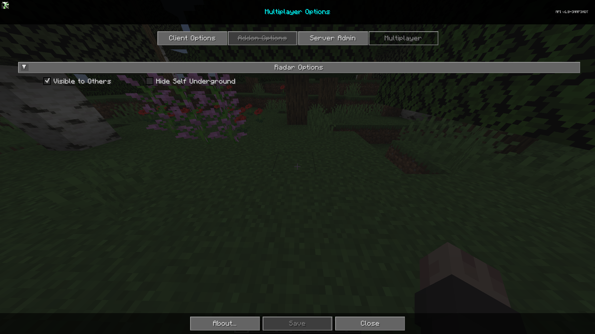

# **Ajustes**

!!! warning "Translation needed for 6.0"

    This page was updated for JourneyMap 6.0. Some sections shown are
    the English source pending translation. See Contributing to help
    translate the docs.

La sección Multijugador es una sección diseñada para brindar a los usuarios control sobre cómo se ven en otros clientes usando el mod JourneyMap y cómo se muestran en el mapa. Esta sección solo se desbloquea cuando el servidor ejecuta el mod JourneyMap y el servidor puede desactivarla.

{: .center}

Para acceder a la pestaña Multijugador, abre el mapa en pantalla completa y haz clic en el botón de configuración en la parte inferior, o presiona la tecla ++o++. Finalmente, en la parte superior, haz clic en la pestaña Multijugador para acceder a la configuración multijugador del mod. Cada entrada de la lista representa una categoría específica de configuración; haga clic en ella para expandirla y ver las configuraciones que contiene.

## **Opciones de Radar**

La sección Opciones de radar es una sección para controlar cómo te ven los demás en el mapa. Tenga en cuenta que estas opciones solo funcionan cuando el radar expandido está habilitado.

{: .center}

## **Alternar**

| Toggle                    | Description                                                                                  |
|---------------------------|----------------------------------------------------------------------------------------------|
| **Visible to Others**     | Uncheck to hide yourself from being seen on the map. Note: Ops can still see you.             |
| Hide Self Underground     | Disable others from seeing you when you're underground.                                      |

## **Server Waypoints**

JourneyMap 6.0 lets servers manage waypoints. When a server you are connected to manages waypoints, you receive "global" waypoints shared by the server in addition to your own personal waypoints. There are no toggles for this in the Multiplayer section - it is controlled by the server. See [Waypoints](../client/waypoints.md) for details on how global waypoints appear and behave.
