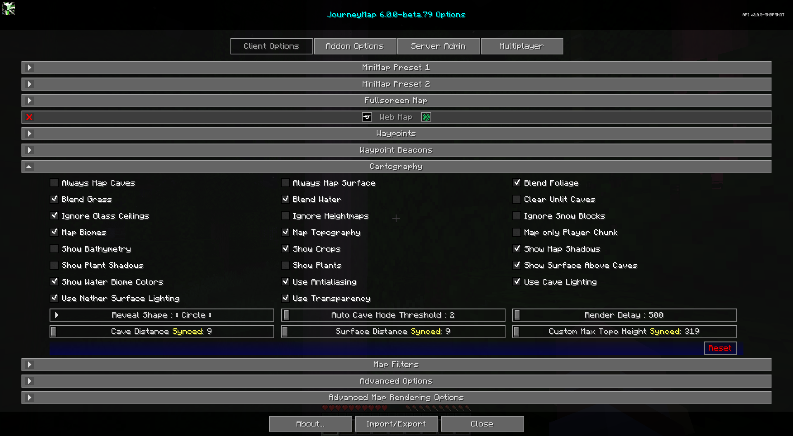

# **Paramètres de cartographie**

Les paramètres de cartographie vous permettent de personnaliser le rendu de la carte et ce qui y est affiché.

{: .center}

Pour les filtres de couleur de carte et les options de shader, voir [Map Filters](filters.md).

## **Toggles**

Les paramètres de bascule **gras** ci-dessous sont activés par défaut.

| Basculer | Descriptif |
|------------------------------|---------------------------------------------------------------------------------------------------------------------------------------------------|
| Toujours cartographier les grottes | Cartographiez toujours chaque couche de grottes de votre morceau vertical, même lorsque vous êtes sur la surface de l'Overworld. La désactivation de cette option améliorera les performances.                    |
| Toujours cartographier la surface | Cartographiez toujours la surface de l'Overworld, même sous terre. La désactivation de cette option améliorera les performances.                                                 |
| **Mélanger le feuillage** | Mélange les couleurs du feuillage entre les biomes. Désactivez-le pour améliorer les performances.                                                                             |
| **Mélanger l'herbe** | Mélange les couleurs de l'herbe entre les biomes. Désactivez-le pour améliorer les performances.                                                                               |
| **Mélanger l'eau** | Mélange les aquarelles entre les biomes. Désactivez-le pour améliorer les performances.                                                                               |
| Effacer les grottes non éclairées | Les blocs de tranches éteints et intérieurs sont rendus clairs au lieu d'être noirs. Cette option n'affecte que les blocs nouvellement mappés.                                   |
| **Ignorez les plafonds de verre** | Être sous une verrière ne passera pas à la cartographie des grottes |
| Ignorer les cartes de hauteur | Ignore les cartes de hauteur de fragments si la couche supérieure du monde ne s'affiche pas correctement. Cela peut avoir un impact sur les performances.                                    |
| Ignorer les blocs de neige | Ignore tous les blocs de type neige de la cartographie. Il s'agit d'une fonctionnalité expérimentale qui peut avoir des effets secondaires étranges et pourrait être supprimée à l'avenir.       |
| Carte uniquement Player Chunk | Cartographie uniquement le morceau dans lequel se trouve actuellement le joueur. Il ignore tout paramètre de distance.                                                         |
| **Carte des biomes** | Fournit une carte des biomes.                                                                                                                         |
| **Topographie de la carte** | Fournit une carte de contour qui montre les changements d'altitude |
| **Afficher les ombres de la carte** | Les blocs projetteront des ombres sur la carte.                                                                                                                  || Afficher la bathymétrie | Montre le terrain du fond de l'océan et sous l'eau |
| **Afficher les cultures** | Les cultures sont indiquées sur la carte |
| Afficher les ombres des plantes | Les plantes et les cultures projetteront des ombres sur la carte |
| Afficher les plantes | Les plantes sont représentées sur la carte |
| **Afficher la surface au-dessus des grottes** | Une faible vue de la surface voisine est visible sous terre |
| **Afficher les couleurs du biome aquatique** | Affiche des aquarelles basées sur le biome.                                                                                                                |
| **Utiliser l'anticrénelage** | Améliore l’effet d’ombrage utilisé pour afficher les changements d’altitude. La désactivation peut améliorer les performances.                                                     |
| **Utilisez l'éclairage des grottes** | Utilisez les niveaux de lumière réels sous terre. Désactivez l'utilisation de la pleine lumière.                                                                               |
| **Utilisez l'éclairage de surface du Nether** | Lorsqu'il est activé, utilise les niveaux de lumière mondiaux réels pour la carte de la surface du Nether. Lorsqu'elle est désactivée, utilise la luminosité maximale pour que la carte soit toujours visible.   |
| **Utilisez la transparence** | Les blocs transparents révéleront ce qui se trouve en dessous |

## **Autres paramètres**

L'option par défaut pour chaque paramètre ci-dessous est marquée d'un **texte en gras.**

| Paramètre | Options | Descriptif |
|----------------------------------|--------------------------------------------------|--------------------------------------------------------------------------------------------------------------------------------------------------------------------------------------------------------------------------------------------------|
| Révéler la forme | <ul><li>Carré</li><li>**Cercle**</li></ul> | Forme de la zone de carte révélée autour de vous. Circle révèle moins de morceaux que Square et améliorera les performances.                                                                                                                          |
| Délai de rendu | Plage : 100 - 60 000 (en millisecondes, par défaut : **500**) | Temps (en millisecondes) entre les passes de rendu. Des valeurs plus élevées peuvent améliorer les performances, mais peuvent entraîner la perte de morceaux pendant le voyage.                                                                                              |
| Distance de la grotte | Plage : 0 - 32 (en morceaux, par défaut : **0**) | Rayon de morceaux autour de vous qui sont finalement cartographiés sous terre ou dans des dimensions sans ciel. Des valeurs inférieures peuvent améliorer les performances. Les valeurs supérieures à la distance de rendu de Minecraft n'ont aucun effet. Réglez sur 0 pour refléter la plage de rendu du bloc de l'option vidéo. |
| Distance superficielle | Plage : 0 - 32 (en morceaux, par défaut : **0**) | Rayon de morceaux autour de vous qui sont finalement cartographiés sur la surface en dimensions avec un ciel. Des valeurs inférieures peuvent améliorer les performances. Les valeurs supérieures à la distance de rendu de Minecraft n'ont aucun effet. Réglez sur 0 pour refléter la plage de rendu du bloc de l'option vidéo.  |
| Hauteur Topo maximale personnalisée | Plage : 0 - 320 (en blocs, par défaut : **0**) | Hauteur utilisée par la cartographie topographique pour les calculs de hauteur maximale. Tous les blocs au-dessus de cette hauteur seront blancs. La modification de ce paramètre peut avoir des effets considérables sur la carte topographique. Réglez sur 0 pour utiliser la hauteur de construction maximale par défaut mondiale. |
| Seuil du mode Cave automatique | Plage : 1 - 100 (en blocs, par défaut : **2**) | Combien de blocs pour passer en mode grotte. Ceci est utile pour empêcher le changement de mode grotte lorsque vous entrez dans une maison.                                                                                                                          |
