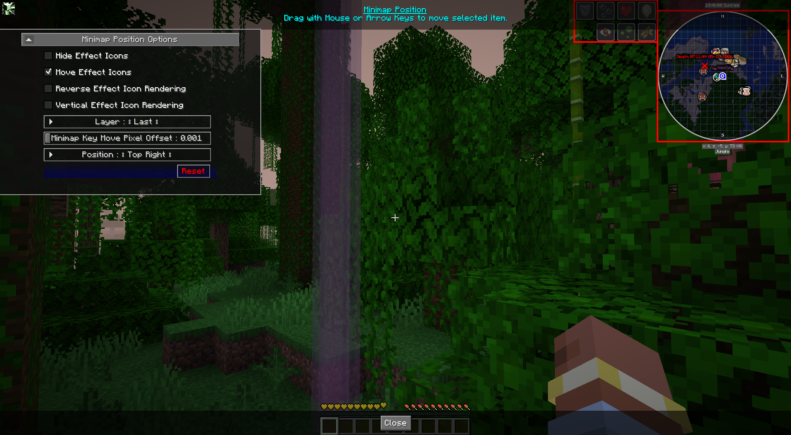

# **Paramètres de position de la mini-carte**

JourneyMap vous permet de configurer l'emplacement des icônes d'effet et de la mini-carte réelle. Cela vous permet en tant qu'utilisateur de déplacer la mini-carte et les icônes d'effet où vous le souhaitez sur l'écran.

{: .center}

## **Toggles**

Les paramètres de bascule **gras** ci-dessous sont activés par défaut.

| Basculer | Descriptif |
|--------------------------------|-------------------------------------------------------------------------------------------------|
| **Icônes d'effet de déplacement** | Permet d'éloigner les effets des potions de la mini-carte.                          |
| Masquer les icônes d'effet | Masque les icônes d’effet.                                                               |
| Rendu d'icône à effet inverse | Rendu inversé des icônes. Vertical de bas en haut, non vertical de gauche à droite.   |
| Rendu d'icône d'effet vertical | Rendu vertical des icônes d'abord de haut en bas.                          |

## **Autres paramètres**

L'option par défaut pour chaque paramètre ci-dessous est marquée d'un texte **gras**.

| Paramètre | Options | Descriptif |
|-------------------------------|---------------------------------------------------------------------------------------------------------------------------------------------------------|----------------------------------------------------------------------------------------------------------------------------|
| Décalage des pixels de déplacement des touches de la mini-carte | <ul><li>Plage : 0,001 - 0,025  **La valeur par défaut est 0,001**</li></ul> | Lorsque vous déplacez la mini-carte avec les touches fléchées, cette option contrôle le nombre de pixels par pression sur une touche pour aider à affiner l'emplacement. |
| Couche | <ul><li>First</li><li>Avant les effets</li><li>After Effects</li><li>Avant le tableau de bord</li><li>Après le tableau de bord</li><li>**Dernier**</li></ul> | Contrôle l'endroit où la mini-carte est dessinée dans l'ordre de rendu du HUD. Les calques précédents s'affichent sous les calques ultérieurs.                     |
| Poste | <ul><li>**En haut à droite**</li><li>En bas à droite</li><li>En bas à gauche</li><li>En haut à gauche</li><li>En haut au centre</li><li>Centre</li><li>Custom</li></ul> | Réglez sur **Personnalisé** pour faire glisser la mini-carte vers l'emplacement souhaité.                                                            |
