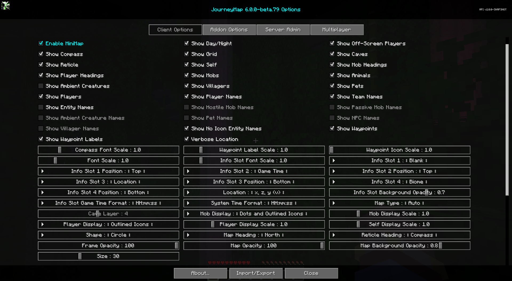

# **Paramètres de la mini-carte**

JourneyMap vous permet d'avoir deux préréglages de mini-carte. Chaque préréglage représente un ensemble distinct de paramètres - vous permettant essentiellement d'avoir deux mini-cartes distinctes disponibles entre lesquelles basculer.

!!! note "Note"

    Les paramètres de chaque mini-carte sont identiques, nous ne couvrirons donc qu'un seul préréglage ci-dessous.

Pour basculer entre les préréglages de mini-carte, appuyez sur la touche de préréglage de mini-carte (la touche ++backslash++ par défaut).

{: .center}

## **Toggles**

Les bascules dont les noms sont affichés en **gras** sont activées par défaut.

| Basculer | Descriptif |
|------------------------------|-----------------------------------------------------------------------------------|
| **Activer la mini-carte** | Afficher la MiniCarte dans le jeu |
| **Afficher jour/nuit** | Passer automatiquement à la carte Jour ou Nuit |
| **Afficher les grottes** | Passer à la carte de la grotte lorsque vous êtes sous terre ou à l'intérieur |
| **Afficher la boussole** | Afficher les points cardinaux sur le cadre MiniMap |
| **Afficher le réticule** | Afficher un réticule (réticule) sur la MiniMap |
| **Afficher la grille** | Afficher une grille de limites de morceaux sur la carte |
| **Montrez-vous** | L'icône de votre localisateur est affichée sur la carte |
| **Afficher les titres des joueurs** | Montrer dans quelle direction les autres joueurs regardent |
| **Afficher les titres de la foule** | Montrer dans quelle direction les foules regardent |
| **Afficher les monstres** | Les foules hostiles à proximité sont affichées sur la carte |
| **Afficher les animaux** | Les foules passives à proximité sont affichées sur la carte |
| Afficher les créatures ambiantes | Les créatures ambiantes à proximité, comme les chauves-souris, sont affichées sur la carte |
| **Afficher les villageois** | Les villageois à proximité sont indiqués sur la carte |
| **Afficher les animaux** | Les animaux à proximité sont affichés sur la carte |
| **Afficher les joueurs** | Les joueurs à proximité sont affichés sur la carte |
| **Afficher les joueurs hors écran** | Les joueurs visibles hors écran voient leur icône affichée sur la bordure de la mini-carte |
| **Afficher les points de cheminement** | Les waypoints à proximité sont affichés sur la carte |
| **Afficher les étiquettes des points de cheminement** | Afficher les étiquettes des waypoints sur la carte |
| **Emplacement détaillé** | L'emplacement affiche les noms de coordonnées (x, y, z) avec les chiffres |
| **Afficher les noms des joueurs** | Afficher les noms des joueurs sur la carte |
| **Afficher les noms des équipes** | Afficher les noms des équipes sur la carte || Afficher les noms d'entités | Afficher les noms des animaux de compagnie, des PNJ, etc. sur la carte |
| Afficher les noms des foules hostiles | Afficher les noms des foules hostiles sur la carte |
| Afficher les noms des foules passives | Afficher les noms des foules passives sur la carte |
| Afficher les noms des créatures ambiantes | Afficher les noms des créatures ambiantes sur la carte |
| Afficher les noms d'animaux | Afficher les noms des animaux sur la carte |
| Afficher les noms des PNJ | Afficher les noms des PNJ sur la carte |
| Afficher les noms des villageois | Afficher les noms des villageois sur la carte |
| **Afficher les noms d'entités sans icône**| Afficher les noms des entités qui n'ont pas d'icône. Ceci remplace toutes les autres bascules de nom |

## **Info Slots**

Les emplacements d'informations sont des zones de texte au-dessus et au-dessous de la mini-carte qui affichent des informations contextuelles supplémentaires. Il y en a quatre de
eux, numérotés de 1 à 4. Chaque emplacement a sa propre source d'étiquette (ce qu'elle affiche) et une position (haut ou bas de
la mini-carte).

{: .center}

Chaque source d'étiquette d'emplacement d'information peut être définie sur l'une des valeurs suivantes :

- **Vierge** : Rien, masquer cet emplacement d'informations
- **Biome** : Le biome de votre emplacement
- **Dimension** : la dimension dans laquelle vous vous trouvez actuellement
- **FPS** : les images par seconde actuelles
- **Game Time** : L'heure mondiale (cycle de 20 minutes), avec un nouveau jour à 6h du matin. C'est l'heure par défaut de Minecraft
- **Game Time with Offset** : L'heure mondiale décalée de 6 heures, donc un nouveau jour commence à minuit
- **Light Level** : Le niveau de lumière du bloc à vos pieds
- **Emplacement** : Vos coordonnées actuelles
- **Minecraft Day** : Le numéro du jour actuel dans le monde
- **Phase de lune** : La phase de lune actuelle
- **Vitesse de mouvement** : votre vitesse de déplacement en blocs par seconde
- **Région** : les coordonnées de votre région actuelle
- **Heure système** : L'heure actuelle en fonction de l'horloge de votre ordinateur
- **Météo** : La météo actuelle pour la dimension

Chaque emplacement d'information dispose également d'un paramètre de position :

| Paramètre | Options | Descriptif |
|----------------------|-----------------------------------------------|------------------------------------------------|
| Emplacement d'information 1 Position | <ul><li>**Haut**</li><li>Bas</li></ul> | Que l'emplacement d'informations 1 se trouve au-dessus ou en dessous de la mini-carte |
| Emplacement d'information 2 Position | <ul><li>**Haut**</li><li>Bas</li></ul> | Que l'Info Slot 2 se trouve au-dessus ou en dessous de la mini-carte |
| Emplacement d'information 3 Position | <ul><li>Haut</li><li>**Bas**</li></ul> | Que l'Info Slot 3 se trouve au-dessus ou en dessous de la mini-carte |
| Emplacement d'information 4 Position | <ul><li>Haut</li><li>**Bas**</li></ul> | Que l'Info Slot 4 se trouve au-dessus ou en dessous de la mini-carte |

Par défaut, l'emplacement d'informations 1 est vide, l'emplacement d'informations 2 affiche l'heure du jeu, l'emplacement d'informations 3 affiche l'emplacement et l'emplacement d'informations 4 affiche
Biome.

## **Autres paramètres**

L'option par défaut pour chaque paramètre ci-dessous est marquée d'un texte **gras**.

| Paramètre | Options | Descriptif |
|------------------------------|---------------------------------------------------------------------------------------------------------------------------------------------------------------------------------------------------------|------------------------------------------------------------------------------------------------------------|
| Type de carte | <ul><li>**Par défaut**</li><li>Jour</li><li>Nuit</li><li>Grotte/Souterrain</li><li>Topo</li><li>Biome</li></ul> | Verrouille le type de carte sur cette valeur. (Nether est toujours une grotte, mais vous pouvez forcer une tranche lorsqu'il est réglé sous terre) |
| Couche de grotte | <ul><li>Plage : -4 - 15  **La valeur par défaut est 4**</li></ul> | La tranche verticale sur laquelle verrouiller la mini-carte lorsque le type de carte est défini sur souterrain. Désactivé sinon.          |
| Forme | <ul><li>**Cercle**</li><li>Carré</li><li>Rectangle horizontal</li><li>Rectangle vertical</li></ul> | La forme de la MiniMap. Remarque : Seul Circle prend en charge le titre de carte « Mon cap ».                          |
| Taille | <ul><li>Plage : 1 - 100  **La valeur par défaut est 30**</li></ul> | La taille de la MiniMap, en pourcentage de la taille de la fenêtre. Les tailles supérieures à 768 px peuvent nuire aux performances.        |
| Titre de la carte | <ul><li>**Nord**</li><li>Vieux Nord</li><li>Mon rubrique</li></ul> | L'orientation (rotation) de la MiniMap. Remarque : Seul Circle prend en charge le titre de carte « Mon cap ».        |
| Titre du réticule | <ul><li>**Boussole**</li><li>Mon cap</li></ul> | L'orientation (rotation) du réticule sur la MiniMap.                                                  || Opacité du cadre | <ul><li>Plage : 0 - 100  **La valeur par défaut est 100**</li></ul> | Dans quelle mesure le cadre MiniMap est-il opaque (en pourcentage).                                                         |
| Opacité de la carte | <ul><li>Plage : 0 - 100  **La valeur par défaut est 100**</li></ul> | Dans quelle mesure la carte est-elle opaque (en pourcentage).                                                                   |
| Opacité de l'arrière-plan de la carte | <ul><li>Plage : 0 - 1  **La valeur par défaut est 0,8**</li></ul> | L'opacité de l'arrière-plan de la carte.                                                                          |
| Échelle de police Compass | <ul><li>Plage : 0,5 - 4  **La valeur par défaut est 1**</li></ul> | L'échelle de police utilisée pour les étiquettes de points cardinaux.                                                              |
| Échelle de police | <ul><li>Plage : 0,5 - 5  **La valeur par défaut est 1**</li></ul> | L'échelle de police pour les étiquettes et le texte.                                                                        |
| Échelle de police de l'emplacement d'information | <ul><li>Plage : 0,5 - 5  **La valeur par défaut est 1**</li></ul> | L'échelle de police utilisée pour les emplacements d'informations.                                                                        |
| Opacité d'arrière-plan de la fente d'information | <ul><li>Plage : 0 - 1  **La valeur par défaut est 0,7**</li></ul> | L'opacité de l'arrière-plan de l'Info Slot.                                                                   |
| Format de temps de jeu de la machine à sous d'informations | <ul><li>**HH:mm:ss**</li><li>H:mm:ss</li><li>HH:mm</li><li>H:mm</li><li>hh:mm:ss a</li><li>h:mm:ss a</li><li>hh:mm:ss</li><li>h:mm:ss</li><li>hh:mm a</li><li>h:mm a</li><li>hh:mm</li><li>h:mm</li></ul> | Format horaire pour le créneau d'information sur l'heure du jeu.                                                                   || Format de l'heure système | <ul><li>**HH:mm:ss**</li><li>H:mm:ss</li><li>HH:mm</li><li>H:mm</li><li>hh:mm:ss a</li><li>h:mm:ss a</li><li>hh:mm:ss</li><li>h:mm:ss</li><li>hh:mm a</li><li>h:mm a</li><li>hh:mm</li><li>h:mm</li></ul> | Format de l’heure pour l’emplacement d’information Heure système.                                                                 |
| Localisation | <ul><li>**x, z, y (v)**</li><li>x, y (v), z</li><li>x, z, y</li><li>x, y, z</li><li>x, z</li></ul> | Le format d'affichage des coordonnées de localisation. Remarque : « v » signifie morceau vertical.                 |
| Affichage de la foule | <ul><li>**Points et icônes soulignées**</li><li>Dots</li><li>Icons</li><li>Icônes décrites</li><li>Points et icônes</li></ul> | Comment les monstres doivent être affichés sur la carte.                                                                   |
| Échelle d’affichage de la foule | <ul><li>Plage : 0,01 - 5  **La valeur par défaut est 1**</li></ul> | L'échelle des icônes et des points Mob.                                                                          |
| Affichage du joueur | <ul><li>**Icônes avec contour**</li><li>Dots</li><li>Icons</li><li>Points et icônes</li><li>Points et icônes avec contour</li></ul> | Comment les autres joueurs doivent être affichés sur la carte.                                                          |
| Échelle d'affichage du joueur | <ul><li>Plage : 0,01 - 5  **La valeur par défaut est 1**</li></ul> | L'échelle des icônes et des points du joueur.                                                                       |
| Balance d'affichage automatique | <ul><li>Plage : 0,01 - 5  **La valeur par défaut est 1**</li></ul> | L'échelle de votre propre icône.                                                                               |
| Échelle des icônes de point de cheminement | <ul><li>Plage : 1 - 5  **La valeur par défaut est 1**</li></ul> | L'échelle des icônes de waypoint sur la carte.                                                                   || Échelle d'étiquette de point de cheminement | <ul><li>Plage : 0,5 - 5  **La valeur par défaut est 1**</li></ul> | L'échelle de police des étiquettes de waypoint sur la carte.                                                             |
