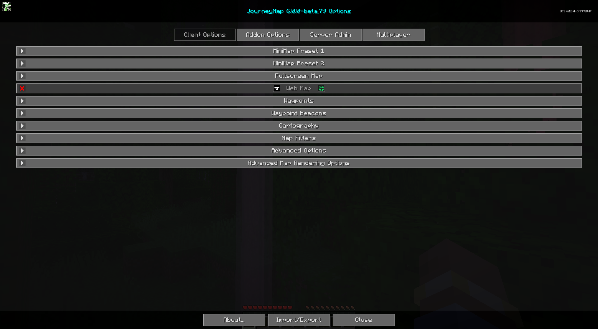
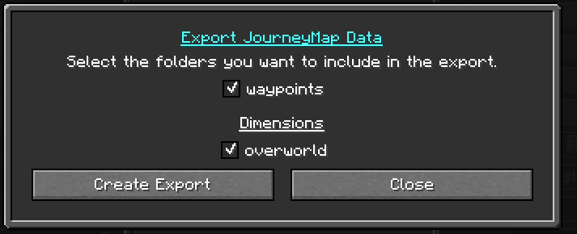

## **Paramètres**

JourneyMap offre de nombreuses options de configuration, vous permettant de personnaliser le comportement et l'apparence de nombreux aspects différents du mod. Tous ces paramètres sont accessibles via le gestionnaire de paramètres.

{: .center}

Pour accéder au gestionnaire de paramètres, ouvrez la carte en plein écran et cliquez sur le bouton des paramètres en bas, ou appuyez sur la touche ++o++. Chaque entrée dans la liste représente une catégorie spécifique de paramètres - cliquez dessus pour l'expandre et voir les paramètres qu'elle contient.

!!! note "Note"

    Chaque catégorie a un bouton Réinitialiser. Veuillez noter qu'appuyer sur ce bouton réinitialisera les paramètres dans cette catégorie aux paramètres par défaut fournis avec JourneyMap, au lieu de simplement ignorer vos modifications.

## **Import / Export**

Le gestionnaire de paramètres dispose d'un bouton **Importer/Exporter**. Il ouvre le
Boîte de dialogue Importer/Exporter des données JourneyMap, qui vous permet de sauvegarder et de restaurer
Les données de JourneyMap pour un monde : les tuiles de carte et les waypoints générés.

{: .center}

### Exporting

Choisissez **Export JourneyMap World** pour sauvegarder le monde actuel. Sélectionnez
quels dossiers (par exemple les dimensions individuelles) inclure, puis
utilisez **Create Export** pour les écrire dans un fichier zip.

{: .center}

### Importing

Pour restaurer une sauvegarde, choisissez **Import Zip** pour importer à partir d'un zip
ou **Import World** pour importer à partir d'un dossier. Sélectionnez la source,
choisissez les dossiers à importer et confirmez avec **Importer la sélection
Dossiers**.

Ceci est pratique pour déplacer votre carte explorée et vos waypoints entre
ordinateurs, ou pour les restaurer après une réinstallation.
