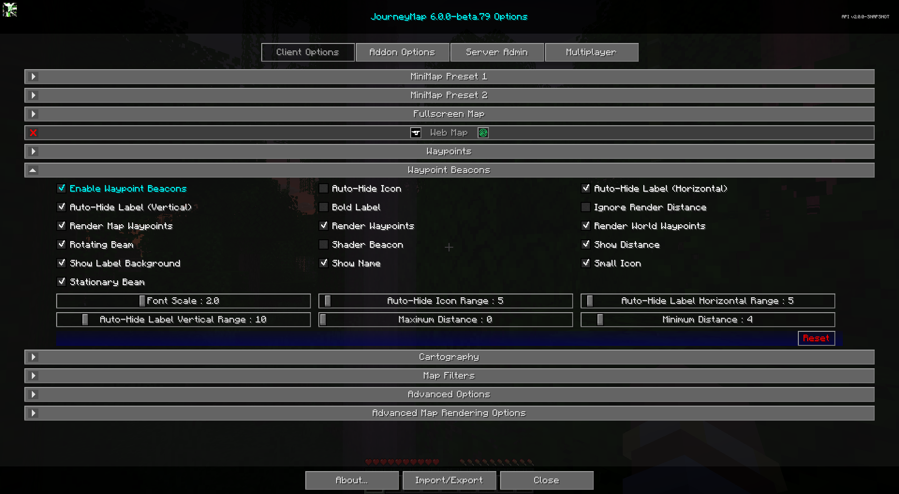

# **Paramètres de la balise de point de cheminement**

Par défaut, les waypoints sont affichés dans le monde à l'aide d'un faisceau de balise au loin, ce qui vous permet de voir où ils se trouvent depuis n'importe où dans le monde. Vous pouvez regarder vers le faisceau et voir également l'icône et l'étiquette du waypoint. Ce comportement peut être personnalisé ci-dessous.

{: .center}

## **Toggles**

Les paramètres de bascule **gras** ci-dessous sont activés par défaut.

| Basculer | Descriptif |
|---------------------------------|--------------------------------------------------------------------------------------------------------------------------------------------------------------------------|
| **Rendu les waypoints du monde** | Désactive/Active le rendu de tous les waypoints du monde. Cela ne change pas si les waypoints sont activés ou désactivés |
| **Activer les balises de point de cheminement** | Afficher les balises dans le jeu de vos waypoints |
| Icône de masquage automatique | Masque automatiquement l'icône du point de cheminement. Si elle est désactivée, elle s'affichera toujours.                                                                                                            |
| Ignorer la distance de rendu | Ignorez le paramètre de distance de rendu Vanilla, l'activation de cette fonctionnalité est utile lorsque des mods qui s'étendent au-delà de la distance de rendu Vanilla visuelle sont présents.                      |
| **Poutre stationnaire** | Utiliser un faisceau intérieur fixe pour les balises de waypoint |
| **Faisceau rotatif** | Utiliser un faisceau extérieur rotatif pour les balises de waypoint |
| **Afficher le nom** | Afficher le nom du waypoint dans son étiquette |
| **Afficher la distance** | Afficher la distance (en blocs/mètres) jusqu'au waypoint dans son étiquette |
| **Masquer automatiquement l'étiquette (horizontale)** | Masquez les étiquettes des waypoints lorsque vous ne les regardez pas horizontalement.                                                                                                   |
| **Masquer automatiquement l'étiquette (verticale)** | Masquez les étiquettes des waypoints lorsque vous ne les regardez pas verticalement.                                                                                                      |
| Étiquette audacieuse | Utiliser des étiquettes de waypoint en gras sur les balises || **Afficher l'arrière-plan de l'étiquette** | Afficher le rectangle d'arrière-plan derrière les étiquettes des balises de waypoint |
| **Petite icône** | Utiliser une petite icône pour les balises de waypoint |
| Balise shader | Permet aux shaders de faire leur travail sur les balises de waypoint. Peut avoir des résultats inattendus. (Tissu uniquement) |

## **Autres paramètres**

L'option par défaut pour chaque paramètre ci-dessous est marquée d'un **texte en gras.**

| Paramètre | Options | Descriptif |
|-----------------------------------|-----------------------------------------------------------|------------------------------------------------------------------------------------------------------------------------------------------------------------------------------|
| Plage d'icônes masquées automatiquement | <ul><li>Plage : 1 - 180  **La valeur par défaut est 5**</li></ul> | Ajustez l'angle dans lequel l'icône sera automatiquement masquée.                                                                                                                       |
| Masquer automatiquement la plage horizontale des étiquettes | <ul><li>Plage : 1 - 180  **La valeur par défaut est 5**</li></ul> | Ajustez l'angle horizontal dans lequel l'étiquette sera automatiquement masquée.                                                                                                           |
| Masquer automatiquement la plage verticale des étiquettes | <ul><li>Plage : 1 - 90  **La valeur par défaut est 10**</li></ul> | Ajustez l'angle vertical dans lequel l'étiquette sera automatiquement masquée.                                                                                                             |
| Échelle de police | <ul><li>Plage : 0,5 - 5  **La valeur par défaut est 2**</li></ul> | L'échelle de police pour les étiquettes et le texte |
| Distance maximale | <ul><li>Plage : 0 - 10000  **La valeur par défaut est 0**</li></ul> | La distance maximale de vous (en blocs/mètres) à laquelle un waypoint doit être affiché. Affecte à la fois les waypoints sur les cartes et les balises de waypoint. Réglé sur 0 pour aucun maximum.       |
| Distance minimale | <ul><li>Plage : 0 - 64  **La valeur par défaut est 4**</li></ul> | La distance minimale de vous (en blocs/mètres) à laquelle une balise de point de cheminement doit être affichée. Réglé sur 0 sans minimum.                                                     |
