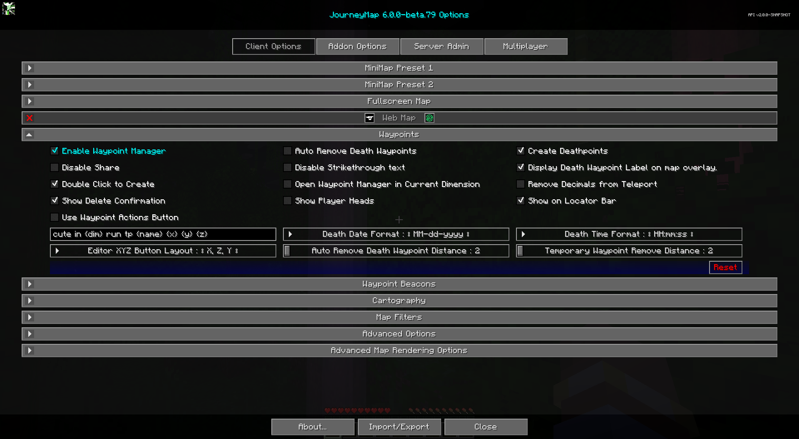

# **Paramètres des points de cheminement**

Cette catégorie vous permet de modifier certains paramètres relatifs au comportement et à l'affichage des [waypoints](../waypoints.md).
Les waypoints disposent également d'un certain nombre de paramètres individuels - vous pouvez les découvrir
sur [la page des waypoints.](../waypoints.md)

{: .center}

## **Toggles**

Les paramètres de bascule **gras** ci-dessous sont activés par défaut.

| Basculer | Descriptif |
|----------------------------------------------------|-----------------------------------------------------------------------------------------------------------------------------------------|
| **Activer le gestionnaire de points de cheminement** | Activez le gestionnaire de points de cheminement. Si vous utilisez un autre mod pour gérer les waypoints, vous devez le désactiver.                                         |
| Afficher la confirmation de suppression | Afficher une invite de confirmation avant de supprimer un waypoint. Cela peut également être activé à partir de la boîte de dialogue de suppression elle-même.                            |
| Désactiver le partage | Désactive le bouton de partage dans le Waypoint Manager et dans le menu contextuel plein écran Chat Position.                                         |
| Désactiver le texte barré | Désactive le barrage du texte du waypoint pour les waypoints désactivés.                                                                  |
| Utiliser le bouton d'actions de point de cheminement | Utilisez une seule liste déroulante d'actions par waypoint au lieu de la liste des boutons d'image. L’utilisation d’un seul bouton permet un affichage de texte plus grand.     |
| Ouvrir Waypoint Manager dans la dimension actuelle | Ouvre le Waypoint Manager axé sur la dimension dans laquelle vous vous trouvez actuellement. |
| **Créer des points de mort** | Créez automatiquement un waypoint à l'endroit où vous mourez.                                                                               |
| Afficher les têtes des joueurs | Montrez les têtes des joueurs dans le monde à leur emplacement. Fonctionne uniquement sur un serveur sur lequel JourneyMap est installé avec le radar étendu activé.       |
| Supprimer les décimales de la téléportation | Certains serveurs ne prennent pas en charge la téléportation au centre d'un bloc, cette option utilise donc des nombres entiers au lieu d'ajouter 0,5 à la valeur.    |
| **Afficher l'étiquette du point de cheminement de la mort  on superposition de carte** | Indique s'il faut afficher le nom des waypoints de la mort sur votre mini-carte et sur la carte plein écran  .                                                    |
| **Double-cliquez pour créer** | Un double-clic sur la carte en plein écran créera un waypoint à l'emplacement.                                                            |

!!! informations "26.1 et plus récent"

    Cette catégorie dispose également d'une bascule **Afficher sur la barre de localisation**, qui affiche
    waypoints sur la barre de localisation vanille au-dessus de la barre de raccourcis. Le localisateur
    la barre est une fonctionnalité de Minecraft 1.21.6+, cette option n'est donc présente que dans
    JourneyMap pour Minecraft 26.1 et versions ultérieures (la ligne 26.x), pas sur le
    Ligne 1.21.1.

## **Autres paramètres**

L'option par défaut pour chaque paramètre ci-dessous est marquée d'un **texte en gras.**

| Paramètre | Options | Descriptif |
|--------------------------------------------------|---------------------------------------------------------------------------------------------------------------------------------------------------------------------------------------------------------|---------------------------------------------------------------------------------------------------------------------------------------------------------------------------------------------------------------------------------------------------------------------------------------------------------------------------------------------------|
| Disposition des boutons XYZ de l'éditeur | <ul><li>**X, Z, Y**</li><li>X, Y, Z</li><li>Champ unique</li></ul> | Sélectionnez le format des boutons X, Y, Z dans l'éditeur de waypoints. Single Field utilise un champ pour les valeurs séparées par des virgules, utile pour copier et coller à partir de sources externes.                                                                                                                                                                                     |
| Commande de téléportation de waypoint personnalisée | Saisie de texte : **/execute dans {dim} run tp {name} {x} {y} {z}** | Définissez la commande de téléportation utilisée lorsque vous vous téléportez vers un waypoint, en utilisant les espaces réservés suivants : <ul><li>**{name}** : votre nom de joueur</li><li>**{dim}** : la dimension cible</li><li>**{x}** : la coordonnée X du waypoint</li><li>**{y}** : la coordonnée Y du waypoint coordinate</li><li>**{z}** : Coordonnée Z du waypoint</li><li>**{wpname}** : Nom du waypoint</li></ul> || Suppression automatique des waypoints de la mort | Basculer | Supprime automatiquement les waypoints de mort à mesure que vous vous en approchez.                                                                                                                                                                                                                                                                                                       |
| Distance du point de cheminement de la mort à suppression automatique | **2** à 64 | La distance à laquelle un waypoint mortel est supprimé. Minimum 2, sinon il sera supprimé dès sa création.                                                                                                                                                                                                                                                      |
| Waypoint temporaire Supprimer la distance | **2** à 64 | La distance du joueur à laquelle les waypoints temporaires sont automatiquement supprimés.                                                                                                                                                                                                                                                                              |
| Format de la date de décès | <ul><li>**MM-jj-aaaa**</li><li>MM-jj-aa</li><li>jj-MM-aaaaZZINLINE6Z Z<li>jj-MM-aa</li><li>aaaa-MM-jj</li><li>aa-MM-jj</li></ul> | Le format de texte de la date du décès, tel qu'indiqué sur l'étiquette du waypoint du décès. <ul><li>**jj** : Jour</li><li>**MM** : Mois</li><li>**aa** : Année (2 chiffres)</li><li>**aaaa** : Année (4 chiffres)</li></ul> || Format de l’heure de la mort | <ul><li>**HH:mm:ss**</li><li>H:mm:ss</li><li>HH:mm</li><li>H:mm</li><li>hh:mm:ss a</li><li>h:mm:ss a</li><li>hh:mm:ss</li><li>h:mm:ss</li><li>hh:mm a</li><li>h:mm a</li><li>hh:mm</li><li>h:mm</li></ul> | Le format de texte de l'heure du décès, comme indiqué sur l'étiquette du point de cheminement du décès.                                                                                                                                                                                                                                                                                       |
