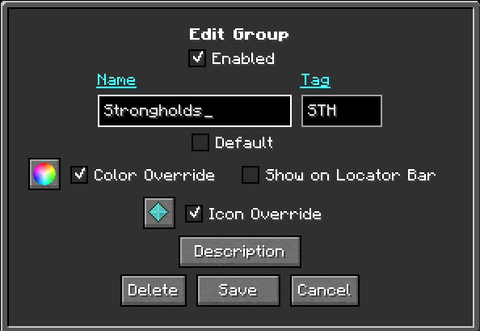

# **Groupes de points de cheminement**

Les groupes de waypoints vous permettent d'organiser vos waypoints en ensembles nommés, tels que
`Bases`, `Mining` ou `Villages`. Les groupes sont gérés depuis le
[Gestionnaire de points de cheminement](waypoints.md#the-waypoint-manager) ; la liste des groupes est
le panneau d'un côté du gestionnaire.

{: .center}

## **Native groups**

JourneyMap possède plusieurs groupes intégrés qui existent toujours :

| Groupe | Objectif |
|---------|-------------------------------------------------------------------------|
| Par défaut | Les nouveaux waypoints vont ici, sauf si vous choisissez un autre groupe.                    |
| Mort | Points de cheminement de mort créés lorsque vous mourez.                                   |
| Temp. | Points de cheminement temporaires.                                                    |
| Tout | Une vue virtuelle qui montre chaque waypoint quel que soit son groupe.       |

Lorsque vous jouez sur un serveur qui gère les waypoints, un groupe **Global** est
également affiché pour les waypoints que le serveur partage avec les joueurs.

Les groupes natifs sont **verrouillés** : leurs noms ne peuvent pas être modifiés. Ils peuvent
toujours être configuré d’une autre manière (voir ci-dessous).

## **Créer un groupe**

Utilisez le bouton **Nouveau groupe** dans le Waypoint Manager, ou le
Option **Nouveau groupe** dans [Éditeur de points de cheminement](waypoints.md#the-waypoint-editor),
pour créer un groupe personnalisé. Les groupes personnalisés peuvent être renommés, modifiés et
supprimé librement.

## **Group actions**

Chaque groupe de la liste a ces actions :

- **Activer / Désactiver le groupe** - activez ou activez chaque waypoint du groupe.
  éteint immédiatement.
- **Modifier le groupe** - ouvrez l'écran Modifier le groupe (voir ci-dessous).
- **Supprimer le groupe** - supprime le groupe. (Les groupes natifs ne peuvent pas être supprimés.)

## **Modifier un groupe**

{: .center}

L'écran **Modifier le groupe** affiche l'identifiant, le tag et le nombre de points de cheminement du groupe.
et propose ces options :

| Options | Descriptif |
|-----------|------------------------------------------------------------------------------------------------------------|
| Nom | Le nom d’affichage du groupe. Les groupes verrouillés (natifs) ne peuvent pas être renommés.                                        |
| Paramètres | Ouvre la [fenêtre contextuelle des paramètres du groupe](#group-settings-and-overrides) pour les couleurs, l'icône et la visibilité du groupe, y compris les bascules de remplacement. |
| Par défaut | Marque ce groupe comme groupe par défaut pour les nouveaux waypoints. Un seul groupe peut être le groupe par défaut à la fois.       |
| Étiquette | Texte préfixé sur chaque nom de waypoint du groupe, à la fois sur la carte et dans le monde. Peut être laissé vide.   |
| Verrouillé | Affiché pour les groupes natifs dont le nom ne peut pas être modifié.                                                       |

### Paramètres et remplacements du groupe

{: .center}

Le bouton **Paramètres** s'ouvre de la même manière
[Poupup contextuel des paramètres de waypoint](waypoints.md#the-waypoint-settings-popup) utilisé
pour les waypoints individuels - la table des couleurs Icône/Balise/Étiquette et le
bascules de visibilité - appliquées au groupe. En mode groupe, il ajoute un
Case à cocher **Remplacer** pour chaque ligne de couleur, plus un **Paramètres de remplacement**
case à cocher sous le tableau :

- **Remplacement** (un par ligne de couleur - Icône, Couleur d'icône, Balise, Étiquette) -
  lorsque le remplacement d'une ligne est coché, chaque waypoint du groupe utilise le
  la valeur du groupe pour cette ligne au lieu de la sienne. La ligne **Icône** couvre
  l'image de l'icône du groupe, **Icon Color** la couleur de l'icône et **Beacon**
  et **Étiquetez** ces couleurs. Les lignes non cochées laissent chaque waypoint conservé
  le sien, vous pouvez donc remplacer uniquement l'icône, juste une couleur ou n'importe quel autre
  combinaison.
- **Remplacer les paramètres** - lorsqu'il est activé, chaque waypoint du groupe utilise
  la visibilité du groupe bascule au lieu de la sienne.

Avec chaque remplacement interrompu, chaque waypoint conserve ses propres couleurs et
les paramètres et ceux du groupe sont ignorés.

### Afficher sur la barre de localisation

!!! informations "26.1 et plus récent"

    La barre de localisation est une fonctionnalité de Minecraft 1.21.6+, cette option est donc
    présent uniquement dans JourneyMap pour Minecraft 26.1 et versions ultérieures (le 26.x
    ligne, dont 26.2). Il n'est pas disponible sur la ligne 1.21.1
    (1.21.1 / 1.21.11).

**Afficher sur la barre de localisation** est l'un des boutons de visibilité dans la fenêtre du groupe.
Fenêtre contextuelle des paramètres. Il montre les waypoints du groupe sur la barre de localisation vanille
au-dessus de la barre de raccourcis.

## **Default group**

Le groupe marqué comme **Par défaut** est celui où les nouveaux waypoints sont placés, à moins que
vous choisissez un groupe différent lors de leur création. Définir une nouvelle valeur par défaut
efface le drapeau du groupe qui le détenait auparavant, donc il y a toujours
exactement un groupe par défaut.

## **Points de cheminement temporaires**

Le groupe `Temp` contient des waypoints temporaires. Des waypoints peuvent être ajoutés ou
supprimé du groupe Temp, ce qui est pratique pour les marqueurs de courte durée que vous
ne voulez pas encombrer vos groupes permanents.

## **Paramètres du panneau de groupe**

L'écran **Modifier les paramètres du groupe** contrôle la façon dont la liste de groupes elle-même est
affiché :

| Paramètre | Descriptif |
|--------------------------|-------------------------------------------------------------------------|
| Masquer tout le groupe | Masque le groupe `All` du panneau de groupe.              |
| Masquer les groupes personnalisés vides | Masque les groupes personnalisés qui ne contiennent aucun waypoint.           |
| Masquer le groupe de la mort vide | Masque le groupe `Death` lorsqu'il n'y a aucun point de mort.  |
| Masquer le groupe temporaire vide | Masque le groupe `Temp` lorsqu'il n'y a pas de waypoints temporaires. |
