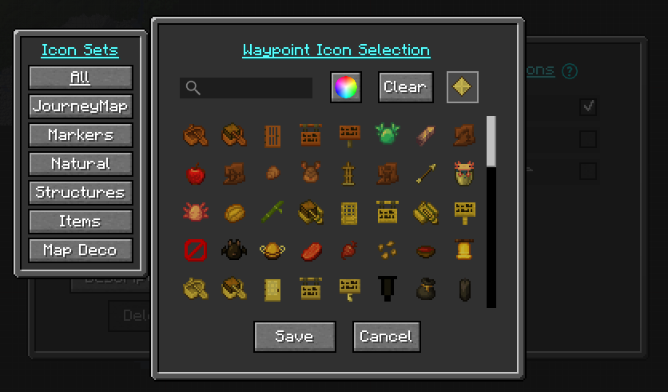
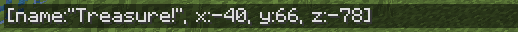
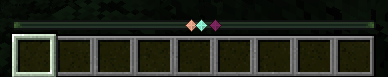

# **Points de cheminement**

Les waypoints vous permettent de marquer des emplacements spécifiques sur votre carte afin que vous puissiez garder
suivez-les ou retrouvez votre chemin vers eux plus tard.

Les waypoints de mort sont créés automatiquement lorsque vous mourez, vous pouvez donc
revenez récupérer vos objets. Les waypoints de la mort peuvent être désactivés dans le
[gestionnaire de paramètres](settings/waypoint.md) si vous préférez.

Par défaut, un waypoint est affiché dans le monde sous la forme d'un faisceau de balise coloré,
avec son nom et son icône affichés lorsque vous regardez vers lui. Ceci et
de nombreux autres comportements peuvent être modifiés dans le
[Paramètres des waypoints](settings/waypoint.md) et
[Paramètres de la balise de point de cheminement](settings/waypoint-beacon.md).

{: .center}

## **Création de points de cheminement**

Vous pouvez créer un waypoint de l'une des manières suivantes :

- Appuyez sur ++b++ dans le jeu pour créer un waypoint où vous vous trouvez.
- Double-cliquez ou appuyez sur ++b++ dans la [carte plein écran](full-screen-map.md)
  pour créer un waypoint au niveau du curseur.
- Ouvrez le Waypoint Manager et utilisez le bouton **Nouveau**.

Chaque méthode ouvre l'[Waypoint Editor](#the-waypoint-editor) afin que vous puissiez
nommez et personnalisez le waypoint avant de l’enregistrer.

## **Le gestionnaire de points de cheminement**

Le Waypoint Manager est un endroit unique pour gérer tous vos waypoints
et les groupes de points de cheminement. Ouvrez-le de l'une des manières suivantes :

- Appuyez sur ++n++ dans le jeu ou sur la carte en plein écran.
- Ouvrez la [carte plein écran](full-screen-map.md) et cliquez sur le Waypoint
  Bouton Gestionnaire.

{: .center}

Le gestionnaire dispose de deux panneaux : une liste de [groupes](#waypoint-groups) sur un
d’un côté et les waypoints du groupe sélectionné de l’autre. Un champ de recherche
filtre la liste au fur et à mesure que vous tapez.

### Manager buttons

| Bouton | Actions |
|----------------------------------|-------------------------------------------------------------------|
| Nouveau | Créez un nouveau waypoint.                                            |
| Nouveau groupe | Créez un nouveau groupe de waypoints.                                      |
| Options | Ouvrez le [gestionnaire de paramètres](settings/overview.md).                |
| Dimensions | Filtrez les waypoints affichés par dimension.                          |
| Importer externe | Importez des waypoints à partir de la mini-carte de Xaero. **Apparaît uniquement lorsque les waypoints de Xaero sont détectés** pour votre monde actuel - voir [Importation depuis la Minimap](#importing-from-xaeros-minimap) de Xaero. |
| Exporter | Exportez vos waypoints dans un fichier (vous choisissez le format).          |
| En attente | Passez en revue les waypoints que d’autres joueurs ont partagés avec vous.              |
| Fermer | Fermez le gestionnaire de points de cheminement.                                       |

Pour importer ou restaurer les propres fichiers de waypoints de JourneyMap (un fichier
`.dat`, ou une sauvegarde), voir [Sauvegardes et importation](#backups-and-importing)
ci-dessous - qui est distinct du bouton Importer externe.

### Actions par waypoint

Chaque waypoint de la liste comporte ces actions :

- **Téléportation** - si le serveur l'autorise, téléportez-vous directement au waypoint.
- **Rechercher** - localisez le waypoint sur la [carte plein écran](full-screen-map.md).
- **On/Off** - bascule la visibilité du waypoint.
- **Modifier** - ouvrez l'[Waypoint Editor](#the-waypoint-editor).
- **Supprimer** - supprime le waypoint.
- **Chat** - partagez le waypoint (voir [Partage des waypoints](#sharing-waypoints)).

### Sélection de plusieurs waypoints

Utilisez **Sélectionner tout** ou sélectionnez des waypoints individuels pour agir sur plusieurs à la fois.
une fois. Avec une sélection active, vous pouvez **Basculer la sélection**,
**Partager la sélection** ou **Supprimer la sélection**.

## **L'éditeur de waypoints**

L'éditeur de waypoints s'ouvre chaque fois que vous créez ou modifiez un waypoint.

{: .center}

L'éditeur fournit ces champs :

- **Nom** - le nom d'affichage du waypoint.
- **Emplacement** - les coordonnées X, Y et Z. Vous pouvez basculer entre
  des champs X / Y / Z séparés et un seul champ `X, Y, Z` combiné en utilisant
  l’option Disposition des coordonnées (voir ci-dessous). Une case à cocher **Sync** à côté de
  le champ Y, lorsqu'il est activé, remplit la valeur Y de la surface mise en cache
  hauteur pour ce X/Z (si ce morceau a été cartographié), donc le waypoint
  se trouve à la surface.
- **Dimensions** - active les dimensions dans lesquelles le waypoint est affiché.
- **Groupe** - le [groupe](#waypoint-groups) auquel appartient ce waypoint.
  Vous pouvez également créer un nouveau groupe à partir d'ici.
- **Activer** - si le waypoint est activé et visible.
- **Couleur** - la couleur du waypoint. Cliquez sur la roue chromatique pour choisir un
  couleur, ou utilisez **Randomize** pour une nouvelle couleur aléatoire. Ceci définit le
  couleurs d'icône, de balise et d'étiquette ensemble ; pour les définir séparément, utilisez
  la fenêtre contextuelle Paramètres.
- **Icône** - cliquez sur le bouton icône pour choisir l'icône du waypoint. Voir
  [Icônes de points de cheminement](#waypoint-icons).
- **Paramètres** - ouvre le
  [popup Paramètres de waypoint](#the-waypoint-settings-popup), où vous pouvez
  définissez les couleurs des icônes, des balises et des étiquettes individuellement et choisissez où
  le waypoint est affiché.
- **Description** - ouvre une fenêtre contextuelle pour une description en texte libre plus longue.

Buttons:

- **Réinitialiser** - annulez vos modifications non enregistrées sur ce waypoint.
- **Enregistrer** - enregistrez vos modifications.
- **Fermer** - ferme l'éditeur sans enregistrer.

### Options de l'éditeur

Le bouton **Options de l'éditeur de waypoint** configure l'éditeur lui-même
plutôt qu'un seul waypoint. Il comprend la **Mise en page des coordonnées**
option, qui bascule entre des champs de saisie X / Y / Z séparés et un
champ `X, Y, Z` combiné unique.

### La fenêtre contextuelle Paramètres du point de cheminement

Le bouton **Paramètres** dans l'éditeur ouvre la fenêtre contextuelle Paramètres du point de cheminement,
qui contrôle les couleurs du waypoint et l'endroit où il est affiché.

{: .center}

**Couleurs.** La fenêtre contextuelle a une table de couleurs à quatre lignes - **Icône**,
**Couleur de l'icône**, **Beacon** et **Étiquette** :

- La ligne **Icône** comporte un bouton icône permettant de choisir le
  [icon](#waypoint-icons), avec un sélecteur de couleurs.
- Les lignes **Icon Color**, **Beacon** et **Label** ont chacune une couleur.
  sélecteur pour cet élément.
- Les couleurs de l'icône, de la balise et de l'étiquette suivent la couleur de l'icône jusqu'à ce que
  vous les définissez individuellement, donc par défaut ils correspondent.
- Le bouton **Effacer** de chaque ligne supprime cette couleur, dessinant l'élément
  sans teinte.
- **Réinitialiser les couleurs** renvoie toutes les lignes à la couleur de l'icône.

**Visibilité.** Une colonne de cases à cocher contrôle l'emplacement du waypoint.
montré:

| Basculer | Effet |
|-----------|-------------------------------------------------------|
| Afficher sur la carte | Affichez le waypoint sur la mini-carte et la carte en plein écran. |
| Afficher dans le monde | Afficher le waypoint dans le monde.                       |
| Afficher l'étiquette | Afficher l'étiquette du nom du waypoint.                       |
| Afficher la balise | Montrez le faisceau de balise dans le monde.                        |
| Afficher l'icône | Afficher l'icône du waypoint.                             |
| Afficher l'écart | Afficher l’affichage de l’écart à côté de l’étiquette.         |
| Afficher sur la barre de localisation | Affichez le waypoint sur la barre de localisation vanille.         |

La bascule **Afficher sur la barre de localisation** n'est présente dans JourneyMap que pour
Minecraft 26.1 et versions ultérieures (voir [Afficher sur la barre de localisation](#show-on-locator-bar)).

## **Groupes de points de cheminement**

Les groupes de waypoints vous permettent d'organiser les waypoints en ensembles nommés - par exemple
`Bases`, `Mining` ou `Villages`. Un groupe peut être activé ou désactivé selon
un tout, doté de sa propre icône et marqué comme groupe par défaut pour les nouveaux
points de cheminement.

JourneyMap possède plusieurs groupes intégrés : `Default` (où les nouveaux waypoints
allez sauf si vous en décidez autrement), `Death` (points de cheminement de la mort) et `Temp`
(waypoints temporaires). La vue `All` affiche chaque waypoint, quel que soit le
groupe.

!!! remarque "Plus de détails"

    Les groupes constituent une fonctionnalité importante avec leur propre écran de gestion. Plein
    la couverture se trouve sur la page [Waypoint Groups](waypoint-groups.md)».

## **Icônes de points de cheminement**

Cliquez sur le bouton icône dans l'éditeur de waypoints (ou sur la rangée d'icônes de l'éditeur de waypoints).
[Paramètres popup](#the-waypoint-settings-popup)) pour ouvrir le sélecteur d'icônes.

{: .center}

Le sélecteur regroupe les icônes en onglets :

- **Tous** - toutes les icônes disponibles.
- **JourneyMap** - les icônes JourneyMap intégrées.
- **Minecraft** - textures d'objets Minecraft vanille.
- **Map Deco** - icônes de marqueurs de carte vanille.
- Un onglet pour chaque jeu d'icônes nommé fourni par un pack de ressources.

Le sélecteur dispose également d'un sélecteur de couleurs, vous pouvez donc définir la couleur de l'icône tout en
en le choisissant, et un bouton **Effacer** pour supprimer la couleur.

Vous pouvez ajouter vos propres icônes de waypoint et vos propres jeux d'icônes nommés, avec un
pack de ressources. Voir
[Icônes de points de cheminement (packs de ressources)](../tools/waypoint-icons.md).

## **Waypoints gérés par le serveur**

Lorsque vous jouez sur un serveur qui exécute JourneyMap, le serveur peut gérer
waypoints lui-même. Dans ce cas, les waypoints ont une **portée** :

- **Personnel** - vos propres waypoints, visibles uniquement par vous.
- **Global** - waypoints gérés par le serveur et partagés avec les joueurs,
  configuré par les administrateurs du serveur.

Le Waypoint Manager affiche un sélecteur de portée lorsqu'il est géré par le serveur
des waypoints sont disponibles. Voir
[Paramètres du serveur multijoueur](../server/multiplayer.md) pour le
options côté serveur.

## **Téléportation vers des waypoints**

Si le serveur le permet, l'action **Téléporter** dans le Waypoint Manager
vous amène directement à un waypoint. La téléportation est contrôlée par
dimension par les administrateurs du serveur, il peut donc être disponible dans certaines dimensions
et pas les autres. En mode solo, il est toujours disponible.

La commande de téléportation utilisée par JourneyMap peut être personnalisée, et il existe un
option pour supprimer les décimales des coordonnées qu’il envoie. Voir le
[Paramètres des points de cheminement](settings/waypoint.md).

## **Partage de points de cheminement**

Vous pouvez partager un waypoint ou un emplacement avec d'autres joueurs. Les joueurs qui le font
JourneyMap ne voit toujours pas l'emplacement dans le chat dans un format lisible.

Il existe trois façons de partager :

1. Dans le Waypoint Manager, utilisez le bouton **Chat** à côté d'un waypoint.
   (ou **Partager la sélection** pour plusieurs). L'emplacement est placé dans le
   entrée de chat pour vous - ajoutez un message si vous le souhaitez, puis appuyez sur Entrée.
2. Dans la saisie du chat, tapez `/jm ~` et appuyez sur Entrée. Il est remplacé par
   votre emplacement actuel.
3. Saisissez manuellement un emplacement dans le chat entre crochets (voir
   [Format d'emplacement](#location-format) ci-dessous).

Lorsqu'un emplacement correctement formaté apparaît dans le chat, **cliquez** dessus pour
créez un waypoint, ou **contrôlez-cliquez** dessus pour afficher l'emplacement sur le
carte en plein écran.

{: .center}

Les waypoints partagés directement avec vous arrivent en tant que waypoints **En attente**. Ouvert
le bouton **En attente** dans le Waypoint Manager pour **Accepter** ou
**Refusez** chacun.

### Location Format

Un emplacement doit avoir au moins les coordonnées x et z. L'ordre du
les valeurs n'ont pas d'importance :

- `[x:#, z:#]`
- `[x:#, y:#, z:#]`
- `[x:#, y:#, z:#, dim:#]`
- `[x:#, y:#, z:#, dim:#, name:text]`
- `[name:text, dim:#, x:#, z:#, y:#]`

Un emplacement est constitué de deux ou plusieurs paires `name:value` séparées par des virgules. Le
les valeurs prises en charge sont :

- `x` (integer) **required**
- `y` (integer)
- `z` (integer) **required**
- `dim` (integer)
- `name` (string, no quotes, no commas)

## **Commandes de points de cheminement**

Les commandes de discussion de JourneyMap vivent sous le préfixe `/jm`.

`/jm reload` recharge les fichiers de waypoints depuis le disque sans redémarrer le
jeu. Ceci est principalement utile après avoir déposé des fichiers de waypoints dans le
dossier waypoint pendant que le jeu est en cours d'exécution.

Lorsque le serveur exécute JourneyMap, les commandes de waypoint côté serveur sont également
disponible sous `/jm waypoint` (ou `/jm wp`). Voir le
[page ](../server/commands/waypoint_command.md) de commande de point de cheminement du serveur.

## **Sauvegardes et importation**

JourneyMap protège vos données de waypoint de plusieurs manières :

- **Sauvegardes continues** - JourneyMap conserve des sauvegardes récentes de votre waypoint
  données et charge automatiquement la bonne sauvegarde la plus récente si le principal
  le fichier s'avère endommagé.
- **Importer/Exporter** - utilisez les boutons Importer et Exporter dans le
  Waypoint Manager pour sauvegarder vos waypoints dans un fichier ou les restaurer.
- **Fusion directe** - déposez un fichier de point de cheminement `.dat` dans le point de cheminement
  dossier et JourneyMap fusionne ses waypoints dans vos données existantes.
  Exécutez `/jm reload` ou reconnectez-vous pour récupérer les fichiers ajoutés pendant la lecture.
- **Importer depuis Xaero** - si les waypoints Minimap de Xaero sont détectés pour
  votre monde actuel, un bouton **Importer externe** apparaît dans le
  Gestionnaire de points de cheminement. Voir [Importation à partir de Minimap](#importing-from-xaeros-minimap) de Xaero.

### Importation depuis la mini-carte de Xaero

JourneyMap peut importer des waypoints à partir de **la mini-carte de Xaero**, actuellement la
seule source externe prise en charge. Le bouton **Importer externe** apparaît dans
la barre d'outils Waypoint Manager **uniquement lorsque** JourneyMap détecte le Xaero
des waypoints pour le monde ou le serveur sur lequel vous vous trouvez ; s'il n'y en a pas pour le
monde actuel, le bouton est masqué.

{: .center}

En cliquant dessus, vous ouvrez l'écran **Importer des waypoints externes**, où vous pouvez
examinez les waypoints détectés et importez-les. JourneyMap lit celui de Xaero
propre dossier de données, correspondant par monde solo, adresse de serveur ou
Royaume.

{: .center}

Ceci est distinct du
[Outils d'importation/exportation de données](settings/overview.md#import-export) et depuis
la fusion drop-in `.dat` ci-dessus : celles-ci gèrent les propres fichiers de JourneyMap,
pendant que ceci lit celui de Xaero.

## **Afficher sur la barre de localisation**

!!! informations "26.1 et plus récent"

    La barre de localisation est une fonctionnalité de Minecraft 1.21.6+, cette option est donc
    présent uniquement dans JourneyMap pour Minecraft 26.1 et versions ultérieures (le 26.x
    ligne, dont 26.2). Il n'est pas disponible sur la ligne 1.21.1
    (1.21.1 / 1.21.11).

Les waypoints peuvent être affichés sur la barre de localisation de Minecraft. Ceci est contrôlé par
une option **Afficher sur la barre de localisation**, disponible à la fois globalement et par
[groupe](waypoint-groups.md). Les waypoints désactivés ne sont pas affichés sur le
barre de localisation.

{: .center}

## **Paramètres**

Le comportement du waypoint est configuré dans deux catégories de paramètres :

- [Paramètres des waypoints](settings/waypoint.md) - waypoints de mort, le
  commande de téléportation, partage et bien plus encore.
- [Paramètres de la balise de point de cheminement](settings/waypoint-beacon.md) - comment le point de cheminement
  des balises et des étiquettes sont dessinées dans le monde.
