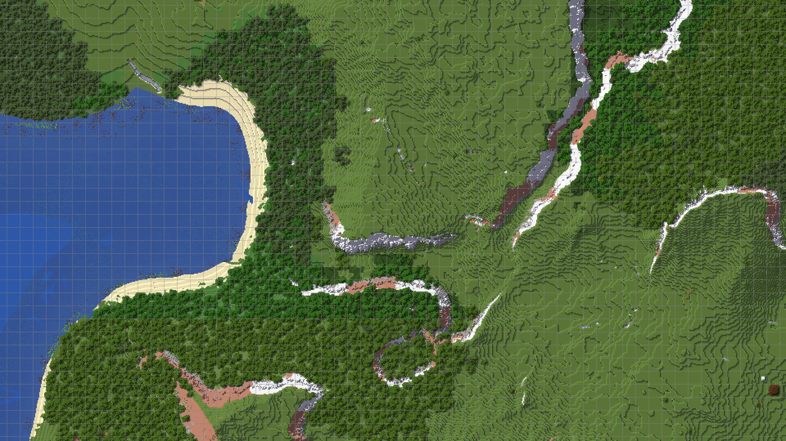

## **Accueil**

JourneyMap est un mod de cartographie populaire pour Minecraft. Originellement publié par techbrew en 2011, il est devenu de plus en plus fort et est aujourd'hui le mod de cartographie le plus populaire au monde.

{: .center}

JourneyMap comprend une mini-carte dans le jeu et une carte plein écran. Une carte Web, visible dans un navigateur, est également disponible sous forme de [module complémentaire de carte Web](webmap/installing.md).

Si vous souhaitez un module de cartographie fonctionnel et facile à utiliser, pourquoi ne pas essayer JourneyMap ? Vous pouvez le trouver sur [CurseForge](https://www.curseforge.com/minecraft/mc-mods/journeymap) ou [Modrinth](https://modrinth.com/mod/journeymap) et l'installer comme n'importe quel autre mod [Fabric](https://fabricmc.net/), [Forge](https://forums.minecraftforge.net/) ou [NeoForge](https://neoforged.net/) - ou continuer à lire si vous avez besoin d'aide.

## **Premiers Pas**

-   [Télécharger JourneyMap](client/installing.md)
-   [Utiliser le Gestionnaire d'Options](client/settings/overview.md)
-   [Partager des Points de Repère](client/waypoints.md#sharing-waypoints)
-   [Obtenir de l'Aide](about/support.md)

## **En Savoir Plus**

-   [Utiliser les Raccourcis Clavier (Keybindings)](client/basic-usage.md#key-mappings)
-   [Personnaliser les Cartes Topographiques](tools/topographic.md)
-   [Cartographier un serveur multijoueur](tools/multiplayer-server.md)
-   [Générer des cartes à l'échelle personnalisée](tools/journeymap-tools.md)

## **Sujets Avancés**

-   [Utilisation dans un Modpack](about/licensing.md)
-   [Intégrer votre mod](tools/integration.md)
-   [Créer des icônes de mobs personnalisées](tools/custom-mob-icons.md)
-   [Créer un Thème d'Interface Utilisateur (Skin)](tools/ui-themes.md)
-   [Traduire JourneyMap dans votre langue](contributing/translate-mod.md)
