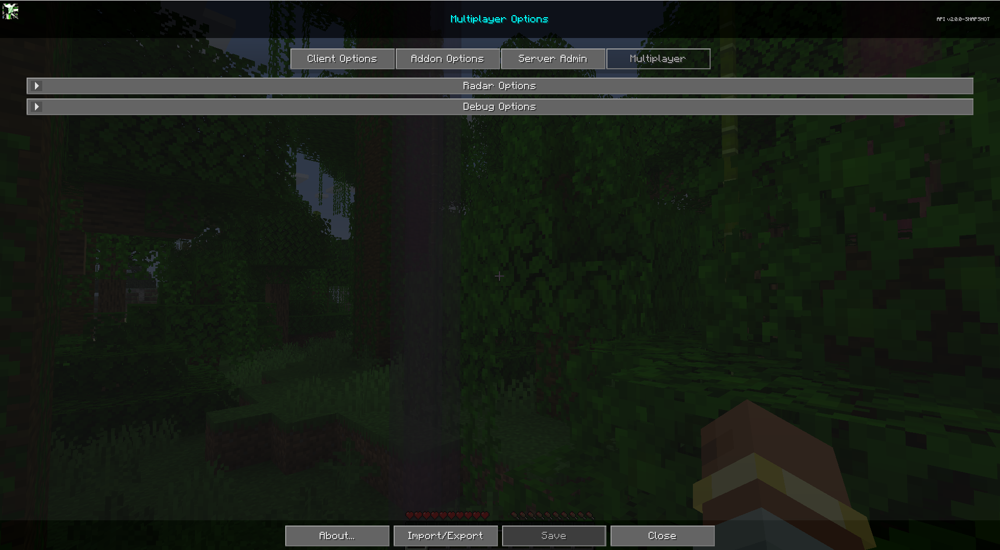

# **Paramètres**

La section Multijoueur est conçue pour donner aux utilisateurs le contrôle sur la manière dont ils sont vus par d'autres clients utilisant le mod JourneyMap, et comment ils sont affichés sur la carte. Cette section n'est déverrouillée que lorsque le serveur exécute le mod JourneyMap et peut être désactivée par le serveur.

{: .center}

Pour accéder à l'onglet Multijoueur, ouvrez la carte en plein écran et cliquez sur le bouton de paramètres en bas, ou appuyez sur la touche **o**. Enfin, en haut, cliquez sur l'onglet Multijoueur pour accéder aux paramètres multijoueurs du mod. Chaque entrée de la liste représente une catégorie spécifique de paramètres - cliquez dessus pour l'étendre et voir les paramètres à l'intérieur.

## **Options de Radar**

La section Options de Radar permet de contrôler comment les autres vous voient sur la carte. Notez que ces options ne fonctionnent que lorsque le radar étendu est activé.

{: .center}

## **Bascules**

| Basculer | Descriptif |
|---------------------------|--------------------------------------------------------------------------------------------------------|
| **Visible par les autres** | Décochez pour ne pas être vu sur la carte. Remarque : les opérateurs peuvent toujours vous voir.             |
| Cacher soi-même sous terre | Empêchez les autres de vous voir lorsque vous êtes sous terre.                                      |

## **Points de cheminement du serveur**

JourneyMap 6.0 permet aux serveurs de gérer les waypoints. Lorsqu'un serveur auquel vous êtes connecté gère des waypoints, vous recevez des waypoints « globaux » partagés par le serveur en plus de vos propres waypoints personnels. Il n'y a pas de bascule pour cela dans la section Multijoueur - elle est contrôlée par le serveur. Voir [Waypoints](../client/waypoints.md) pour plus de détails sur la façon dont les waypoints globaux apparaissent et se comportent.