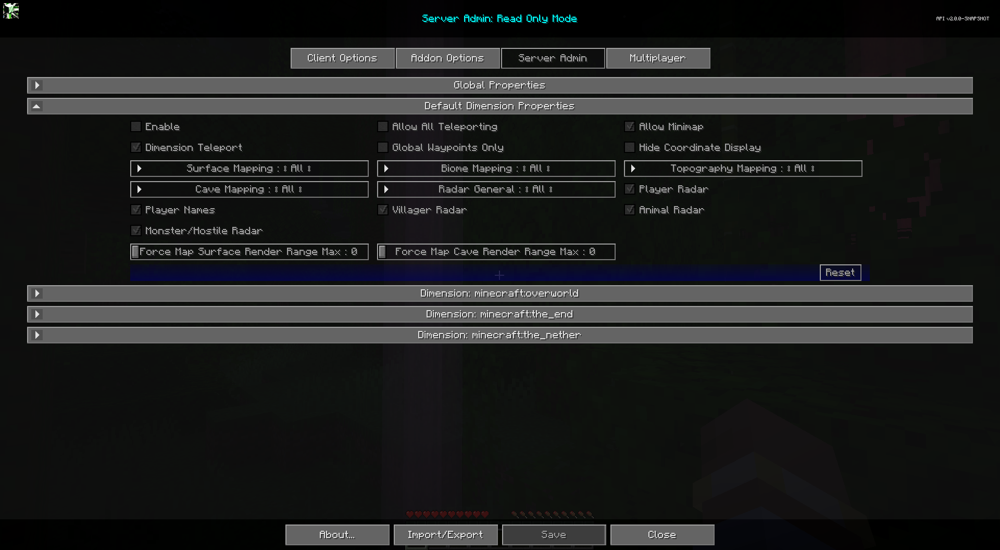

# **Default Dimension Properties**

La catégorie Propriétés de dimension par défaut contient des paramètres qui seront les paramètres par défaut pour toutes les nouvelles dimensions.
créé. Ces paramètres peuvent être remplacés pour chaque dimension.

{: .center}

## **Toggles**

| Basculer | Descriptif |
|----------------------------------------|------------------------------------------------------------------------------------------------------------------------------------------------------------------------------------------|
| Activer | L'activation de cette dimension remplacera les propriétés globales de cette dimension.                                                                                                           |
| Autoriser la mini-carte | Activez ou désactivez la mini-carte.                                                                                                                                                           |
| Masquer l'affichage des coordonnées | Masque tous les affichages de coordonnées, empêche la modification des valeurs de coordonnées pour les waypoints. Remplace la plupart des affichages de coordonnées par le texte « Emplacement inconnu ». N'affecte pas les noms de waypoints existants. |
| Waypoints mondiaux uniquement | Lorsqu'il est activé, les joueurs peuvent uniquement afficher et activer la visibilité des waypoints globaux. La création, la modification et la suppression de waypoints personnels sont désactivées.                                        |
| Autoriser toutes les téléportations | Permet la téléportation des waypoints et du menu contextuel plein écran. La téléportation par waypoint uniquement est prioritaire.                                                                                        |
| Téléportation dimensionnelle | Activez la téléportation Cross Dimension Waypoint pour les utilisateurs non opérationnels. Les utilisateurs OP peuvent toujours l'utiliser.                                                                                                |
| Radar des joueurs | Si les joueurs peuvent voir d'autres joueurs sur la carte.                                                                                                                                             |
| Noms des joueurs | Si les joueurs peuvent voir les noms des autres joueurs sur la carte.                                                                                                                                      |
| Radar villageois | Si les joueurs peuvent voir les villageois sur la carte.                                                                                                                                                 |
| Radars pour animaux | Si les joueurs peuvent voir des animaux sur la carte.                                                                                                                                                   || Radar monstre/hostile | Si les joueurs peuvent voir des monstres ou des entités hostiles sur la carte.                                                                                                                              |

## **Autres paramètres**

L'option par défaut pour chaque paramètre ci-dessous est marquée d'un texte **gras**.

| Paramètre | Options | Descriptif |
|---------------------------------------------------|------------------------------------------------------------------|--------------------------------------------------------------------------------------------------------------------------------------------------------------------------------------------------------------------------------------------------------|
| Forcer la plage de rendu de surface de la carte Max | <ul><li>Plage : 0 - 32 **La valeur par défaut est 0**</li></ul> | Forcer tous les joueurs à respecter une distance maximale de rendu de surface pour la carte. 0 pour utiliser les paramètres client. Ce paramètre force uniquement le maximum, il n'augmente pas leur plage de rendu. Cette valeur n'est pas reflétée dans les options de Cartographie du client.            |
| Force Map Cave Render Range Max | <ul><li>Plage : 0 - 32 **La valeur par défaut est 0**</li></ul> | Forcez tous les joueurs à respecter une distance maximale de rendu de la grotte pour la carte. 0 pour utiliser les paramètres client. Ce paramètre force uniquement le maximum, il n'augmente pas leur plage de rendu. Cette valeur n'est pas reflétée dans les options de Cartographie du client.               |
| Cartographie des surfaces | <ul><li>**Tous**</li><li>Op</li><li>Aucun</li></ul> | Cartographie de surface pour tous, opérations, aucun.                                                                                                                                                                                                                      |
| Cartographie topographique | <ul><li>**Tous**</li><li>Op</li><li>Aucun</li></ul> | Cartographie topographique pour tous, opérations, aucun.                                                                                                                                                                                                                   |
| Cartographie du biome | <ul><li>**Tous**</li><li>Op</li><li>Aucun</li></ul> | Cartographie du biome pour tous, opérations, aucun.                                                                                                                                                                                                                        |
| Cartographie des grottes | <ul><li>**Tous**</li><li>Op</li><li>Aucun</li></ul> | Cartographie des grottes pour tous, opérations, aucun.                                                                                                                                                                                                                         || Radar général | <ul><li>**Tous**</li><li>Op</li><li>Aucun</li></ul> | <ul><li>All : le radar fonctionne pour tout le monde, utilisez des cases à cocher individuelles pour désactiver des éléments spécifiques.</li><li>Op : désactive complètement le radar pour tout le monde sauf les utilisateurs OP, les cases à cocher fonctionnent pour Ops.</li><li>None : le radar est désactivé pour tout le monde.</li></ul> |
