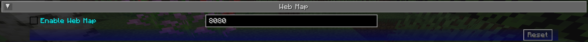

# **Paramètres de la carte Web**

La carte Web est configurée à partir des options de JourneyMap, sous la **Webmap**
catégorie. Ouvrez les options de JourneyMap (appuyez sur `O` ou utilisez les options
sur la carte en plein écran) et sélectionnez **Carte Web**.

{: .center}

## **Toggles**

Cette bascule est **désactivée** par défaut.

| Basculer | Descriptif |
|----------------|------------------------------------------------------|
| Activer la carte Web | Si le serveur Webmap est activé et accessible. |

## **Autres paramètres**

| Paramètre | Options | Descriptif |
|---------|------------------------------------------|--------------------------------------------------|
| Port | Plage : 80 - 65 535 (par défaut : **8080**) | Le port auquel le serveur Webmap tente de se lier. |

## **How port selection works**

Lorsque la carte Web démarre, elle essaie de lier le port que vous avez configuré
(8080 par défaut).

Si ce port est déjà utilisé, la carte Web revient à un port libre
choisi par le système d'exploitation au lieu de ne pas démarrer. Cela signifie
le port sur lequel la carte Web aboutit peut différer de celui que vous avez défini.

Pour trouver le port réellement utilisé :

- Si l'option avancée **Annonce Mod** est activée (c'est par
  par défaut), JourneyMap publie l'adresse de la carte Web dans le chat une fois lorsque vous
  rejoindre un monde.
- Le port résolu est également écrit dans le journal de jeu
  (`WebMap is now listening on port ...`).
