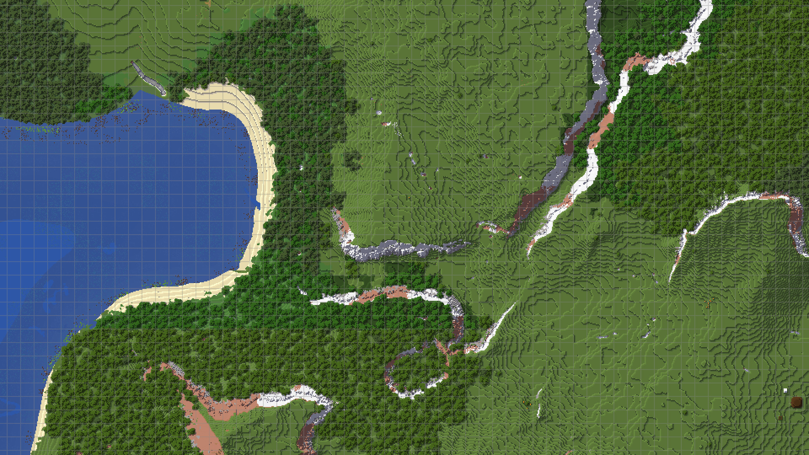

## **Home**

JourneyMap is a popular mapping mod for Minecraft. Originally released by techbrew in 2011, it’s gone from strength to strength and today stands as the most popular mapping mod in the world.

{: .center}

JourneyMap includes an in-game minimap and full-screen map, as well as a webmap that can be viewed in a browser.

If you’d like a featureful, easy-to-use mapping mod then why not give JourneyMap a try? You can [find it on Curse](https://www.curseforge.com/minecraft/mc-mods/journeymap) and install it just like any other [Forge](https://forums.minecraftforge.net/) mod - or continue reading if you need help.